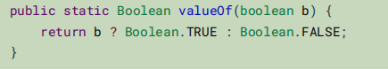

### 静态方法代替构造函数

#### 创建实例的

- 使用构造函数
- 使用工厂方法
- 使用反射
- 枚举

#### 使用静态过程创建实例

**注意：**它和设计模式中的工厂方法不一样。

它仅仅是一个提供创建对象的静态方法

类可以提供一个静态工厂方法，而不是公共构造方法，这种方式有好处也有坏处。

#### 好处

**好处一:**可以有一个有意义的名字，而不是不知所措的参数，但是并不知道代表什么意思。

- 静态过程方法是有名字的。
- 易于阅读，对于构造函数，即使多个参数来区别不同的构造函数，仅仅在有开发文档的情况下知道。

**好处二**：对于不变类，这个类是可以进行公用的

- 不是每次调用都去创建一个对象
- 可以减少类的创建，可以对同一个类进行公用

**好处三**：可以返回该类的任意子类

- 可以返回该类型的任意子类
- 他是返回对象，而不是返回类
- jdk1.8之后接口的静态方法限制被取消

**好处四**：

- 可以返回的类型，根据输入的参数不同而不同

**好处五**

- 返回值的类不需要存在

#### 缺点

**缺点一**

- 没有公共或者受保护的构造方法的类不能子类化

**缺点而**

程序员很难找到

#### 看到后面在回来补，感觉和后面有关

