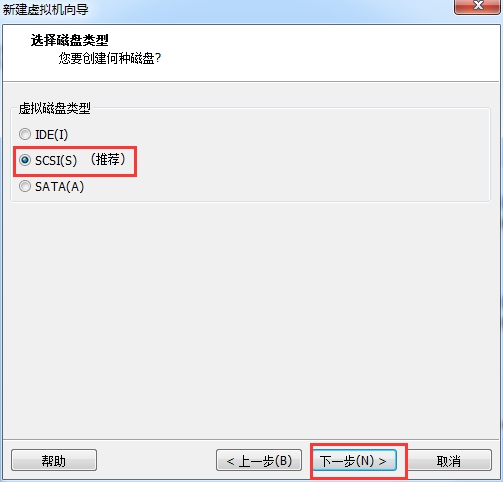

**在vmware上安装ubuntu14.04（64位）**

**安装环境：**

电脑型号：lenovoY430p（i7）笔记本

系统环境：win7 64位旗舰版

虚拟机vmware版本：VMware workstation 10

**Ubuntu版本：ubuntu14.04 64位**

 

**所需软件下载地址：**

<http://pan.baidu.com/s/1o6zAP30>

 

**具体步骤如下：**

1、双击打开VMware Workstation；

2、点击“创建新的虚拟机”；

 

3、选择“自定义（高级）（C）”，然后点击“下一步”；

 

4、点击“下一步”；

 

5、安装来源选择“安装程序光盘映像文件（iso）（M）”，找到要安装的映像，然后选择“下一步”；

 

6、输入用户信息，这些信息可以随意设置，不过要记住自己的设置。输入完成后，点击“下一步”；

 

7、填写虚拟机的名称及选择存储位置，虚拟机的名称可以随意填写，不过最好要见名知意，存储位置建议选择在剩余容量比较多的盘内。上述完成后点击“下一步”；

 

8、点击“下一步”；

 

9、选择虚拟内存，按默认即可，然后点击“下一步”；

 

10、选择网络连接“使用网络地址转换（NAT）（E）”，然后点击“下一步”；

 

11、选择I/O控制器类型“LSI Logic（L）”，然后点击“下一步”；

 

12、选择磁盘类型“SCSI（S）”，然后点击“下一步”；

 

13、选择磁盘“创建新虚拟磁盘（V）”，然后点击下一步；

 

14、指定磁盘容量，可以根据自己的硬盘剩余容量进行设置，然后点击“下一步”；

 

15、点击“下一步”；

 

16、点击“完成”；

 

 

点击完成后，可能会出现如下错误提示：

 

产生这个错误的主要原因是现在平常用的 VMware等软件本身都是基于 32 位的，如果要在其上运行 64 位系统，需要把CPU的虚拟化打开！而 Windows7 64位操作系统在默认情况下是关闭的！ 

解决方法如下：

首先是要检查 CPU 是否支持虚拟化，可以用CPU-Z软件查看，看到 VT-X，说明 CPU 是支持虚拟化的，如下图显示表明我的电脑支持虚拟化；如果未看到VT-X，则说明不支持虚拟化，则无法在虚拟机上安装64位的系统。

 

若CPU支持虚拟化，我们需要开启此功能，，开启方法如下：

（1）进入BIOS（开机按F2或者Del、F12等快捷键，我的电脑是lenovoY430p笔记本，开机时按F2即可进入，不同电脑，情况不同）

（2）选择“Configuration->Intel Virtual Technology”，使该选项设置为“Enabled”

 

选好之后，保存退出。

 

当然BIOS有不同的版本，有的选项可能不一样，你自己找一下差不多的。

17、错误排除后，重新打并重新打开ubuntu；开VMware，

 

打开后可能会出现如下提示，点击”“取消更新：，然后点击“关闭”：

 

还可能会出现如下提示，点击“确定”即可：

 

18、上述步骤完成后，接下来就是安装系统的过程，此过程比较长，我的电脑用了半个小时左右，具体时间试电脑性能而定。

 

19、漫长的等待后，则完成安装，如下图：

 

输入之前设定的密码后，即可进入ubuntu界面，如下图：

 

至此，ubuntu安装完成。

 