# **Github使用**

## 1. **准备工作**

## 1.1. **注册github账号**

### 1.2. **设置ssh key**

Github上已经有仓库时的认证，是通过ssh进行验证的，创建ssh key，将其加入到github中

​        Ssh-keygen -t rsa -C “邮箱地址”

然后将公钥，添加到github中

Ssh -T [git@github.com](mailto:git@github.com)测试是否成功。

### 1.3. **使用社区功能**

Follow关注别人，对方的一举一动就会在你的面板中显示。

## 2. **简单操作**

### 2.1. **创建仓库**

（1）创建一个新的仓库

 

（2）新建仓库页面中Repository name设置仓库名称

v Description，描述仓库

v Public 【免费】和private【要钱】

v Initialize this……会自动的初始化仓库并设置

v Add.gitignore可以自动生成这个文件，不需要在仓库总进行版本管理的文件都放在这里，省去了每次设置的麻烦。

v Add a license要添加的许可文件

<https://github.com/wangwangla/learn-12.10>

v README.md 初始化文件，会自动生成显示在首页，一般为软件概要、使用流程、许可协议

### 2.2. **一些指令使用**

| **or create a new repository on the command line** echo "# learn-12.10" >> README.mdgit initgit add README.mdgit commit -m "first commit"git remote add origin https://github.com/wangwangla/learn-12.10.gitgit push -u origin master |
| ------------------------------------------------------------ |
| **…or push an existing repository from the command line**git remote add origin <https://github.com/wangwangla/learn-12.10.git>git push -u origin master |

 

### 2.3. **公开代码**

Clone已有的代码，将已有的仓库clone到身边的开发环境中

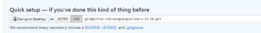 

 

### 2.4. **编写代码**

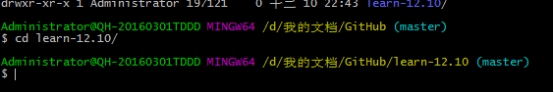a.c

查看状态  git Status

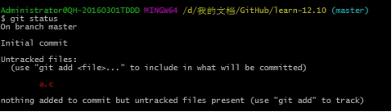 

然后将内容添加到流中

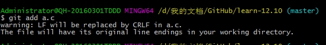 

查看是否提交

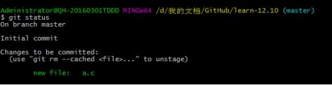 

提交

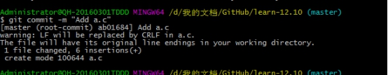 

查看日志

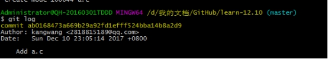 

提交成功

打开本地客户端【命令 git push】

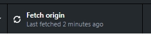 

 

将数据进行更新。

## 3. **各命令的使用**

### 3.1. **基本命令**

Ø Git init-初始化仓库              使用版本管理就必须初始化仓库，.git存储着当前目录中的数据，文件的编辑等操作都快照在工作树中，一次管理历史快照。

Ø Gitstatus-查看仓库命令          

Ø Git add-向暂存区去存入数据      向暂存器中存入数据

Ø Git commit-保存仓库的历史记录   将数据保存到历史仓库中，就可以将数据进行复原 -m是提交信息

​    上面是简单的记录描述信息，如果想姚详细的描述信息，可以只执行commit，

Ø Git log-提交日志                 可以查看遗忘仓库中提交的日志。

Ø Git log -p显示文件改动

Ø Git diff查看前后的差别

## 4. **分支操作**

在进行多个并行作业时，我们会用到分支，同时会存在多个最新代码。从master分支创建feature-A分支和fix-B分支后，每个分支都会有自己的最新代码。Master是个默认的分支，基本上都是以这样的方式进行的。

1. 分支作业完成之后，在与master合并。

2. 分析

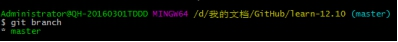 

*表示当前所在的目录。没有显示其他的所以说，这个里面只有一个分支。

3. Git checkout -b创建、切换分支

(1) 如果是以当前master分支Git checkout -b

(2) git checkout -b feature-A

(3) 切换到feature-A分支

​    git checkout feature-A

两条的是相同的。

(4) 下来提交代码，就会将代码提交到feature-A中。

Git add README.md

4. 切换到master分支

5. Git和svn有明显的得区别，创建分支不需要连接仓库，所以可以去轻松的创建。一般稳定的分支是master。

6. 主干分支同时也是合并的终点。

7. 合并分支  首先切换到这个命令下

git checkout master

合并

Git merge --no-ff A

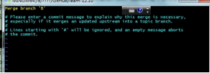 

Esc : wq保存数据

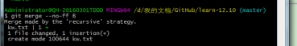 

8. Git log graph

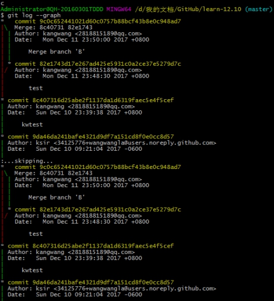 

## 5. **更改提交操作**

1. Git reset-回溯历史版本

  在不影响历史的情况下，然后对其进行操作。

 演示：回到历史版本。

比如说之前是master，有一个master-A，这个时候将回到master-A，之前，然后创建一个新的分支

（1）使用git reset --head 目标哈希  ，就可以回到指定时间的地方。

（2）创建一个新的分支。

（3）然后提交git add xxx文件 

2. 推进至feature-A分支合并后的状态

3. 处理冲突

打开文件，看到文件的冲突部分

4. 之后使用git add和git commit

## 6. **推送至远程仓库**

开始去网洛的另一头

在创建仓库的时候，注意，不易爱勾选Initialize……

 

1. git remote add---添加远程仓库

Git remote add origin 地址

2. 推送至远程仓库

Git push -u origin  master

-u将其推送到远程仓库里，将源数据设置为本地仓库的上游。

3. 从远程仓库获取

Git clone 地址

## 7. **工具栏**

1. Notificatiobs，是否有新通知

2. Gist：管理和发布一些谁便编写的代码。

3. News Feed是显示已经Follow和已经Watch的项目的活动信息