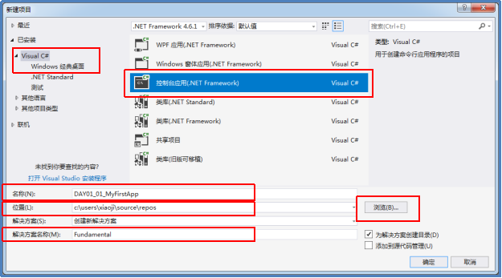
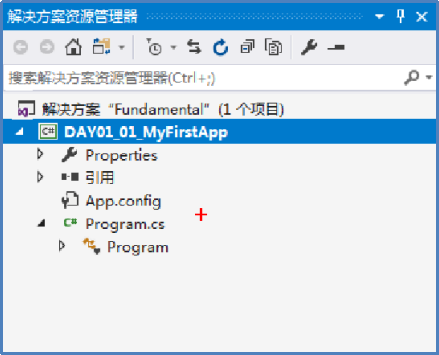
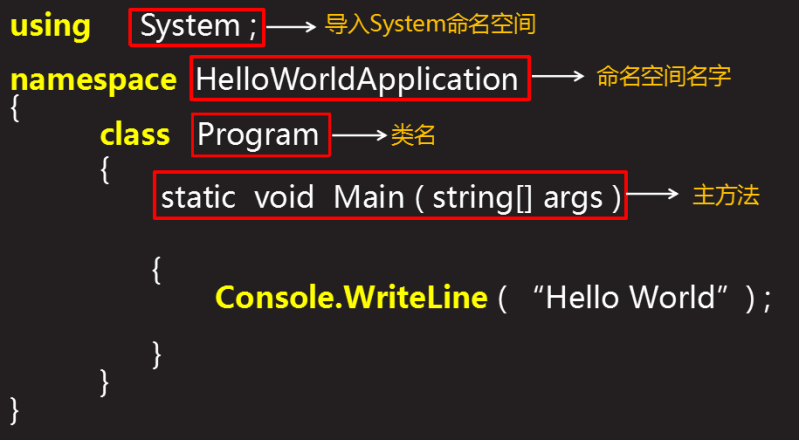
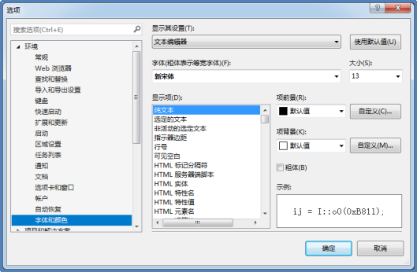
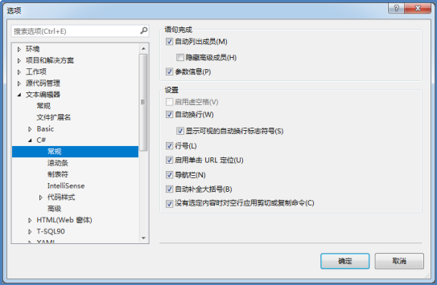
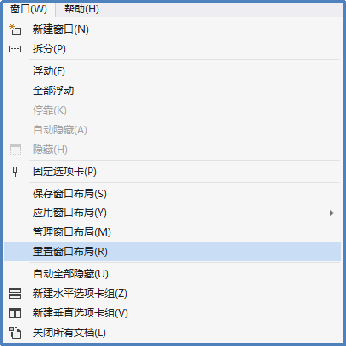

[TOC]


# 环境以及工具介绍

### dot net

​	.NET，是美国微软公司（Microsoft）推出的一个用于**软件开发和运行平台**。这个平台允许**应用程序通过Internet进行通讯和共享数据**。而**不管**所操作的是哪种**操作系统、设备或编程语言**。无论哪种设备都可以使用这个平台，可以使用自己熟悉的语言，通过互联网进行数据的共享和通信。

​	.NET Framework：.NET 平台的**核心框架**是： .NET　Framework，是 .NET　Framework 赋予了.NET丰富而又强大的功能。

​	.NET Framework组成:CLR　CTS　CLS。

​	从**开发人员**的角度来看，.NET 可以理解为一个**运行库**和一个全面的**基础类库**。C#中，运行层的正式名称是：CLR，即：Common Language Runtime，表示的是公共语言运行库。

​	CLR 的主要作用是为我们定位、加载和管理.NET 类型，同时也负责一些低层细节的工作，如内存管理、应用托管、处理线程、案例检查等。

​	NET 平台的另一个构造块是：CTS，即：Common Type System，表示公共类型系统。CTS 完整描述了运行库所支持的所有可能的数据类型和编程结构，指定了这些实体间如何交互、也规定了它们在 .NET 元数据格式中的表示（关于元数据，可以从网上获取参考资料）。

### c#语言#

1. C#为 .NET 推出的高级编程语言。C# 是多种语言的混合体，因此它像 Java 一样语法简洁，像VB一样使用简单，像C++一样功能强大和灵活。以下是C#核心特征的一部分，其中大部分特点也是其他支持 .NET 的程序语言所共有的特征。

2. 环境

   .NET  Framework 下载：https://www.microsoft.com/net

   Visual  Studio 下载https://www.visualstudio.com/zh-hans/?rr=https%3A%2F%2Fwww.microsoft.com%2Fzh-cn

3. c#控制台

   创建项目的两种方式：通过使用 cmd 命令行方式利用 IDE 集成开发工具。

   1. cmd创建文件的步骤

   - [ ] step1.  在你电脑的任意位置创建记事本文档，并将文档　　　　  扩展名改为 .cs ，如：Test.cs
   - [ ] step2.  在　Test.cs　中编写程序代码　 
   - [ ] step3.  通过 csc 命令编译源文件，如：　　　　   csc  Test.cs     　　　  编译成功后，会生成 Test.exe程序集    
   - [ ] step4.  接下来，键入  Test 　来执行程序，将看到　　　　 “HelloWorld”打印在屏幕上。

   2.使用VS创建

   - [ ] 首次打开VS时，起始页，该界面的“新建项目”；

   - [ ] Ctrl + Shift + N ，打开新建对话框

   - [ ] 文件菜单—>新建—>项目

     

     

   - [ ] 

4. 一个c#语言包含的部分：

   - using 关键字　用于在程序中包含命名空间。一个程序可包含多个using语句；任何C#程序的第一条语句都是：using  System ; 

   - class  关键字用于定义一个类，class 后面跟类名即可；

   - namespace　关键字表示定义一个命名空间，相当于一个大文件夹，日后编码时可在该命名空间下创建很多类；

   - Main(）方法　是一个类中的主方法，是所有 C# 程序的 入口点，即：　程序运行时首先会从这个入口处开始执行，且一个类只　能有一个Main()方法。

     

5. 运行项目

   工具栏“启动”按钮Ctrl + F5调试—>开始执行（不调试）

   ### c#语言知识介绍

   1. 一个 C# 程序主要由以下几个部分组成：

      - 定义命名空间（借助 namespace 关键字声明）
      - 导入命名空间（借助 using 关键字）
      - 定义类（借助于 class 关键字定义类）
      - 定义类中的成员（字段、方法等）
      - 注释

   2. 在任何 C# 程序中的第一条语句都是：　　

      ```
      using   System ; 
      ```

   3. Main方法是程序的入口，

   4. 方法也应该使用一组花括号括起来，花括号中可以写一　 条或多条或零条语句；程序在执行时，会按语句书写顺    序从上到下依次执行。

      ```
      static   void   Main ( string[]   args )   { ...... }　　
      ```

   5. 注释

      注释分类：单行注释、多行注释、文档注释。

       - 单行注释：符号是2条斜线 “//”(注意斜线方向)；2条斜线右侧的内容就是注释，左侧的代码不会受影响。
       - 多行注释：以“/*”开头且以”*/”结尾，之间的内容就是注释，可以包含多行。　
       - 文档注释：符号是3条斜线“///”,定在类、方法或属性（以后会学到）的前面。

      ### vs的常用操作

      - 如何更改字体

        如何更改 VS 中代码字体的样式（字体大小、颜色）：　**工具--选项--会打开“选项”**对话框，在该对话框左侧　选择“环境”--字体和颜色，会在右侧出现如下界面：

        

      - 显示和隐藏行号

        如何实现 行号 的显示|隐藏：　**工具--选项，打开“选项”对话框，左侧选择“文本编辑器**”-- C# -- 常规，在右侧界面中有一项“行号”

        

        

      - VS默认的布局样式

        如何实现VS中实现界面布局默认的样式：　如果不小心删除是VS默认的一些视图界面，可以重置到　VS默认的界面布局，具体设置如下：

        

        -- 常用快捷键

        - 保存：Ctrl + S
        - 新建：Ctrl + Shift + N
        - 开始调试：F5
        - 开始执行（不调试）：Ctrl + F5
        - 快速操作和重构：Ctrl + .
        - 查找类源码定义：F12
        - 移动代码（选中行）：Alt + 向上箭头|向下箭头

1. 程序结构

   ```
   命名空间我的理解就是包名，可以不使用
   using System;  //程序包含的命名空间
   using System.Collections.Generic;
   using System.Linq;
   using System.Text;
   using System.Threading.Tasks;
   //命名空间  类的住址
   namespace Demo02  //命名空间，它里面包含好多个的类
   {
   //定义类
   class Program   //声明一个类
   {
       //程序入口
       static void Main1(string[] args)
       {
           Console.Title = "第一个程序！";
   /**            Console.ReadLine();
           String str1 = Console.ReadLine();
           String str2 = "XXX";
           Console.WriteLine("输入字符串是："+str1);
           //占位符  控制显示顺序
           String str = string.Format("str2是：{1},st1字符串为：{0}", str1, str2);
           Console.WriteLine("str2是：{1},st1字符串为：{0}", str1, str2);
    */
           //金钱表示   加上c表示金钱
           Console.WriteLine("str2是：{0:c}",10);
           //位数  f1指定精度   p百分比   p0(100%) p1(100.0%)
           Console.WriteLine("str2是：{0:d2}", 1);
          //字符串前后加上双引号
           Console.WriteLine("我是\"康旺\"");
           //空字符
           char c1 = '\0';
           //两行显示   \r\n
            Console.ReadLine();
             }
       static void Main(string[] args) {
           //赋值
           int n1 = 3, n2 = 3;
           n1 = n2 = 2;
           //运算符
           int r1 = n1 / n2;
           int r2 = 5 / 2;//截断
            
           float r3 = 5/2; //2
   
           Console.WriteLine(r1+"   "+r2+"    "+r3);
           Console.ReadLine();
           //数据类型转换
           //int.Parse(string);
           
           Console.ReadKey();等待一个用户和那件按下。
       }
       }
   ```

**注意：**

- 大小写敏感
- 所有语句和表达式使用分号隔开
- 程序Main入口
- 文件名可以不同于类名称

2.//源文件  .cs文本  cls编译 exe中间语言 位于源代码和机器之前

3.运行在哪里，我们编译之后，就会保存硬盘，执行的时候放在内存中。

4.网速是按照字节计算的，不是按照M计算的。

- 有符号和无符号，就是8个位置都放数据，有符号就是7个位置放数据。
- 1个字节8位，2的8此方
- 1 个字节sbyte -128 ~127  byte 255
- 2个字节 short -32678~32678   ushort 0~65535
- 4个字节 int uint
- 8个字节 long ulong
- 4个字节 float 1.3f   
- 8 个字节 double 1.3d  
- 16字节 decimal 1.3m  不加默认是double
- 2个字节 char
- String 字符串和文本
- bool 1个字节
- 声明就是开辟空间，遵循命名规则
- 声明+赋值
- 声明  赋值
- 计算的时候需要注意 1.0f-0.1f 不为0.9f，因为精度损失 二进制表示十进制，有精度损失。

## 基本语法

```c#
using System;  //命名空间
using System.Collections.Generic;
using System.Linq;
using System.Text;
using System.Threading.Tasks;

namespace Demo03
{
    class Rectangle {
        double length;
        double width;
        public void Acceptdetails() {
            length = 4.5;
            width = 3.5;
        }
        public double GetArea() {
            return length * width;
        }
        public void Display()
        {
            Console.WriteLine("Length:{0}",length);
            Console.WriteLine("Width:{0}", width);
            Console.WriteLine("Area:{0}", GetArea());
        }
    }
    class Program
    {
        static void Main(string[] args)
        {
            Rectangle r = new Rectangle();
            r.Acceptdetails();
            r.Display();
            Console.ReadKey();
        }
    }
}

```

## 数据类型

数据类型分类：值类型、引用类型、指针类型

- 值类型

  给变量分配一个值。

  - bool 、byte：8、char：16、decimal：128、double：64、float：32、int：32、long：64、sbyte：8、short：16、uint：32、ulong：64字节、ushort：16字节

  - 程序查看字节

    ```
    sizeof(int);
    ```

- 引用类型

  不存储实际内容，而是存储数据的地址。

  - 对象类型
  - 动态类型
  - 字符串

- 指针类型

  ```
  char *cptr；
  int *iptr；
  ```

  

## 类型转换

将一种类型向另一个类型的转换。转换分为隐式和显式。

## 变量

## 封装

​	将一个或者多个小牧封闭在一个项目中或者逻辑包中，面向对象中，封装是为了防止对实现细节的访问，C#会根据需要，设置不同的访问权限。

​	public  private  protected   internal