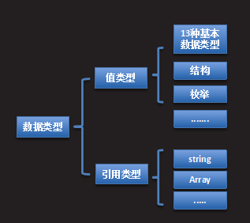

## 内存分配

###  数据类型：

值类型和引用类型

- 通用类型系统CTS(Common Type System)是.NET框架中的一个组成部分，为所有面向.NET框架的语言定义了数据类型的规则。

- 值类型：存储数据本身。

- 引用类型：存储数据的引用(内存地址)

  

### 内存分配

------

内存

**是CPU与其它外部存储器交换数据的桥梁。用于存储正在执行的程序与数据，即数据必须加载到内存才能被CPU处理。通常开发人员表达的”内存”都是指内存条**

程序运行时，CLR将申请的内存空间从逻辑上进行划分。

- 栈区：    -- 空间小(1MB)，读取速度快。    -- 用于存储正在执行的方法，分配的空间叫做栈帧。栈帧中存储方法的参数以及变量等数据。方法执行完毕后，对应的栈帧将被清除。
- 堆区：    -- 空间大，读取速度慢。    -- 用于存储引用类型的数据。

### 存储区域：

值类型：    声明在栈中，数据存储在栈中。 【声明：栈    数据：栈 】

引用类型：    声明在栈中，数据存储在堆中，栈中存储该数据的引用。  【声明：栈    数据：堆  】

### 垃圾回收

- GC(Garbage Collection)是CLR中一种针对托管堆自动回收释放内存的服务。
- GC线程从栈中的引用开始跟踪，从而判定哪些内存是正在使用的，若GC无法跟踪到某一块堆内存，那么就认为这块内存不再使用了，即为可回收的。 