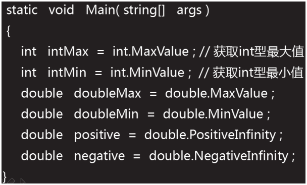
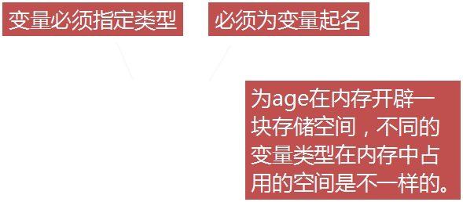
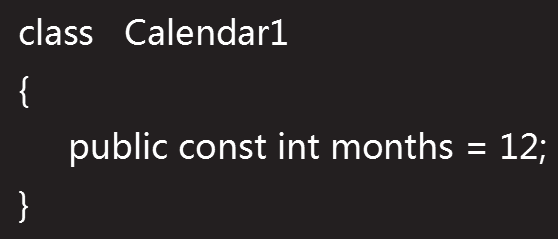
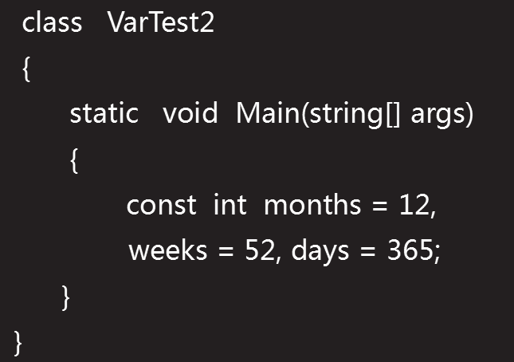
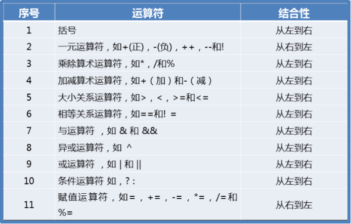

[TOC]


# 语言基础

**目标**

- [x] 基本数据类型
- [x] 数据类型转换
- [x] string数据类型

#### 基本数据类型

- 数据类型分为两大类：值类型和引用类型。

  - 值类型：所谓值类型，是**以“栈”的形式存储的**，它将数据的地址，也可以认为是数据和命名放在一起的；
  - 引用类型：引用类型，是以“堆”的形式存储数据的，但它并未抛弃栈，它将数据的地址存储在栈中，而数据具体内容存储在堆中，然后将栈中的数据名用一个指针指向堆中它相应的内容，如此一来，它就将数据和内容分开存储了。

  **简单说：值即使直接存储数值   引用类型就是存储地址**

  #### 值类型

  -  分类：

    - 结构:包括了13种基本数据类型:

      | 类型   | 占据空间 |                                          |
      | ------ | -------- | ---------------------------------------- |
      | byte   | 1 Byte   |                                          |
      | sbyte  | 1 Byte   |                                          |
      | short  | 2 Byte   |                                          |
      | ushort | 2 Byte   |                                          |
      | int    | 4 Byte   | 开辟 4 个字节的空间,范围：-2^31 ~ 2^31-1 |
      | uint   | 4 Byte   |                                          |
      | long   | 8 Byte   |                                          |
      | ulong  | 8 Byte   |                                          |
      | float  | 4 Byte   | 开辟4个字节                              |

      - int数据类型
        - int所能表示的数据范围，会出现错误。
        - 如果一个整数是int、uint、long或是ulong没有任何显式的声明，则该变量默认为int类型。若要指定其他整数 类型，可在数字后面加类型的缩略表示
        - 运算：两个整数相除，如果结果是小数，会自动舍弃小数，只取整数部分（直接舍弃小数，不四舍五入）
        - 溢出：两个整数进行运算时，结果可能会超过整数范围，　造成数据溢出的情况。
      - float数据类型
        - float 一般用于表示较小的浮点数，且精度较低；
        - 一个float类型的数据，在内存占用 4 个字节；
        - 浮点数默认的直接量（字节量）是 double 双精度类型，所以使用float 定义一个浮点数时，需要在具体数字后面加上float的表示符f，（大小写均可）   float  height  =  1.75f ；
      - double类型
        - double类型，称为双精度小数
        - 使用double类型描述小数时，小数后面省略了大写或小写的字母　D　
        - C#中的double类型，运算时数据不准确，原因：**底层处理的都是二进制数据。在二进制系统中，只能使用0和1，故二进制中是无法精确的表示1/10(十分之一)**，一般不会使用=double 或 float　来进行一些精确数据运算的场合或行业，如：银行系统，工程图纸等方面。
      - bool类型
        - bool 值不能和整数值进行相互转换；
        - bool 类型的默认值为：false 

      **数值的最大值和最小值**

      

      **值类型的字节数：sizeof ( 类型说明符 )  **

    - 枚举:

  ### 引用类型:

  - object、string,存储在堆栈中，且存储的是在堆内存     中的引用（地址）

  

#### 数据类型转换

1. 数据类型转换的方式：自动类型转换（又叫：隐式类型转换　或　向上转型）强制类型转换（又叫：显示类型转换　或　向下转型）
   - 自动类型转换：安全方式进行的转换, **不会导致数据丢失。**
   - 显示类型转换：将一个范围大的数据转为一个范围小的数据类型。
     - 有可能引起数据溢出或精度丧失

#### String数据类型

1.字符串（string）类型 允许您给变量分配任何字符串值，字符串（string）类型是 System.String 类的别名。它是从对象（Object）类型派生的。

2.定义的时候使用双引号括起来

#### 变量

1.在内存中开辟的一块存储空间，用于存储程序中需要的各种类型的数据。

2.访问修饰符，如果省略默认为private。




3.变量可以被多次赋值，变量的值则是最后一次的赋值 .

4.常量:常量在声明时必须初始化赋值

​	

一次可以声明多个常量



6.常量分类：常量可以是任何基本数据类型，比如整数常量、浮点常量字符常量或者字符串常量，还有枚举常量。

- 整数常量可以是十进制八进制、十六进制。
- 整数常量也可以有后缀，可以是 U 和 L 的组合，U 和 L 分别表示 unsigned 和 long。后缀可以是大写或者小写，多个后缀以任意顺序进行组合

7.运算符优先级



#### 控制台输入

- ReadLine()：用于从标准的输入流读取一行内容，返回string。标准输入设备为键盘时，ReadLine()表示读取用户从键盘输入内容，此方法会造成程序阻塞，直到用户按下Enter 键时停止。
- ReadLine方法另外用途是在清空控制台并向其显示新信息之前暂停程序执行，或者提示用户在终止应用程序之前按下Enter键。


---------

#### c#语言基础程序分析

1. 代码分析

```
using System;
//引入命名空间

//命名空间[住址]:对类进行逻辑上的划分，避免重名
namespace Day01
{
    //定义类[做工具]
    class Program
    {
        //定义方法[做功能] 
        static void Main1()
        {
            //自上而下逐语句执行
            //***************从本行开始执行******************** 
            System.Console.Title = "俺的第一个程序";
            //程序：程序员对计算机下达的一系列指令
            //字面意思：控制台.写一行("内容");
            //作用： 将括号中的文本   写到 控制台中(黑窗口)
            Console.WriteLine("请输入姓名：");  // 调用方法[使用功能]
            //字面意思：控制台.读一行();
            //作用： 暂停程序，等待用户输入。==》 将用户输入的内容   读取到程序（变量 name）中来
            string name = Console.ReadLine();
            Console.WriteLine("您好：" + name);
            Console.ReadLine();
            }
       }
  }
         
```

**总结：程序自上而下运行**

- Console.ReadLine();输入        
- Console.WriteLine("您好：" + name);输出 
- Console  是 类 [工具]
- WriteLine()/ReadLine()   方法[动词的行为/功能]
- Title  属性[名词 的 描述]

2.调试

       //调试[能力]
       //让程序中断，按F11，执行1条指令
       //步骤：加断点  --》 按F5启动调试  --> 按F11(逐语句执行)
3.代码的执行过程

- 写代码（.cs文本文件） --> 生成  -->双击 exe（\SolutionBase\Day01\bin\Debug\Day01.exe）
- 源代码（人的语言）  —编译—  中间语言IL  — 编译 — 机器码 0  1
- 编译错误(语法错误)
- 运行时错误(异常 、逻辑错误 )     

4.变量

       //变量
        static void Main2()
        {
            //数据类型 变量名;
            //变量名  =   数据; 
            //100
            int number;
    
            number = 100;
    
            //男
            string sex = "男";
    
            //1 >  2
            //声明 + 赋值
            bool r1 = 1 > 2;
    
            //因为浮点型，在内存中近似存储，所以在运算过程中有误差。
            bool r2 = 1.0f - 0.9f == 0.1f;
            bool r3 = 1.0d - 0.9d == 0.1d;
            //128位数据类型，可以避免误差
            bool r4 = 1.0m - 0.9m == 0.1m;
    
            //同一范围，同一变量不能重复声明
            //int a;
            //string a ;
    
            //同一变量，可以重复赋值
            int a = 1;
            a = 2;
    
            //变量使用前，必须赋值
            //int b; 
            //Console.WriteLine(b);
    
        }


​       
​    
5.字符

```
 //程序的入口[主方法]
    static void Main3()
    {
        //转义符 ： 改变了字符串的原始含义
        //    \"     \'      \0     \\    \t     \r\n回车换行
        string str = "我\t爱\"Unity!\"";
        char c1 = '\'';// '
        char c2 = '\0';//空字符
        string path = "C:\\MSOCache\\All Users\\00-C";
        string path02 = @"C:\MSOCache\All Users\00-C";
        string strNumber = "123\r\n456789";

        string name = "老宋";
        int age = 30;
        //在字符串中插入变量：
        //字符串的拼接
        Console.WriteLine("名字是：" + name + ",年龄是：" + age + "。");
        //占位符  {位置的编号}
        Console.WriteLine("名字是：{0},年龄是：{1}。", name, age);
        //string.Format("格式",变量……);
        string str02 = string.Format("名字是：{0},年龄是：{1}。", name, age);
        Console.WriteLine(str02);

        //标准数字格式字符串
        Console.WriteLine("{0:c}", 10);//￥10.00  货币 
        Console.WriteLine("{0:d3}", 10);//010  不足指定位数，使用0填充
        Console.WriteLine("{0:f2}", 1.126);//1.13 根据精度四舍五入保留小数
        Console.WriteLine("{0:p0}", 0.1);//0.1% 以百分数显示
    }

```

6.输入输出

```
 //练习：在控制台中录入枪的信息（类型、攻击力、弹匣容量、当前弹匣内子弹数、剩余子弹数）
    //"请输入枪的类型："
    //……
    //"请录入攻击力："
    //……
    //类型为：xxx,攻击力是：xxx,弹匣容量：xxx,当前弹匣内子弹数：xx,剩余子弹数：xx。
    static void Main()
    {
        //读写
        Console.WriteLine("请输入枪的类型：");
        Console.WriteLine("请输入攻击力：");
        string atk = Console.ReadLine();
        Console.WriteLine("请输入弹匣容量：");
        string ammoCapacity = Console.ReadLine();
        Console.WriteLine("请输入当前弹匣内子弹数：");
        string currentAmmoBullets = Console.ReadLine();
        Console.WriteLine("请输入剩余子弹：");
        string remainBullets = Console.ReadLine();
        string name = Console.ReadLine() ;
        Console.WriteLine("类型为：{0},攻击力是：{1},弹匣容量：{2},当前弹匣内子弹数：{3},剩余子弹数：{4}。",  atk, ammoCapacity, currentAmmoBullets, remainBullets);
    } 
}
```

7.逻辑预算

```
 //运算符
        static void Main1(string[] args)
        {
            //.NET简介   编译过程     变量
            //源代码  —CLS—  中间语言 exe  —CLR—  机器码0  1
            //int     float        bool         char   string
            // 10    10.0f    true/false      ‘1’      “1”
            //数据类型 变量名;  --->  在内存中开辟一块空间
            //变量名  =  数据;   --->  在该空间存储数据

            //数据的基本运算(运算符    类型转换)
            //语句(选择语句   循环语句  跳转语句)

            //一、算数运算符
            //一次声明多个同类型变量
            int num01 = 5, num02 = 2;
            int r1 = num01 / num02;//2 截断删除  算数运算

            string str01 = "我", str02 = "你";
            string r2 = str01 + str02;//"52"  字符串拼接

            //%
            int r3 = num01 % num02;//1
            //作用：1.判断一个数能否被另外一个数整除

            int year = 2015;

            //作用：2.获取整数的个位
            int num = year % 10;

            //二、比较运算符    等于 ==  不等于 !=    >    <    >=     <=
            bool r4 = str01 == str02;//判断两个字符串中的文字是否相同

            //三、逻辑运算符  与&&  或||    非!
            //判断两个bool的关系
            bool r5 = true && true;//真  与   真  结果：真
            r5 = true && false;//真  与   假  结果：假
            r5 = false && true;//假  与   真  结果：假
            r5 = false && false;//假  与   假  结果：假
            //总结：一假俱假  

            bool r6 = true || true;//真  或   真  结果：真
            r6 = true || false;//真  或   假  结果：真
            r6 = false || true;//假  或   真  结果：真
            r6 = false || false;//假 或   假  结果：假
            //总结：一真俱真

            bool r7 = !true;//false

            //如果到达最左边 并且  还想向左移动    或者   到达最右边 并且 还想向右移动
            //停

            //闰年：年份能被4整除   但是 不能被100整除
            //          年份能被 400 整除

            //2016
            //bool isLeapYear = year % 4 == 0;  //true
            //bool isLeapYear = year %  100 != 0;//true  
            //bool isLeapYear = year % 400 == 0;//false
            //true  是闰年   false 不是闰年
            bool isLeapYear = (year % 4 == 0 && year % 100 != 0) || year % 400 == 0;

            //四、快捷运算符  +=   -=   *=   /=  %=
            int a = 1;
            //a = a + 1;//一个变量 加上 另外一个数 再赋值给自身
            a += 1;
            Console.WriteLine(a);//2

            //五、一元运算符(具有1个操作数的运算符) 自增++    自减--
            int number01 = 1;
            number01++;
            Console.WriteLine(number01);//?

            int number02 = 1;
            ++number02;
            Console.WriteLine(number02);//?
            //1.无论操作数在++前或后，对于下一条指令，都是增加1之后的结果
            //2. ++在操作数后，则后自增，先返回结果
            //    ++在操作数前，则先自增，后返回结果

            int number03 = 1;
            Console.WriteLine(number03++);//1
            Console.WriteLine(number03);//2

            int number04 = 1;
            Console.WriteLine(++number04);//2
            //Console.WriteLine(number04);//2

            //六、三元运算符  数据类型 变量名 =  条件 bool ?  满足条件的结果  : 不满足条件的结果;
            //作用：根据条件进行赋值
            int numberResult = true ? 0 : 1;//0

            string strResult = false ? "ok" : "no";//“no”
        }

```

8.数据类型转换

```
   //数据类型转换
        static void Main2()
        {
            string strBulletCount = "100.1";
            //1.Parse转换：字符串类型 转换为 其他类型
            //语法： 数据类型.Parse(字符串)
            //备注：如果字符串不是该类型的数据，将抛出异常。
            //int intBulletCount = int.Parse(strBulletCount);
            float floatBulletCount = float.Parse(strBulletCount);

            //2.其他类型转换为字符串类型
            //语法： 其他数据.ToString()
            string strResult = floatBulletCount.ToString();

            //3.隐式转换：由小范围 到 大范围的自动类型转换(一定可以成功)
            byte bt01 = 100;
            int num01 = bt01;

            //4.显式转换：由大范围 到 小范围的强制类型转换(有可能丢失精度)
            int num02 = 500;
            byte bt02 = (byte)num02;//244
            //通常发生在数值之间

            //多种类型变量参与的运算，类型会自动提升
            short number01 = 200;
            byte number02 = 200;
            long result = (number01 + number02);

        }

```

9.案例：

```
 //练习：让用户在控制台中录入4位整数1234
        //         计算每位相加和1+2+3+4  ==》 10 
        static void Main3()
        { 
            //准备数据
            Console.WriteLine("请输入4位整数：");
            string strNumber = Console.ReadLine(); //"1234"
            int number = int.Parse(strNumber);//1234

            //解决方案1：数学方法
            //逻辑处理
            int result = number % 10; // 个位
            //result += number / 10 % 10;// 十位 1234 / 10 -->  123 %10 --> 3
            result = result + number / 10 % 10;
            result += number / 100 % 10;// 百位 1234 / 100 -->  12 %10 --> 2
            result += number / 1000;// 百位 1234 / 1000  -->  1 
            //显示结果
            Console.WriteLine("结果为：" + result);

            //解决方案2：从字符串中获取每个字符  "1234"
            //获取第一个字符
            char c1 = strNumber[0];//"1234" -->  '1':{'1','2','3','4'}
            //'1' -->  "1"
            string s1 = c1.ToString();
            //"1" --> 1
            int result02 = int.Parse(s1);

            result02 += int.Parse(strNumber[1].ToString());
            result02 += int.Parse(strNumber[2].ToString());
            result02 += int.Parse(strNumber[3].ToString());
            Console.WriteLine("结果为：" + result02);
        }
```

6.if语句

```
  //语句   选择语句   循环语句  跳转语句
        static void Main4()
        {
            /* if（条件bool)
             * {
             *       满足条件时执行
             * }
                else
             * {
             *       不满足条件时执行
             *  }
             * */

            Console.WriteLine("请输入性别：");
            string sex = Console.ReadLine();
            //如果 
            if (sex == "男")
            {
                Console.WriteLine("您好，先生！"); 
            } 
            else if (sex == "女")
            {
                Console.WriteLine("您好，女士！");
            } 
            else
            {
                Console.WriteLine("性别未知");
            }
            //else 输入上面的if

            //if (sex == "男")
            //{
            //    Console.WriteLine("您好，先生！");
            //} 
            //if (sex == "女")
            //{
            //    Console.WriteLine("您好，女士！");
            //} 
            //if(sex  != "男" && sex !="女")
            //{
            //    Console.WriteLine("性别未知");
            //} 
        }

```

案例：

```
        static void Main5()
        { 
            //练习：让用户在控制台中录入2个数字，1个运算符。
            //         根据运算符 计算 数字
            //"请输入第一个数字："
            //"请输入第二个数字："
            //"请输入运算符(+ - * /)：" 

            //准备数据
            Console.WriteLine("请输入第一个数字：");
            string strNumberOne = Console.ReadLine();
            int numberOne = int.Parse(strNumberOne); 
            Console.WriteLine("请输入第二个数字："); 
            int numberTwo = int.Parse(Console.ReadLine()); 
            Console.WriteLine("请输入运算符：");
            string op = Console.ReadLine();//“+” 

            //逻辑处理
            int result;
            if (op == "+")
            {
                result = numberOne + numberTwo;
            }
            else if (op == "-")
            {
                result = numberOne - numberTwo;
            }
            else if (op == "*")
            {
                result = numberOne * numberTwo;
            }
            else if (op == "/")
            {
                result = numberOne / numberTwo;
            }
            else
            {
                result = 0;
            }

            //显示结果
            //如果运算符输入无误
            if (op == "+" || op == "-" || op == "*" || op == "/")
            {
                Console.WriteLine("结果为:" + result);
            }
            else
            {
                Console.WriteLine("运算符输入有误！"); 
            }
        }
```

案例2：

```
        //练习：让用户在控制台中录入一个月份
        //根据月份计算天数
        //1  3  5   7  8   10  12     有31天
        //4   6  9  11     有30天
        //2     有28天
        static void Main8()
        {   
            //作用域：起作用的范围
            //从声明开始  到 }  结束 
            Console.WriteLine("请输入月份：");
            int month = int.Parse(Console.ReadLine());

            int days = -1;
            if (month >= 1 && month <= 12)
            { 
                switch (month)
                {
                    case 2:
                        days = 28;
                        break;
                    case 4:
                    case 6:
                    case 9:
                    case 11:
                        days = 30;
                        break;
                    default:
                        days = 31;
                        break;
                }
            } 
            //显示结果
            Console.WriteLine("{0}月具有{1}天。", month, days); 
        }
```

10.循环语句

```
        //循环语句
        static void Main()
        {
            //预定次数的循环for
            /*
            for ( 初始值 ;  循环条件  ;   增减变量 )
            { 
                  循环体
            }
             * */

            int sum = 0;//存储累加和
            for (int i = 1; i <= 100; i++)
            {//   
                //如果能被3整除则累加
                //if (i % 3 == 0)
                //{
                //    //            0  +  1
                //    //            1  +  2
                //    //            3  +  3
                //    //            6  +  4
                //    sum = sum + i;
                //}
                //如果不能被3整除
                if (i % 3 != 0)
                {
                    continue;//跳过本次循环，继续下次循环
                }
                sum += i;
            }
            //累加1--100之间能被3整除的数字
            Console.WriteLine(sum);

            //练习：一张纸的厚度为0.01毫米
            //请计算对折30次之后的厚度为多少米。
            float thickness = 0.00001f;
            for (int i = 0; i < 30; i++)
            {
                thickness *= 2;
            }
            Console.WriteLine(thickness);
        }
    }
```

