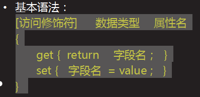
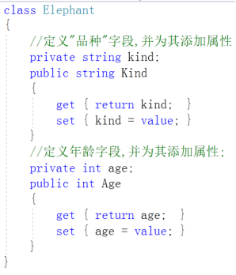

[TOC]


## 面向对象

**面向过程：**面向过程是计算机中解决问题的一种编程思想，着眼点是**过程**，强调的是解决问题的**具体步骤**。一般来说，在实际开发中，使用面向过程语言一方面来**编写底层代码**，比如智能手机Android系统底层是Linux内核和一些C/C++语言编写的系统代码；另外一方面，偶尔会使用面向过程来解决开发中一些比**较小的问题**。如：判断一个数是否是奇偶数、判断一个数是否是质数等。

**面向对象:**是计算机中解决问题的一种编程思想。它的着眼点是**对象**，强调的也是对象，有了具体的对象，然后按照一定的架构或一定的逻辑对对象进行逐步渗透，以此来解决程序的一种思想。

### 类

**类：**是组成 C# 程序最**基本的单位**。C#中的**每个类**都是一个**独立**的的 **.cs** 文件；

- 类名大多应使用英文中的名词表示，且命名遵循 Pascal 命名法（多个单词组成，每个单词首字母大写）；
- 创建新的类意味着当前项目中产生了一种新的**数据类型**。

#### 1.类的创建

举例:


2.类的创建和类的初始化：

- 程序中对象的创建借助于 new 关键字；

- 对象在创建时实际要完成两部分：

  - 声明

  - 初始化

    -   类名　对象名（又叫变量名，类的引用） 
    - 初始化对象（new 关键字）
    -  对象名　 =    new   类名( ) ; 说明：对象的声明和初始化也可以放在一条语句中完成
    - 类名　 对象名　=　new   类名( ) ; 说明：对象名的命名规则和普通变量的命名是一样的

    举例：

    


#### 2.类的组成

  成员有两种：字段和方法，字段又叫"成员变量"，方法又叫"成员方法"。

- 字段

    访问修饰符      字段类型      字段名 ；

    public  string  roleName ;

  

​    

#### 3.构造函数（方法）

- 什么叫构造方法（构造方法是什么）

  构造方法也是方法，属于一种特殊的方法。

- 什么时候使用构造方法使用构造法，

  主要是创建对象时为对象的字段赋值

- 为什么要构造方法

  通过构造方法，一方面解决由于对象名.字段名=值赋值时代码繁琐问题； 另一方面，方便传递值。

##### 1.特点

- 构造方法的方法名和类名相同，没有任何返回值，即使是空的（void）也不行； 
- 构造方法是由编译器自动调用的，开发人员从来不能手动调用；
- 创建完一个类，编译器会为该类提供无参数构造方法，前提是该类没有其它任何形式的构造方法； 如果一旦有其它形式的构造方法，都不会再提供无参数的构造方法；

**名字相同    自动调用    若无默认。**

#####  2.构造方法是如何工作的

- 如： Student   s   =   new   Student( "Tom" , 25 ) ； 当使用new创建对象s时，编译器会自动进到Student类中找这个类含有两个参数（并且第一个参数string类型，第二个参数int类型）的构造方法，如果 Student 类中没有含有两个参数参数类型和个数匹配的，程序则会报错； 如果有，会将两个实际参数 "Tom" 和 "25" 传递给学生类中两个参数构造方法中的形式参数变量接收。构造方法中的形式参数接收之后，再想办法赋值给类中的字段。

  查看是否有输入参数一样的构造函数，并且类型匹配

 将数据传递给变量，将值赋值给字段。

#### 4.面向对象的三大特性

封装性、继承性、多态性

#### 5.修饰符

- public : 公共的，公开的

  使用public修饰的字段或方法，在当前项目下的所有包及其包中的类都可访问到，甚至其它外部程序集都可以访问。

- private ：私有的

  使用private修饰的字段或方法，只能在这个类（结构）中访问到，一旦出了这个类（结构），在任何其它的地方是访问不到的。　

  创建完一个类后，类中的构造方法（构造函数）默认是private修饰的。在一个类中定义的变量或方法，如果省略访问修饰符，默认也是 private 级别的。

- protected：受保护的

  用于修饰：类型成员或嵌套类型protected，一般用于含有继承关系的子父类当中。可以由定义它们的类型及其任意子类使用，但外部类无法通过 C# 的“.”操作符访问。

- internal：内部的

  用于修饰：类型或者类型成员

  作用范围：当前项目下的所有类使用

  internal修饰类中的字段或方法，在当前项目所有类下都可访问，但是其它项目是访问不到的。

  class 关键字的前面省略了：internal 修饰符

- protected  internal ：受保护的内部的

  作用范围在定义它们的程序集、类以及派生类中可用。

#### 6.封装性

- 使用 C# 中的访问修饰符控制类中的成员的作用范围，是目前实现狭义封装的主要方式。

- 具体规则：

  - 类中的字段私有化，即：使用 private 修饰
  - 类中的方法公开化，即：使用 public 修饰然后，为类中私有化的字段加一组 Get|Set方法（称为属性）为外界提供一种间接访问的方式

- get方法：

  - Get 表示获取字段的值；
  - Get 后面跟的是字段名，且字段名的每个单词首字母大写，其它字母小写；
  - Get 方法定义时方法的返回值和当前操作的字段的类型是一致的；
  - Get方法的返回值应与对应操作的字段类型保持一致；

  

  

- set方法

  - Set 表示为当前操作的字段赋值；

  - Set后面跟的是字段名，以Set开头，Set后面跟字段名，且字段名的每个单词首字母大写，其它字母小写； 

  - Set方法可以有参数，如果有参数变量，用于为当前操作的字段进行赋值操作的；

  - Set方法的返回值为 void ；

    

  举例：

  

  通过为大象类中的字段添加Get|Set方法，我们已经初步掌握了实现狭义封装的方式。但是会发现，Get***和Set***代码写起来较繁琐，将来若要为每一个字段都添加这组方法，工作量会很大，所以，C#对此做了修改.

  C# 将这组方法作为一个整体放在了一个名为“属性”的里面，属性的名字就是当前操作字段的字段名（大小写做了改变）。

  

  - 访问修饰符，一般都是使用 public

  - 数据类型，就是当前操作的字段的类型

  - 属性名，就是当前操作的字段名（使用Pascal命名法）

    案例:

    

    

     

#### 7.访问内容


#### 8.添加逻辑


#### 9.自动属性

- 当属性（又叫属性访问器）中不需要任何其他**逻辑**时(即不需要在set方法中添加任何业务代码)使用自动属性可以更加简洁。

- 自动属性本质就是一个字段两个方法。

  举例：

  

- 特点：

  - 自动属性可利用编译器自动生成，以简化代码的编写注：代码中输入prop，按两下Tab键即可自动生成；

  - 自动属性只能成对出现,即:不能只有一个get或一个set，也就是，自动属性不支持设置 只读 | 只写 操作；

  - 不需要自己生命字段.

    由于 自动属性 是编译器自动生成的，所以编译器在生成自动属性时，会自动添加一个私有的字段，我们在写时，不用再自己声明私有字段，只需要直接添加属性即可。

    

    

    自动属性和这个的区别

    


##### 这个在java中也是可以实现的，但是不推荐这么使用的。

### 继承

#### 1.定义:

定义：继承是面向对象三大特性之一；当多个类中包含相同的内容时（字段或方法），可以将相同内容提取出来，作为父类，其它类要想使用，只要继承这个父类，就可以使用父类中的内容。

#### 2.C#继承的特点

- C#中的继承，使用的关键符号为：（冒号）
- C# 中的继承体现的是 is-a 的关系程序中的继承，主要目的是实现代码的利用，简化程序的编写；
- 继承中的关系词：　父类　与　子类                             基类　与　派生类
- C# 中所有类的父类：Object

#### 3.继承的基本案例


#### 4.具体继承了什么？

- C#中的继承，是单继承，即：一个子类只能有一个直接父类（继承的单层性）；
- 继承具有传递性（继承的多重性），即：A 类继承了 B 类，B 类继承了 C 类，此时 A 类不仅继承了 B 类中的内容，同时也继承了 C 类中的内容；
- 子类继承了父类，默认是继承父类的全部内容（私有的和构造方法除外）。父类私有的默认子类也是继承了，只是访问不到而已。

5.构造方法的继承

- 子类继承父类，父类的构造方法子类默认是**继承不到**的。但是子类**可以使用**父类的构造方法。
- 而且就算子类不使用父类的构造方法，编译器也会**强制性**的自动先调用父类的构造方法。

如果父类没有无参数的构造方法，子类在调用父类的构造方法的时候，就会报错，当没有显示执行的时候，原因即使会系统会自己调用哪一个默认无参数的构造函数。

#### 5.base关键字

- base 关键字一般用于含子父类的继承关系中

#### 6.使用位置

- 访问父类中的同名方法，适合于子类中存在与父类相同签名的方法时；
- 访问父类的构造方法，在子类构造方法的小括号后面使用 　: base( 参数值列表 )  表示访问父类的构造方法；

#### 7.多态

- 多态重点是体现在代码的使用上；

- 多态：对象的多种状态。对于含有继承关系的子父类来说，当使用“父类变量，创建子类对象”的形式创建一个对象后，这个写法称之为多态。[父类创建子类对象]

- 语法

  ```
  父类　变量名　　=　　new  　子类（参数列表）
  ```

  这种父类变量指向子类对象的过程，称为向上转型。

  举例：

  

- 　当子类和父类都有相同的方法时，调用子类自己的方法；　当子类没有该方法时，调用父类的方法；　当子类和父类都没有调用的方法时，程序编译报错。

  利用对象 c 调用Introduce(),编译期间调用父类Car的，运行期调用子类Benz自己的，对于对象 c 来说,它具备两种状态:编译期和运行期。编译期属于Car类型，运行期属于Benz类型。所以用c调用Introduce()时,会调用子类（奔驰类）自己的Introduce()方法

- 


----------

#### 类代码练习:

```
 //定义 老婆 类
    class Wife
    {
        //数据成员
        //字段：存储数据    老板
        private string name;

        //属性：保护字字段(本质2个方法GetName   SetName)   助理
        public string Name
        {
            //需要赋值时被调用
            set
            { this.name = value; }
            //需要获取数据时执行
            get
            { return name; }
            //value : 要写入的数据(理解为：SetName的参数) 
        }

        private int age;

        public int Age
        {
            get
            { return this.age; }
            set
            {
                if (value >= 18 && value <= 30)
                    this.age = value;
                else
                    throw new Exception("我不要");
            }
        }
           //构造函数：提供了创建对象的方式，用于初始化(仅1次，开始)对象的特殊方法。
        //特点：
        //1.创建对象时，自动调用（不能手动调用）。
        //2.没有返回值位置
        //3.与类同名

        //若一个类没有构造函数，编译器会自动提供一个无参数构造函数
        //            具有                         不会提供
        public Wife() 
        {
            Console.WriteLine("创建对象就执行！");
        }

        public Wife(string name):this()
        {
            this.name = name;//如果赋值给字段，那么属性是不会执行的。
        }

        public Wife(string name, int age) : this(name)
        {
            //Wife();
            //this.name = name;//如果赋值给字段，那么属性是不会执行的。
            this.Age = age;  
        }

         
        //方法成员
        public void SetName(string name)
        {//this 这个对象的引用
            this.name = name;
            //SetName(name);
        }

        public string GetName()
        {
            return this.name;
        }

        public void SetAge(int age)
        {
            if (age >= 18 && age <= 30)
                this.age = age;
            else
                throw new Exception("我不要");
        }

        public int GetAge()
        {
            return this.age;
        }
    }
    }
```

- 定义类

  ```
  class Wife{}
  ```

- 定义属性

  ```
  private string name;
  ```

- 属性赋值

  ```
   自动属性：
   public string Name
   {
        //需要赋值时被调用
         set
         { this.name = value; }
         //需要获取数据时执行
          get
          { return name; }
              //value : 要写入的数据(理解为：SetName的参数) 
    }
    一般的属性赋值
    public int Age
          {
              get
              { return this.age; }
              set
              {
                  if (value >= 18 && value <= 30)
                      this.age = value;
                  else
                      throw new Exception("我不要");
              }
          }
          
    我认为各有各自的优势。
  ```

  

- 构造函数

  ```
          public Wife() 
          {
              Console.WriteLine("创建对象就执行！");
          }
  
          public Wife(string name):this()
          {
              this.name = name;//如果赋值给字段，那么属性是不会执行的。
          }
  
          public Wife(string name, int age) : this(name)
          {
              //Wife();
              //this.name = name;//如果赋值给字段，那么属性是不会执行的。
              this.Age = age;  
          }
  ```

  

类的赋值和参数获取

        //类和对象
        static void Main2()
        {
            //声明 Wife类型 的引用
            Wife wife01;
            //指向Wife类型的对象(实例化对象)
            wife01 = new Wife();
    
            wife01.SetName("王美丽");
            wife01.SetAge(18);
    
            Console.WriteLine(wife01.GetName());
            Console.WriteLine(wife01.GetAge());
    
            Wife wife02 = wife01;//赋值引用
            //wife02 = new Wife();
            wife02.SetName("俊辰"); 
            Console.WriteLine(wife01.GetName());//?
    
            Wife wife03 = new Wife();
            //wife03.SetAge(50);
            //wife03.age = 60;
            wife03.Name = "美丽";
            wife03.Age = 20;
            Console.WriteLine(wife03.Name);
            Console.WriteLine(wife03.Age);
    
            //调用2个参数构造函数 --》 调用1个参数 --》 调用0个参数
            Wife wife04 = new Wife("美丽", 20);
        }
创建对象的方式

```
创建方式一：
 //声明 Wife类型 的引用
  Wife wife01;
  //指向Wife类型的对象(实例化对象)
  wife01 = new Wife();
```

```
 方式二：
 Wife wife02 = wife01;//赋值引用
 //wife02 = new Wife();
 wife02.SetName("俊辰"); 
 Console.WriteLine(wife01.GetName());//?
```

```
创建方式三：
Wife wife03 = new Wife();
```

```
 创建多个对象
 Wife[] wifeArray;
 wifeArray = new Wife[5];
```


静态方法

        //每次创建对象 都存在一份
        public int InstanceCount { get; set; }
    
        //仅仅存储一份，可以被所有对象共享 
        public static int StaticCount { get; set; }


继承

    class Student:Person
    {
        //public string Name { get; set; }
    
        public int Score { get; set; } 
    }