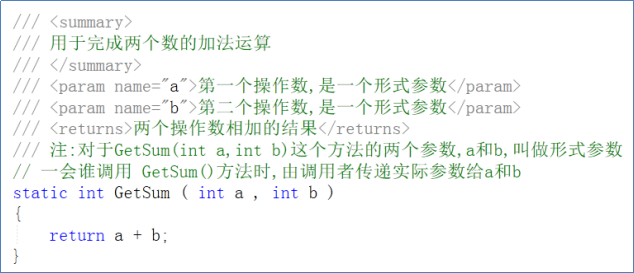
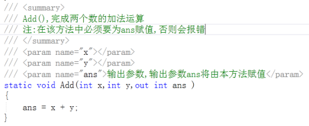
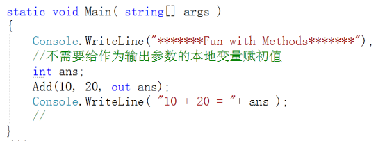
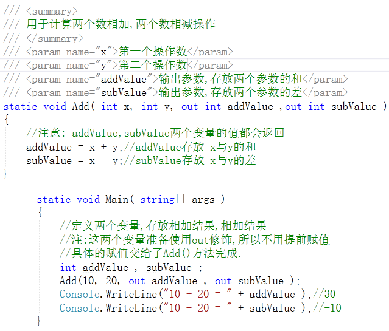
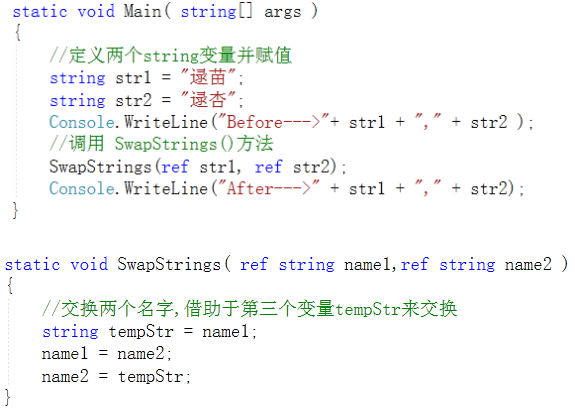

[TOC]


## 方法

方法由以下几部分组成：修饰词、方法返回值类型、方法名、 参数列表、方法体。

```
    static    void    Main ( string[]   args )
    { 　......
    }
```

定义和调用




一个方法调用的过程

- 在mai中分配参数的地址和函数名称并赋值。
- 为调用的方法，分配空间
- 将值传递给方法变量中
- 将结果的值返回
- 将方法的参数变量释放
- main中得到返回值


## 参数修饰符

- out修饰符

- ref修饰符

1.out，表示输出参数 ，在退出这个方法之前，给参数赋一个恰当的值

方法定义



方法调用



使用的好处就是可以一次返回多个返回值



2.rel修饰符

ref修饰的参数，称为引用参数

它和输出参数有相同点，同时也是有区别的。

输出参数不需要在它们被传递给方法前初始化，因为方法在退出之前必须为输出参数赋值。

引用参数必须在它们被传递给方法之前初始化，因为是在传递一个对已存在变量的引用。如果不赋给它初始值，就相当于木对一直未赋值的本地变量进行操作。

