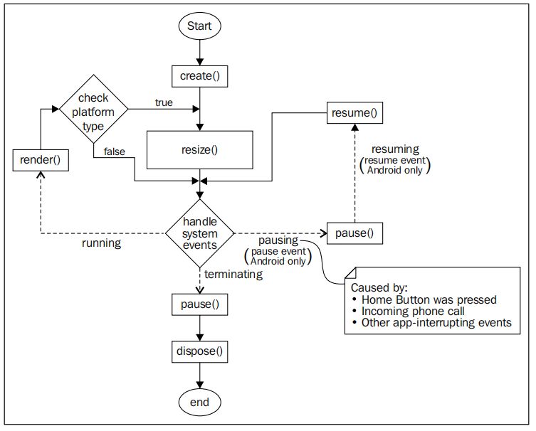

## 简介
- 是什么？
  是一个2D/3D游戏开发框架
- 开发语言
  java语言
- 开发环境
  使用的是java语言开发，开发环境有多种。
- 跨平台
- 成功案例


#### Graphics

- 渲染通过OpenGLES2.0
- 他使用在Android 2.0或者更高的版本


#### 优雅的关闭

Gdx.app.exit():可以优雅的关闭正在运行的应用程序，框架将以正确的顺序关闭，并且释放内存中的资源，以及在java本地堆中的资源。

### 持久化数据

可以使用Preferences类，他可以使用一个名称创建不同类别的文件，存储的是键值对，键存在就覆盖，否则就创建。

```
Preferences  p = Gdx.app.getPrefereces("setting.prefs");
//存储
p.putInteger("key",100);
flush();

//获取参数，键不存在就设置默认值
p.getInteger("key",40);
```


#### 查询Api版本

在Android上查询Api级别，根据不同版本处理不同的操作。

```
Gdx.app.getVersion();
```

#### 查询平台类型

```
Gdx.app.getType()  返回值为：Desktop/Android/WebGL/IOS/default
```

#### 查询内存

可以查询系统，查找应用程序当前的内存占用。

```
Gdx.app.getJavaHeap();
Gdx.app.getJavaNativeHeap();
```

#### 多线程

创建游戏是，libGdx创建一个名为主循环线程的单独线程，并加入OpenGL上下文，整个线程处理呈现都发生在此线程中，所以需要将数据传递给UI线程，我们可以使用Application.postRunnable();


#### libGdx的生命周期

声明周期方法，在正确的时候进行调用。



首先在create方法中将资源加载进来，然后resize他们的大小，下来就是处理系统事件，然后进行展示。下来完成两件事。

- 更新游戏模型
- 使用更新的游戏世界模型在屏幕上绘制

根据平台执行不同的分支，在桌面或者是浏览器，就会每次都执行Resize方法。

然后继续监听是否有事件处理，如果是退出，那么就先去pause，在这个里面可以对信息进行保存，最后执行dispose方法。

