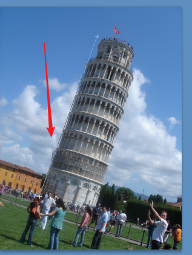
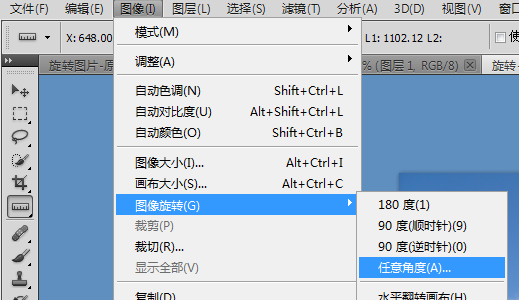
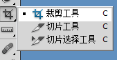
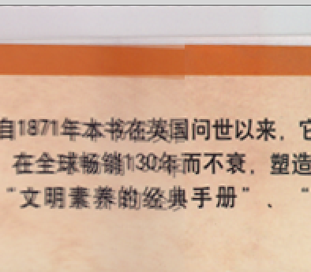

# PS基本操作

1. 画布操作

   

   

2. 旋转

   

3. 旋转画布

   

   

   

   

4. 一般裁剪

   

   

5. 透视裁剪

   

   选中上方的透视

   

6. 照片的处理，

   设置图片的大小，然后设置边框，将其放入到一个布局里面。

   

   裁剪之后，设置画布

   

   制作图片

   

   

   

   按住ALT进行复制

7. 拼合

   先将画布变大，然后将需要拼接的连接在一起，然后将一个的透明度调低，进行-拼合，最后进行裁剪就可以了。

   拼接之后，会出现这样的效果，如何处理

   

   按下delete就可以了。

   拼接的时候ctrl+t进行旋转等，如果图片无法移动，可以修改他们的模式。

   

8. 选区

   

   

   当选中的时候，只能在选中的区域中修改和画图。选取就是将要操作的区域。

   案例实现下面这样的效果

   

   第一步设置选取

   

   

   

   ---------

   复制粘贴

   

   选中，ctrl  C  ctrl  V   

   去除logo：

   复制图层，覆盖它， ctrl  C  ctrl  V  或者是ALT移动 [原图层修改]  

   ctrl+T进行其他变换。

9. 选区运算

   

   一个选区   两个选区合并  两个选区相减   两个选区公共

10. 套索工具

    

    

11. 快速选择工具，将同一种颜色的进行快速的选取

    

    点击魔棒工具，就可以快速的选中点击的区域。就会将所有的颜色选中，如果是连续的，那么只会将连接的部分选中。

    选中的时候需要注意容差。

12. 羽化操作，羽化目的就是为了更改的融合，融合的时候可以设置羽化的半径。

    

13. 色彩范围

    

    选择颜色

    

    crtl+U进行设置颜色

    ****

    如果为了只选择一各区域的，那么就要开始选中一个选区。然后执行上面的操作。                                  

    案例：将草地变为绿色、                                                            

14. 图像合成

15. 描边

    

    

    历史记录条板:记录着，所有的操作步骤。

    

16. 给塔加上光环

    

    

    

    

    

17. 扩展的使用

    1.选中选区

    2.扩展

    

    

    羽化和填充。

    使用羽化和填充也可以用来做投影。

18. 图像变形

    裁剪一块下来。

    

    复制、粘贴，然后执行ctrl+T，然后会出现一个框。

    

    对其进行各种拖拉。查看一下在变换里面有什么方法。，

    

19. 案例将一个图片贴到一个球上，那么我们可以设置模式为正片叠底。

    

20. 绘制一个图像，然后对其进行旋转，然后按下ctrl+shift+T进行再次旋转。

21.螺旋结构

将两个圈子圈在一起，先复制出两个圈子，然后将其中一个透明度降低，然后将其中一部分删除掉。

22.选区，对某一种颜色增加旋转区域,旋转相似

23.选取加载

ctrl+左击一下，选取修改进行收缩等操作，

选取相似：选择+选择相似

24.平滑：画出带弧度的图像，使用平滑

25.制作图片

定义的图片，当我们使用喷桶的时候，就会将所有的显示出来，我们为了可以显示在一个特定的区间中，可以定义选区。然后将图像显示。

30.渐变

- 线性渐变

- 径直渐变

  

31.直方图

