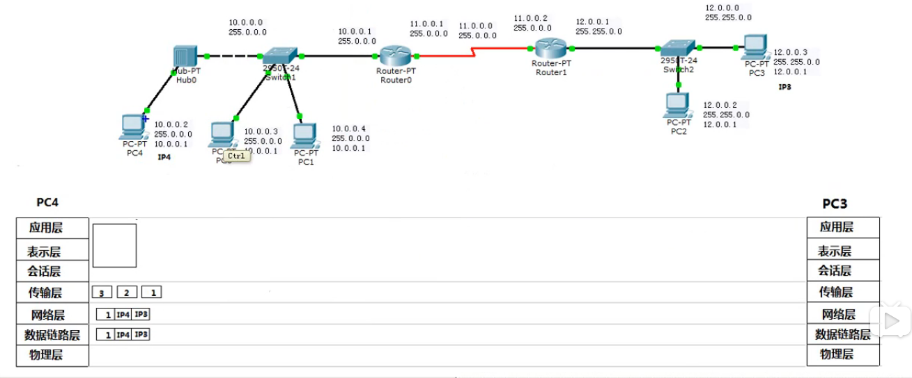

## 网络层

网络层层数据加上IP变为数据包，数据包发送通过路由器进行发送，每个数据包可能会走不通的路径，所以最终到达的时间是不一样的。在传输过程中，网络等原因就会将一些数据包丢掉，网络层的作用就是选择路由扔出去，不关心是不是传输到目的地。

#### 数据传输的过程



- 应用程序准备数据

- 传输层将数据进行分割

- 网络层封装IP地址

- 数据链路层封装Mac  

  -  数据链路层通过子网掩码，分析自己的网络，分析对方的网络，如果在同一个网段中，那么就直接发生Arp请求获取目标的mac地址，直接封装Mac地址即可
  - 不在同一网段中，那么就将数据给漏油器进行向外转，所以mac地址是当前电脑的和漏油器发送口的地址（发生arp请求获取路由器的mac地址）。

  

  


根据IP确定出口


### 网络层协议

APR协议、IP协议、ICMP协议、IGMP协议

#### Arp协议

Arp协议发送的是广播，发生Arp请求得到的是mac地址，然后就将mac地址缓存，而不是需要每次都进行一次 ，它只可以解析本网段的。漏油器是隔绝广播的，

```
arp -a
```

##### Arp欺骗：将mac获取到

A---->B  通信

在一个局网中，c计算机收到A索要的mac地址，将其发送一个给a，那么A--->c就可以通信了，并未与B通信

```

```

arp -s ip地址  mac地址 

##### 网络执法官


#### IP协议

将数据包从一个网段发送到另一个网段。


#### ICMP

用来测试网络层是不是畅通。使用最多的也就是Ping命令

```
linux ： 64
windows： 128
unix: 255

ping 域名  -t 一直ping
ping -l 200 域名
```


#### 网关

不设置网关，数据包无法进行传播，可以是ping检测，数据无法返回，就是请求超时


#### IGMP协议

IGMP是internet组播网络管理协议。


- 区分广播、多播、点到点
  - 广播：所有的计算机都可以收到，在同一个网段中，不跨漏油器。
  - 多播：所有的计算机都可以收到，但是收到的计算机绑定需要接收频道的地址，播到哪里看哪里。
  - 点到点：值发给一个计算机，可以前进后退
- 那么IGMP的作用就是，在漏油器扫面所有的端口，那些绑定了多播的端口。

### IP协议

网络层协议的目的是转发数据包，不去关系数据包是不是正确的发送。

那么他是如何选择如何出去的呢，他是通过路由表决定的，漏油表的获取有两种方式一种是管理员告诉它的，一种是自己获取到的 