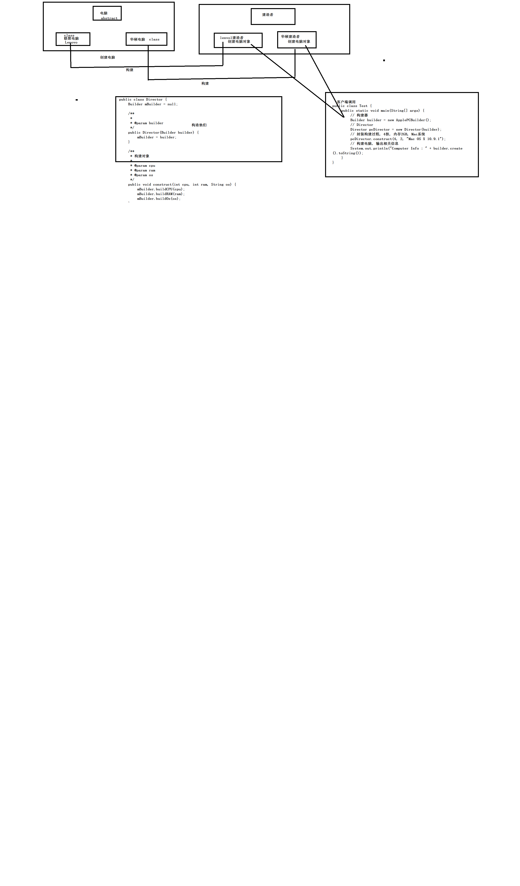

## Builder（建造者模式）

将一个复杂对象的构建与它的表示分离，使得同样的构建过程可以创建不同的表示。

#### 模式的使用场景

- 相同的方法，执行顺序不同，结果不同。
- 多个部件或者零件，装配到一个对象中，但是运行结果又不相同。
- 产品类非常复杂，或者产品中的调用方式不同产生不同的效能。 

#### 使用的步骤

案例说明：

构造一个电脑，我们需要CPU，需要知道它的核数，我们也需要有ROM,还有RAM，这些构架一个电脑。

- 创建一个电脑类，他可以设置核数、ROM、RAM

  ```java
  public abstract class Computer {
  	protected int mCpuCore = 1;
  	protected int mRamSize = 0;
  	protected int mRamSize = 0;
  	protected Computer() {
  	}
  
  	// 设置CPU核心数
  	public abstract void setCPU(int core);
  
  	// 设置内存
  	public abstract void setRAM(int gb);
  
  	// 设置操作系统
  	public abstract void setOs(String os);
  
  }
  ```

  

- 我们现在需要创建一个联想电脑

  ```java
  public class LenovoComputer extends Computer {
  	protected Lenovo Computer() {
  
  	}
  
  	@Override
  	public void setCPU(int core) {
  		mCpuCore = core;
  	}
  
  	@Override
  	public void setRAM(int gb) {
  		mRamSize = gb;
  	}
  
  	@Override
  	public void setRom(int rom) {
  		mRomSize = rom;
  	}
  
  }
  ```

  

- 创建一个构造者

  ```java
  // 设置CPU核心数
  	public abstract void buildCPU(int core);
  
  	// 设置内存
  	public abstract void buildRAM(int gb);
  
  	// 设置操作系统
  	public abstract void buildRom(int rom);
  
  	// 创建Computer
  	public abstract Computer create();
  ```

  

- 联想电脑的构造者

  ```java
  public class ApplePCBuilder extends Builder {
  	private Computer mApplePc = new AppleComputer();
  
  	@Override
  	public void buildCPU(int core) {
  		mApplePc.setCPU(core);
  	}
  
  	@Override
  	public void buildRAM(int gb) {
  		mApplePc.setRAM(gb);
  	}
  
  	@Override
  	public void buildOs(int rom) {
  		mApplePc.setRom(rom);
  	}
  
  	@Override
  	public Computer create() {
  		return mApplePc;
  	}
  
  }
  ```

  

- 构建他们

  ```java
  public class Director {
  	Builder mBuilder = null;
  
  	/**
  	 * 
  	 * @param builder
  	 */
  	public Director(Builder builder) {
  		mBuilder = builder;
  	}
  
  	/**
  	 * 构建对象
  	 * 
  	 * @param cpu
  	 * @param ram
  	 * @param os
  	 */
  	public void construct(int cpu, int ram, String os) {
  		mBuilder.buildCPU(cpu);
  		mBuilder.buildRAM(ram);
  		mBuilder.buildOs(os);
  	}
  }
  ```

  

- 创建

  ```java
  public class Test {
  	public static void main(String[] args) {
  		// 构建器
  		Builder builder = new ApplePCBuilder();
  		// Director
  		Director pcDirector = new Director(builder);
  		// 封装构建过程, 4核, 内存2GB, Mac系统
  		pcDirector.construct(4, 2, "Mac OS X 10.9.1");
  		// 构建电脑, 输出相关信息
  		System.out.println("Computer Info : " + builder.create().toString());
  	}
  }
  ```




## Android源码中的模式实现

我们在安卓中使用弹出框，使用Builder模式创建一个AlertDialog.builder,使用Builder构建一个复杂的AlertDiakog，基本代码如下：

```java
    //显示基本的AlertDialog  
    private void showDialog(Context context) {  
        AlertDialog.Builder builder = new AlertDialog.Builder(context);  
        builder.setIcon(R.drawable.icon);  
        builder.setTitle("Title");  
        builder.setMessage("Message");  
        builder.setPositiveButton("Button1",  
                new DialogInterface.OnClickListener() {  
                    public void onClick(DialogInterface dialog, int whichButton) {  
                        setTitle("点击了对话框上的Button1");  
                    }  
                });  
        builder.setNeutralButton("Button2",  
                new DialogInterface.OnClickListener() {  
                    public void onClick(DialogInterface dialog, int whichButton) {  
                        setTitle("点击了对话框上的Button2");  
                    }  
                });  
        builder.setNegativeButton("Button3",  
                new DialogInterface.OnClickListener() {  
                    public void onClick(DialogInterface dialog, int whichButton) {  
                        setTitle("点击了对话框上的Button3");  
                    }  
                });  
        builder.create().show();  // 构建AlertDialog， 并且显示
    } 
```


创建的时候，通过Builder创建

```
 // ************  Builder为AlertDialog的内部类   *******************
    public static class Builder {
        // 1 : 存储AlertDialog的各个参数, 例如title, message, icon等.
        private final AlertController.AlertParams P;
        // 属性省略
        
        /**
         * Constructor using a context for this builder and the {@link AlertDialog} it creates.
         */
        public Builder(Context context) {
            this(context, resolveDialogTheme(context, 0));
        }


        public Builder(Context context, int theme) {
            P = new AlertController.AlertParams(new ContextThemeWrapper(
                    context, resolveDialogTheme(context, theme)));
            mTheme = theme;
        }
        
        // Builder的其他代码省略 ......

        // 2 : 设置各种参数
        public Builder setTitle(CharSequence title) {
            P.mTitle = title;
            return this;
        }
        
        
        public Builder setMessage(CharSequence message) {
            P.mMessage = message;
            return this;
        }

        public Builder setIcon(int iconId) {
            P.mIconId = iconId;
            return this;
        }
        
        public Builder setPositiveButton(CharSequence text, final OnClickListener listener) {
            P.mPositiveButtonText = text;
            P.mPositiveButtonListener = listener;
            return this;
        }
        
        
        public Builder setView(View view) {
            P.mView = view;
            P.mViewSpacingSpecified = false;
            return this;
        }
        
        // 3 : 构建AlertDialog, 传递参数
        public AlertDialog create() {
            // 调用new AlertDialog构造对象， 并且将参数传递个体AlertDialog 
            final AlertDialog dialog = new AlertDialog(P.mContext, mTheme, false);
            // 5 : 将P中的参数应用的dialog中的mAlert对象中
            P.apply(dialog.mAlert);
            dialog.setCancelable(P.mCancelable);
            if (P.mCancelable) {
                dialog.setCanceledOnTouchOutside(true);
            }
            dialog.setOnCancelListener(P.mOnCancelListener);
            if (P.mOnKeyListener != null) {
                dialog.setOnKeyListener(P.mOnKeyListener);
            }
            return dialog;
        }
    }
    
```


建造者设计模式的基本方式是

- 创建一个类
- 通过建造者创建里面的东西
- Drector用来构建他们
- 在Client中可以直接的使用Drectr进行创建

也就是说需要创建对象里面的东西是通过builder创建出来的，并不是自己创建。


-----------------

建造者最常见的一种形式是下面的这种

```
public class Car {
    private String name;
    private String type;
 	public Car(builder){
        this.name = name;
        this.type = type;
 	}   
 	set get
 	public class Builder{
        private String name;
        private String type;
        public Builder setName(String name){
            this.name = name;
        }
        
        public Builder setType(String type){
            this.type = type;
        }
        
        public Car Builder(){
            return new Car(this);
        }
 	}
}
```


