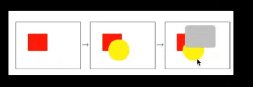
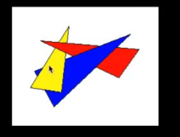
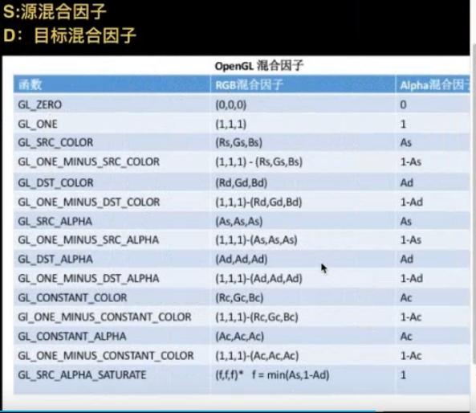

## OpenGL ES总结，以及使用技巧

纹理显示

- 加载图片  解码（CPU）  
- 确认显示  将其转换为位图
- 将数据交给GPU
- GPU得到位置和纹理

uiview和calayer关系

GPU和CPU
GPU：是并发的计算单元，可以实现并发计算，CPU是串行单元，实现资源的调度
GPU主要是计算工作，但是GPU不可以代替CPU，如果仅仅是没有联系的任务可以，比如说每个像素点。

管线相当于一个流水线，这个流水线是按照一定顺序执行的。

固定管线就是直接的调用API
但是这样是不灵活的，那么就有顶点着色器和片源着色器。
使用语言GLSL语言，

滤镜实现原理
- 获取到颜色值
- 计算出显示的颜色值
- 将颜色值传递给片段着色器

视频渲染的处理，也是通过OpenGLES来实现的

隐藏面消除问题
- 在渲染的过程中，不应该让看到的，却被看到了，没有过早的丢弃

处理方法
1. 油画法：就是绘制的顺序。   

   
- 缺点：有些场景无法完成

   

   浪费性能
   	
2. 背面裁剪
- 只绘制显示出来的部分
- 绘制顺序是逆时针的，就是正面

深度测试
有个深度缓存区，将最前面的绘制，缓存区中存储的也就是嘴上面的颜色。
如果是半透明的，那么就需要计算处颜色值。

