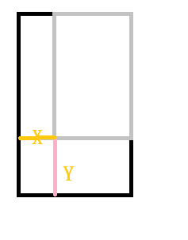

# 准备工作


## 工具安装

- jdk安装

- sdk安装

- IDE开发环境

- 一个手机

  推荐使用真机，它可以反映真实的性能和结果。

  

  虚拟机创建

  - Android SDK 执行SDK Manager.exe
  - Tools--> Manage AVDS 
  - new 

  ### GLSurfaceView

- 他是一个特殊的类初始化OpenGL，可以处理OpenGLES的基本操作，，渲染器可以在一个称为surface的里面完成。渲染是在一个“surface”的特定区域中完成的，也就是视口。

  

- 它可以轻松的管理声明周期。

- GLSurfaceView是没有动画和特效的。可以使用TextView，TextView可以通过GLSurfaceView转换.或者直接使用TextView。

  **回顾声明周期**

  create：创建  destroy：销毁   pause：暂停  resume:回来继续。

### 创建程序

1.创建一个项目

2.初始化OpenGL

- 使用一个特殊的类GKSurfaceView进行初始化，他会初始化比较基本的操作
- GLSurfaceView类也可以使用activity的生命周期方法。

```java
public class MainActivity extends Activity {
	@Override
	protected void onCreate(Bundle savedInstanceState) {
		super.onCreate(savedInstanceState);
		setContentView(R.layout.activity_main);
	}
}
```

在MainActivity中引入GLSurfaceView

```java
//引入一个gLSurfaceView
private GLSurfaceView gLSurfaceView;
//设置GLSurfaceView的状态
private boolean renderSet = false;	
```

我们去掉本身的setContentView，初始化GLSurfaceView。

下来需要在生命周期中初始化GLSurfaceView对象。

```
glSurfaceView = new GLSurfaceView(this);
```


下来为了可以使用GLSurfaceView，或者是否支持，进行判断，是否支持使用GLSurfaceView，并设置它使用的版本号。

- 首先获得activityManager通过service获得。
- 得到相关的配置信息。
- 判断GLES的版本是否大于2.
- 然后设置使用的版本【这个版本可以在配置中设置】
- 就可以使用渲染器进行渲染了。

```java
final ActivityManager activityManager = (ActivityManager)getSystemService(Context.ACTIVITY_SERVICE);
		final ConfigurationInfo configurationInfo = activityManager.getDeviceConfigurationInfo();
		final boolean supportsEs2 = configurationInfo.reqGlEsVersion>=0x20000;
```

根据supportsEs2的返回值得出是否支持OpenGLEs,如果支持设置版本，这个可以在配置文件中设置。

```java
if(supportsEs2) {
	gLSurfaceView.setEGLContextClientVersion(2);
	renderSet=true;
}else {
	Toast.makeText(this, "不支持", Toast.LENGTH_LONG).show();
	return ;
}
```

并且设置OpenGlES标志位。

GLSurfaceView基本设置完毕，下来设置Renderer类，通过gLSurface.setRender新实例。通过标志参数可以在知道，renderer已经设置过了。下来如果发生改变，或者是启动，那么这个渲染器就会被调用。

```java
gLSurfaceView.setRenderer(new MyRenderer());
```

将GLsurfaceView设置到activity中去。

```java
setContentView(gLSurfaceView); 以上步骤已经将GL设置完毕，并且将渲染器也设置完成，下来讲GL输出到屏幕上。
```

2、我们需要设置生命周期，否则会出现崩溃或者程序无法运行。它才可以在后台继续渲染或者是正常停止。

```java
@Override
protected void onPause() {
	// TODO Auto-generated method stub
	super.onPause();
	gLSurfaceView.onPause();
}
@Override
protected void onResume() {
	// TODO Auto-generated method stub
	super.onResume();
	gLSurfaceView.onResume();
}
```

上面代码可以正常执行，主要因为是它也可以支持声明周期的缘故。其实在这里我们为了保险起见，我们可以进行判断，判断之后在执行声明周期操作。

----

#### 创建Renderer

创建一个渲染器，渲染器的创建有三个方法。

```
- 绘制时
- 一定会绘制  即使是空屏幕
- 因为缓存区会被交换，并显示  如果没有数据显示。那么将会出现闪锁
- 这个就是每次都会执行，每画一阵就会执行一次。
@Override
public void onDrawFrame(GL10 arg0) {
	// TODO Auto-generated method stub
}
- 屏幕尺寸发生变化的时候   横竖屏切换
@Override
public void onSurfaceChanged(GL10 arg0, int arg1, int arg2) {
	// TODO Auto-generated method stub
}
- 创建一定会执行  
- 设备唤醒，或者其他的activity跳转过来的时候，可能会执行，执行声明周期的时候会执行。
- 被调用多次
@Override
public void onSurfaceCreated(GL10 arg0, EGLConfig arg1) {
	// TODO Auto-generated method stub
}
```

方法使用：

设置清空屏幕的颜色

```java
public void onSurfaceCreated(GL10 arg0, EGLConfig arg1) {
	// TODO Auto-generated method stub
	glClearColor(1.0f,1.0f,1.0f,1.0f);
}
```

设置窗口的大小    视口，也就是每次显示的时候显示窗口的大小。

```java
@Override
public void onSurfaceChanged(GL10 arg0, int width, int height) {
	// TODO Auto-generated method stub
	glViewport(0,0,width,height);
}
```

将屏幕清空，并将之前的颜色填充进来。

```
	@Override
	public void onDrawFrame(GL10 arg0) {
		// TODO Auto-generated method stub
		glClear(GL_COLOR_BUFFER_BIT);
	}

```

GLSurfaceView是一个线程来渲染的，在主线程中只做一个调用，默认会以刷新频率进行刷新不断渲染。

上面主要介绍了GLSurfaceView在java中连接java程序和OpenGLes的使用，GLSurfaceView设置渲染器，通过渲染器进行页面属性的设置。


# 错误方法

​	在顶点和片段着色器中，向GPU着色程序或者片段着色器，由于在开发者色器脚本文件中国的代码，没有一个实时地编译个运行的差错，所以写一个检查方法。

-----------

做了什么？？

1.安装环境

2.为后面做准备，创建一个简单的案例

3.渲染的基本步骤。