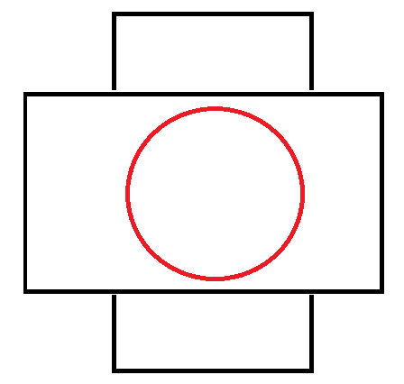
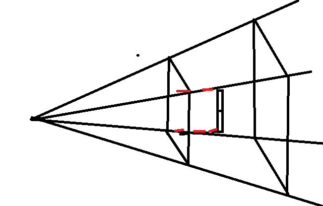

# 第五章 调整屏幕宽高比

​	我们在上面的是在竖屏变为横屏的时候，尺寸就会发生变化，这个有两种方式，一种是不让屏幕发生变化，在Activity中指定屏幕的方向，还有一种是自己让屏幕进行适配。

​	宽高问题：在横屏和竖屏之间切换会使得屏幕的图像发生变化，处理方式就是通过矩阵。我们需要使用宽高比，如果是一个正方形的屏幕就不会出现这样的问题。

-------

​	我的理解：通过宽高的比例，进行模拟出一个正方形，也就是归一化，竖屏的时候，将高度设置为-1,1，将宽度设置为-1.78 1.78.

​	

## 使用宽高比

​	需要调整坐标空间，以使得它把屏幕的形状考虑在内，在一个较小的范围内，屏幕尺寸的比例调整在一个大的范围。

​	长1280，宽720，我们可以将宽度范围限定在[-1,1],并将高度调整为[-1280/720].将高设置为[-1.78,1.78]，高度为[-1,1].

## 虚拟坐标

​	调整坐标空间，以便我们把屏幕方向考虑进去，我们不直接在归一化坐标里工作，而是在一个虚拟的坐标里面工作，并且找到的虚拟化坐标可以抓换为归一化坐标。以使得在每个方向上都是正确的。

​	这样叫做正交投影，，无论远近都是相同的，这种是俯瞰，我们还可以在侧看，叫做等轴投影，特殊的正交。

​	投影有正交投影和透视投影：

 - 正交投影是在一个大的正方体里面，每个面看到的都是相同的，

- 如果是透视投影，会产生远小近大的效果。

  

## 虚拟化坐标到归一化坐标

​	我们使用正交投影吧虚拟化坐标变为归一化坐标，实际上就是定义三维世界的一部分，将某一个视角的东西显示出来，区域外的都会被裁剪掉。

​	跳转屏幕的宽高比的原理：因为显示是独立于实际像素的，所以为了横屏和竖屏有相同的效果，那么就需要将他们的宽高比重新的排列，让他们始终保持一个比例。

-------

总结就是一句话：

​	使用矩阵相乘的方式将点的坐标进行变换，修改顶点的位置变换，在代码中，获取矩阵，传递数据给矩阵，创建一个数组，数组担任写入数组参数的作用。