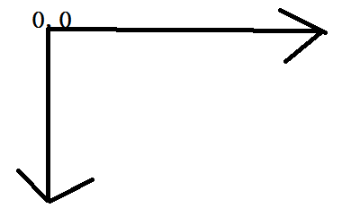

# 使用纹理增加细节

​	我们为了绘制出更加精致的细节，那么就需要使用纹理， 纹理是一个头像或者照片，他们被加载进Open GL中。

​	我的理解：纹理就是画出一个图形，为了有一个更好的、更加细致的细节，我们使用纹理，



​	比如一个游戏也就是基本的点、直线、三角形。但是可以加入一些细节，构建更好的三维场景。我们使用纹理，然后就可以使用多个着色器的程序，，我们使用代码来灵活 的使用这些变化。

​	**本章计划**

​	我们以纹理开始，然后撰写把纹理加载进OpenGL中的代码。

​	学习如何显示一个纹理，调整代码，使其支持多个着色器。

​	不同的纹理过滤模式以及他们的应用场景

### 理解纹理

​	纹理可以用来表示图像、照片、甚至有一个数学算法生成的分形数据，，每一个二维纹理都是通过许多小的纹理组成的，他是小块的数据，类似于片段和像素。最简单的就是从一个图像中加载数据。

​	并且将纹理图形放入到res/drawable-nodpi,每个纹理都有其坐标空间，范围是（0,0）到（1,1）,一个叫s，一个叫T,在使用一个纹理的时候我们需要为每个顶点都指定一组ST纹理坐标，以便OpenGL知道需要用哪个纹理的那个部分画到每个三角形上，我们使用坐标将其使用到需要显示的坐标上，默认是向下，y随着图像的向下移动而增加， 在使用的过程中，纹理不必 是正方形，他必须是2的倍数，最大值为204

​	纹理的大小和图像的像素大小是一样的，他们之间也是一一对应的。

​	案例：将一个图形加载到桌子上，每个纹理都有自己的坐标空间，


###  案例

-  将纹理加载OpenGL

  将一个图片加载进OpenGL的纹理中，我们还是创建一个工具类。返回出纹理的id，在这个里面，所有的东西都是返回一个ID.

```
public static int loadTexture(Context context ,int resourceId){
    首先创建一个纹理
    glCenTextures(1,textObjectIds,0);
    if(textObjectIds==0){
    	return 0；    
    }
}
```

- Androd的API读取图像文件的数据，openGL不尅直接读取png等文件的数据，因为他们压缩的，使用Android内部的解码器。

  ```
  创建一个实例，
  final BitmapFactory.Options options = new BitmapFactory.Options();
  想要一个原始数据，而不是压缩。
  option.inScaled = false ;
  开始解码
  BitmapFactory.decodeResource(context.getResources(),resourceId,option);
  成功就有参数，未成功就是null
  ```

- 让openGlEs知道使用哪一个纹理。

  ```
  告诉OpenGL这个是一个二维的纹理进行处理
  glBindTexture(GL_TEXTURE_2D,textureObjectIds[0]);
  ```

- 文本过滤

#### 理解纹理过滤

​	当纹理被增加或者缩小的时候，需要使用纹理过滤明确会发生什么。将多个纹理元素，变为一个，那就是缩小了，如果一个变为多个，那就是扩大。我们需要配置一个纹理过滤器。

​	两种基本的过滤器：最近邻过滤器和双线性过滤器。

-  最近邻过滤器

  这个方式为每个片段选择最近的一个纹理元素，如果缩小就没有足够的纹理来绘制就会出现丢失，如果是放大，那么就会使用最近的纹理元素。

- 双线性过滤器

  双线性的差值平滑像素之间的过度，而不是为每一个片段使用最近的纹理元素，OPenGLES会使用最近的4个纹理做插值，

- 设置默认的纹理过滤参数

  ```
  glTexParameteri(GL_TEXTURE_2D，GL_TEXTURE_MIN_FILTER，GL_LINEAR_MIPMAP_LINEAR);
  glTexParameteri(GL_TEXTURE_2D，GL_TEXTURE_MAC_FILTER,GL_LINEAR)
  设置，这个2D的，缩小使用三线性，放大使用GL_LINEAR。
  ```

  ````
  纹理过滤模式
  GL_NEAREST					最近过滤
  GL_NEAREST_MIPMAP_NEAREST 	  使用MIP贴图
  GL_NEAREST_MIPMAP_LINEAR 	  使用MIP贴图级别之间插值的最接近邻过滤
  GL_LINEAR					双线性
  GL_LINEAR_MIPMAP_NEAREST 	  使用MIP贴图的双线性
  GL_LINEAR_MIPMAP_LINEAR 	  三线性
  
  每种情况下使用纹理过滤
  GL_NEAREST
  GL_NEAREST_MIPMAP_NEAREST
  GL_NEAREST_MIPMAP_LINEAR
  GL_LINEAR					缩小
  GL_LINEAR_MIPMAP_NEAREST
  GL_LINEAR_MIPMAP_LINEAR
  ---------
  GL_LINEAR					放大
  GL_NEAREST
  ````

  - 将纹理加载到OpenGL中

    ```
    textImage2D（GL_TEXTURE_2D,0,bitmap,0）；
    ```

    告诉OpenGL读入位图，并将其读入纹理中去。这个时候，位图已经被加载进来了，现在就可以将位图删除掉了。

    ```scala
    bitmap.recycle();
    ```

  - 生成位图

    我们告诉他们生成什么级别的，

    ```
    glGenerateMipmap(GL_TEXTURE_2D)
    ```

    ## 创建新的着色器集合

    ​	将纹理绘制之前，我们不得不重新创建一个顶点着色器和片段着色器。

    - 顶点着色器

    - 创建一个片段着色器


纹理使用：

- 创建纹理，加载一个图片
- 创建着色器，使用点着色器传递到片段着色器，传递给gl_FragColor,还有纹理坐标
- 首先将活动的纹理设置为0，
- 将纹理与这个单元绑定
- 将选定的纹理单元传递给片段着色器


- 创建纹理
- 着色器编写
- 编译等操作
- 设置值 【其实真没啥区别，仅仅是给着色器赋值】


我目前对纹理的理解，纹理就是将一个图片加载进着色器，并且纹理的大小为1，基本思想就是首先为图元加载每个纹理的位置，然后通过纹理坐标在纹理图中选中一个区域，将选中的区域显示

**纹理拉伸**

- 重复拉伸，纹理无论如何都是1,1的大小，如果设置为对于1的数字，就会显示多个，前提是使用重复。

- GLES20.glTexParameterf(GLES20.GL_TEXTURE_2D,GLES20.GL_TEXTURE_WRAP_S,GLES20.GL_REPEAT);

  GLES20.glTexParameterf(GLES20.GL_TEXTURE_2D,GLES20.GL_TEXTURE_WRAP_T,GLES20.GL_REPEAT);


  **纹理拉伸**

  拉伸是边缘拉伸，不是1看做1.

  GLES20.glTexParameterf(GLES20.GL_TEXTURE_2D,GLES20.GL_TEXTURE_WRAP_S,GLES20.GL_CLAMP_TO_EDGE);

  GLES20.glTexParameterf(GLES20.GL_TEXTURE_2D,GLES20.GL_TEXTURE_WRAP_T,GLES20.GL_CLAMP_TO_EDGE);

  **纹理采样**

  - 采样方式有最近点采样

    在速度上是最快的，他在采样是，获取附进的像素，作为本次像素点。

    缺点就是有锯齿。

    GLES20.glTexParameterf(GLES20.GL_TEXTURE_2D,GLES20.TEXTURE_MIN_FIFTER,GLES20.GL_NEAREST);

    GLES20.glTexParameterf(GLES20.GL_TEXTURE_2D,GLES20.TEXTURE_MAX_FIFTER,GLES20.GL_NEAREST);

    不可以满足高视觉效果。

  - 线性采样

    

  - MIN和MAX采样 


纹理就是对图像进行操作，比如将图片贴到一个tux


​	我的理解，顶点着色器和片段通过程序连接起来，就会产生关系，以后每次就会将顶点着色器传输给片段着色器。光栅化之后，将每一小块的数据和图像的数据一一对应。

