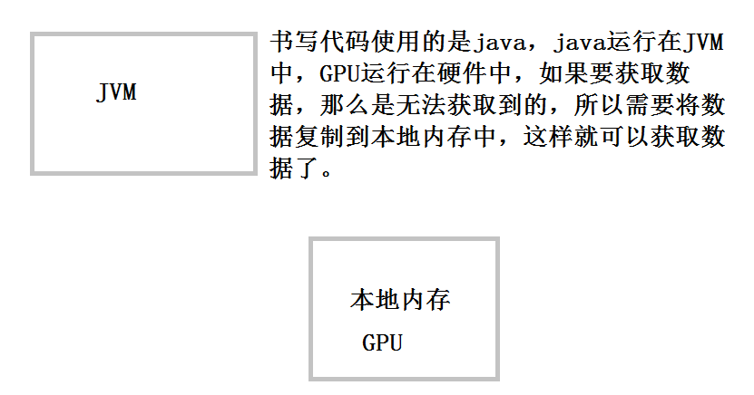
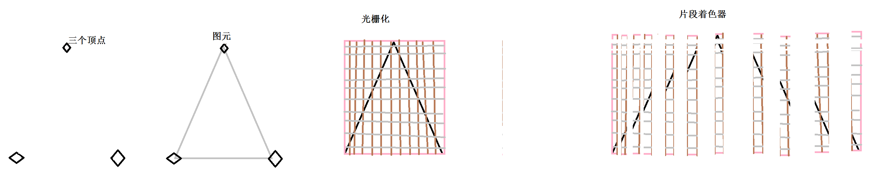

# 顶点和着色器

​	我们使用独立的点集合构建物体，都是使用顶点，之后会使用着色绘制图性，以及告诉OpenGLES如何绘制的小程序。

​	片段着色器，即每个小的像素的渲染，

​	顶点着色器确定所绘制图像的位置【空间位置】，举个例子就是需要画出一个桌子，我们需要知道这些点的位置。

​	顶点汇聚成一个一个的图形，使用着色器绘制。

顶点着色器--->图元就是将图像的位置基本“画出来”然后将其光栅化，每个点每个点的进行显示出来。在这个时候设置颜色的亮度、颜色等操作。在顶点着色器阶段仅仅是确定位置。

#### 桌子的绘制

--------------

​	按照OpenGLES可以认识的形式创建，以下步骤

- 介绍顶点

  一个顶点就是一个集合对象的拐点，这个点有很多的附加属性，最重要的就是位置，它代表了这个顶点在空间位置中定位。

- 游戏中的桌子

  一个桌子有4个点，4个拐点，也就是有四个顶点，每个顶点在每个维度上都有一个坐标。

- 在代码中定义顶点

  我们使用数组存储这些点，二维中必须有x和y轴的坐标。

  每个顶点的个数     每个点的坐标

  ```
  每个顶点分量的个数
  private static final int POSITION_COMPONENT_COUNT = 2;
  public MyRenderer() {
  	// TODO Auto-generated constructor stub
  	float []tableVertices = {
  		0f,0f,
  		0f,14f,
  		9f,0f,
  		9f,14f
   };
  }
  ```

  十进制表示每个顶点所在的位置。

- 点、直接、三角形

  在OpenGLES中仅仅支持点、直线、三角形。我们都是同点，并告诉他们如何连接起来。通过三角形进行组成其他更加复杂的图像。顶点顺时针和逆时针表示图像的正反。

  ```
  /*更新代码如下*/
  0f,0f,
  9f,14f,
  0f,14f,
  0f,0f,
  9f,0f,
  9f,14f
  ```

  它的顺序是逆序排列，因为正面是逆序，反面是顺序。

- 增加中间的线和点

  ```
  0f,7f,
  9f,7f,
  4.5f,2f,
  4.5f ,12f
  ```

  顶点的数据是浮点型，不是双精度的。我们使用十进制来表示这些存储的位置，这些数组通常就是顶点的属性。

  我们无论什么时候需要使用都需要将他们使用点、直接、三角形把它组合出来。

  ##### 使得数据可以被OpenGLES存取

  -----------------

  ​	顶点定义完成了，但是代码和顶点，使用了不同的代码，

  - Java代码运行在虚拟机上，它是不可以访问本地的数据的，除了特殊的命令。并且虚拟机会检测无用的变量等，进行垃圾回收掉的。

  - OpenGLES运行在本地硬件中，没有虚拟机，也没有垃圾回收等操作。那么画图的时候，GPU如何获取到点的信息。

    **处理方法：**

    - 二者需要通信就需要使用JNI,这样就可以进行通信，

    - 通过改变内存分配方式，使用java的特殊类，在本地开辟空间，并将内存中的数据复制到这片内存，不受垃圾回收机制的控制

      

  内存从java堆复制到本地堆，使用java中特殊的类在本地中分配一块内存，并将数据复制到本地中，本地内存可以被本地环境变量存取，而不受垃圾回收机子管控。

  - 代码如下

    ```
    //顶点的个数
    private static final int BYTES_PER_FLOAT = 4;
    //复制到本地存储的位置
    private final FloatBuffer vertexData;
    ```

    ByteBuffer.allocateDirect(BYTES_PER_FLOAT*tableVertices.length).order(ByteOrder.nativeOrder())创建一个本地的内存。将数据变为本地的方式。

    .asFloatBuffer()：将数据变为FloatBuffer，因为我们不愿去操作一个单字节，所以输出为Float的形式。

    vertexData.put(tableVertices)：将数据从虚拟机复制到本地内存区。当使用完毕之后，就会释放本块内存。


    **总结：**在本地开辟空间，将数据复制进去，以Float的方式输出。开辟空间的大小是由数组的长度*每个数组的子节点组成的大。
    
    ##### 引入管道
    
    ----------
    
    	将顶点坐标从虚拟机复制到本地内存中，需要将它们传入到管道。就需要使用着色器，着色器告诉图像处理单元，如何出理这些数据。
    
    	顶点着色器：每个顶点的最终位置，每个顶点都会执行一次，一旦位置确定了，就可以吧这些点的集合组装成点、直线、以及三角形。
    
    	片段着色1器：将每个点、三角形、直接形成最终的颜色，对于每个片段，都会执行一次。
    
    颜色形成后就会将其写入到缓冲区中，最终显示到屏幕上。

  - 创建一个顶点着色器

    创建位置：raw文件夹中。

  - 写如下内容

    ```
    //每个顶点都是一个属性，所以这里使用是Attribute
    //类型是vec4，代表4个坐标系x,y,z,w
    attribute vec4 a_Position;
    
    void main()
    {
    	gl_Position = a_Position;
    }
    ```

    每个顶点都会执行这个顶点着色器，在这个里面是有a_position来接收属性值，并将值给特殊变量gl_postion,attribute 就是设置属性值的。它的作用就是将前面设置的位置属性，设置到这个里面。gl_PositionJ就是最终的位置。

  ## 片段着色器

  - 光栅化技术

    屏幕上成千上万小的独立的部件组成，他们成为像素，光栅化就是吧点、直线和三角形分解成小分段，他们可以映射到屏幕上，构成一幅图像，

  - 片段着色器的作用就是每个片段使用的颜色是什么，基于图元的每个片段，都会调用一次

  ````
  定义了精度
  precision meduimp float;
  
  uniform vec4 u_color;
  
  void main()
  {
  	fl_FragColor = u_Color;
  }
  ````

  定义精度：

  ​	lowp、meduimp、highp分别是低精度、中等精度、高精度,在顶点中的精度是很高的使用了默认的高精度。

  片段着色器uniform vec4 u_color;使用了uniform，他会使得每一个顶点使用同一个值，除非我们去改变他



他负责每一块片段的颜色，颜色有四种颜色组成。


----------------------

总结:


· 将数据加入到本地内存中

· 创建着色器


