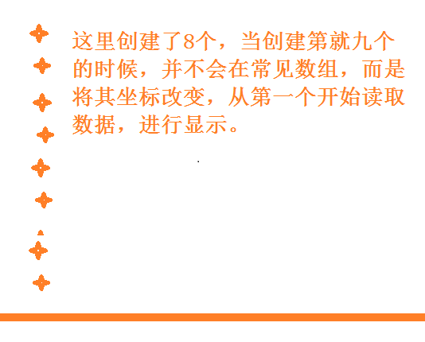
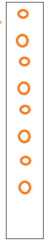

# 粒子

- 创建一个粒子着色器

  - 解决的问题

    他可以存储所以的粒子，如果大量创建，太浪费了，所以我们把粒子存储在一个固定大小的数组中。我们需要就需要将数组下标加1，然后接着执行，如果内存不足，那就结束，从头开始进行。我的理解就是创建一个循环利用的粒子。

    还需要一个绘制点，这个点可以是任意图像，并且每一个点都有唯一的一个颜色。

  - 着色器的创建，首先每个粒子有坐标，时间久了，就会运动的源，粒子的方向。

    ```
    着色器代码
    uniform mat4 u_Matrix;   变换矩阵
    uniform float u_Time;	当前时间
    
    attribute vec3 a_Position;  位置
    attribute vec3 a_Color;  颜色
    attribute vec3 a_DirectionVector;  方向
    attribute vec3 a_ParticleStartTime;  开始时间
    
    varying vec3 v_Color; 颜色
    varying float v_ElapsedTime; 运动的时间
    
    void main()
    {
        v_Color = a_Color;
        v_ElapsedTime = u_Time - a_ParticleStartTime;
        vec3 currentPosition = a_Position+(a_DirectionVector * v_ElapsedTime);
        gl_Postion = u_Matrix * vec4(currentPosition,1.0);
        gl_PointSize = 10.0;
    }
    ```

    一个点是有四个点的，但是为了防止和w发生混乱，那么就需要将3分量的向量表示位置和方向，当需要和u_Mathrix相乘的是才将其变为4维的。这样可以确保在求位置的时候，不至于和w搞混了。

    ```
    片段着色器
    precision mediump float；
    varying vec3 v_Color;
    varying float v_ElapsedTime;
    
    void main()
    {
        gl_FragColor = vec4(v_Color/v_ElapsedTime,1.0);
    }
    ```

    

  - 创建一个粒子系统

    创建出一个粒子，粒子的坐标，颜色，运行时间，方向。

    准备数据，放入缓存区，绑定参数，画图。

    我们创建一次将其放入到数组中，再次创建在放入数组中，当我们创建了大于数组大小的时候，我们就不会在去创建，而是将原来的顶点信息获取出来，进行循环。

  

  - 上面已经创建了粒子，下来我们就可以将粒子进行扩散，扩散我们需要制定他们的方向。开始的时候，向量是确定的，下来可以通过改变方向数据，进行显示。就会出现扩散效果。
  - 添加重力，我们已经创建粒子，并将粒子显示在屏幕上，下来为了可以更好的展现出逼真的效果，我们加入重力，也就是有下落的效果，之前，可以根据时间，粒子向上运动， 下来我们可以将粒子，随着时间的改变，Y轴分量加大，这样就将会出现下落现象。时间最大，下落的阻力最大，当阻力大于上运行的大小的时候，就会展现出下落
  - 

## 混合技术

​	使用累加混合技术混合粒子。我们需要一种粒子越多就越会越亮。我们可以执行下面的指令将其打开。

```
glEnable(GL_BLEND);
glBlendFunc(GL_ONE,GL_ONE);
```

混合技术是将缓冲中的数据和片源着色器的数据进行相加得到的值进行显示。

## 外形设置

实际中我们可以通过gl_PointCoord自定义外形。对于每一个订单，我们通过调用片段着色器，对于每个点来说，它的坐标是从0到1的，我们将坐标放在0.5,使用勾股定理，画出一个圆。

每个点，也是通过片源着色器一个个像素得到的，点的大下在着色器中设置。

## 点使用纹理绘制

将纹理绑定，改变每一个点的外观，

实现步骤：

​	- 先修改着色器，接收一个unit，得到位置，给位置绑定纹理

