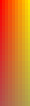

## 增加颜色和着色

- 任务：不是将所有的都显示同一种颜色，而是现实多种颜色，并且形成颜色的过度，举个例子，我们将一个线段，左边为红，右边为绿，线段颜色的变化是从左到右慢慢变化的。他们在中间的颜色是50%,对于三角形，他们是面积的逐渐变化。

- 我们需要达到的目标是桌子中间的颜色最亮，逐渐的编程其他颜色，这个时候需要引入三角扇。达到这样的要求，那么就需要使用四个三角形组成。中心点是0 0

- 三角扇：就是以一个中心顶点开始，使用相邻的两个顶点创建一个三角形，每个顶点就会创建一个三角形，围绕起始的中心按扇形展开，为了使得其闭合，所以最后一个点用该去重合。

- 平滑着色

  在属于uniform的过程中，使用的是单一的颜色绘制物体，我们只能画出三角形、直线和点，并且所有的物体都是以他们为基础创建的 ，如果我们创建多种颜色，那么我们可以使用多个颜色的三角形，，但是这种方式可行，但是太消耗资源了。可以使用在三角形三个角上使用不同的颜色，让他们在平面上混合即可。	 

  ​	平滑着色是在顶点之间完成的，这样在桌子中央使用，在中间比较明亮，其他地方比较昏暗。为了达到效果，我们可以使用四个三角形组成一个长方形。


## 更新顶点坐标变为三角扇

  ​	为了达到效果，我们可以更新坐标如下：

```
  		float []tableVertices = {
  				/*
  				 * 三角扇顶点
  				 * 
  				 * 00被公用，最后的-0.5变为一周，被重合
  				 * 为了可以表示颜色，这个时候在点坐标的最后加上颜色
  				 * */
  	               0f,    0f,   1f,   1f,   1f,         
  	               -0.5f, -0.5f, 0.7f, 0.7f, 0.7f,            
  	                0.5f, -0.5f, 0.7f, 0.7f, 0.7f,
  	                0.5f,  0.5f, 0.7f, 0.7f, 0.7f,
  	               -0.5f,  0.5f, 0.7f, 0.7f, 0.7f,
  	               -0.5f, -0.5f, 0.7f, 0.7f, 0.7f,
  
  	               // Line 1
  	               -0.5f, 0f, 1f, 0f, 0f,
  	                0.5f, 0f, 1f, 0f, 0f,
  
  	               // Mallets
  	               0f, -0.25f, 0f, 0f, 1f,
  	               0f,  0.25f, 1f, 0f, 0f
  		};
```

  前面两位代表的是坐标，最后三位代表的是颜色，这里使用的是6个点代表4个三角形，因为他们的点是公用的，我们还需要写出做后一个重合的点，依次来获得一个圆周。我们在画出桌子的时候，使用三角扇，如下：

```
  glDrawArrays(GL_TRIANGLE_FAN, 0, 6);
```

- 给着色器增加颜色属性，我们去掉顶点统一颜色的属性，使用varying动态的使用颜色。varying也可也以加入到片段着色器中，这样就可以计算混合之后的颜色
- 使用渲染器渲染，我们已经更新了一个颜色的属性，更新了顶点和片段，下来去掉之前的代码，使用新的方式来渲染图像。首先就是a_color属性，颜色的个数，跳转的个数。我们使用一个顶点，在是另一个顶点，我们就需要跳转到另一个顶点。
- 获取新的属性，更新属性的点，让设置颜色，我们让其跳转到指定的位置进行读取属性信息。
- 将着色器和颜色关联起来，并且在读取颜色信息的时候跳转的字节数


总结：

​	颜色如果是一个那么就不需要一次 一次的传递uniform就足够了，下来如果想要颜色发生变化，那么就需要动态的传递颜色参数，使得每一个顶点有不同的颜色参数。将数组和颜色放在一个数组中的，其实为了好理解完全没有这个必要，可以将其分开，放在一起，仅仅加入一个跳转的参数即可。其实也就是将属性获取到之后，然后将属性的值与数组中的进行邦定就可以了，就会将数据的值显示出来。


varying就是一个渐变的过程



比如红-->蓝   开始红为100%  蓝为0%  下来就会反过来。它的渐变是 : （当前距离s1/s红蓝）*将要计算的颜色。

