[TOC]


# Open GL核心代码

## 项目基本框架

## 画图代码

**基本步骤为：shader分析，设计，顶点分析，创建，画图**

1. 一个三角形：

   分析：一个三角形有三个点，点的参数由程序传入。【shader中有接收顶点代码，将其传输给gl_position】

   片段着色器，定义全局精度，设置颜色。

   - 订单着色器

   ```c++
   attribute vec3 aPosition;  //顶点位置
   void main()     
   {                            		
      gl_Position = aPosition; //根据总变换矩阵计算此次绘制此顶点位置
   }       
   ```

   - 片段着色器

     ```c++
     precision mediump float;
     uniform  vec4 vColor;
     
     void main()                         
     {                       
        gl_FragColor = vColor;//给此片元颜色值
     }
     ```

     完成了着色器的操作，下来定义顶点，创建变量和位置。

     订单可以自己设置0~1之间。

     ```c++
     final float UNIT_SIZE=0.2f;
     float vertices[]=new float[]
     {
     	-4*UNIT_SIZE,0,
      	0,0,-4*UNIT_SIZE,
      	0,4*UNIT_SIZE,0,0
      };
     ```

     将其放入本地中

     ```
     ByteBuffer vbb = ByteBuffer.allocateDirect(vertices.length*4);
     vbb.order(ByteOrder.nativeOrder());
     mVertexBuffer = vbb.asFloatBuffer();
     mVertexBuffer.put(vertices);
     mVertexBuffer.position(0);
     ```

     获取着色器位置，设置参数

     ```
     maPositionHandle = GLES20.glGetAttribLocation(mProgram, "aPosition");
     //获取程序中顶点颜色属性引用id  
     maColorHandle= GLES20.glGetUniformLocation(program, name)
     ```

     画图

     ```
             GLES20.glVertexAttribPointer(maPositionHandle,3, 
              		GLES20.GL_FLOAT, 
              		false,
                     3*4,   
                     mVertexBuffer
              );
              //允许顶点位置数据数组
              GLES20.glEnableVertexAttribArray(maPositionHandle);  
              glUniform4i(location, x, y, z, w);
     ```

     画图

     ```
       GLES20.glDrawArrays(GLES20.GL_TRIANGLES, 0, vCount); 
     ```

     上面几乎是一个图像的最少思路。

   ## 变色

   

   上面仅仅完成了只有一个颜色构成的图像，下俩我们创建一个变色的图像。

   首先将着色器增加一个颜色的变量，varying vec3 v_color;传输给片段的变量varying vec3 a_color.

   顶点着色器

   ```
   attribute vec3 aPosition;  //顶点位置
   attribute vec4 aColor;    //顶点颜色
   varying  vec4 vColor;  //用于传递给片元着色器的变量
   
   void main()     
   {                            		
      gl_Position = aPosition; //根据总变换矩阵计算此次绘制此顶点位置
      vColor = aColor;//将接收的颜色传递给片元着色器 
   }             
   ```

   片段着色器

   ```
   precision mediump float;
   varying  vec4 vColor; //接收从顶点着色器过来的参数
   
   void main()                         
   {                       
      gl_FragColor = vColor;//给此片元颜色值
   }
   ```

   点的坐标不发生变化，但是需要增加一个颜色的数据

   ```
           float colors[]=new float[]
           {
           		1,1,1,0,
           		0,0,1,0,
           		0,1,0,0
           };
           
           ByteBuffer cbb = ByteBuffer.allocateDirect(colors.length*4);
           cbb.order(ByteOrder.nativeOrder());
           mColorBuffer = cbb.asFloatBuffer();
           mColorBuffer.put(colors);
           mColorBuffer.position(0);
   ```

   下来获取到位置信息，设置参数

   ```c++
   maColorHandle= GLES20.glGetAttribLocation(mProgram, "aColor");
   
            GLES20.glVertexAttribPointer  
            (
           		maColorHandle,
            		4,
            		GLES20.GL_FLOAT,
            		false,
                   4*4,
                   mColorBuffer
            );
            //允许顶点位置数据数组
            GLES20.glEnableVertexAttribArray(maColorHandle);  
   ```

   基本需要改变的已经结束 ，三角形有了，颜色可以自己设置。

2. 加入动作，手动可以改变坐标，进行旋转。

   着色器需要使用mat矩阵，同坐标相乘得到最终的位置坐标。

   ```
   uniform mat4 uMVPMatrix; //总变换矩阵
   attribute vec3 aPosition;  //顶点位置
   attribute vec4 aColor;    //顶点颜色
   varying  vec4 vColor;  //用于传递给片元着色器的变量
   
   void main()     
   {                            		
      gl_Position = uMVPMatrix * vec4(aPosition,1); //根据总变换矩阵计算此次绘制此顶点位置
      vColor = aColor;//将接收的颜色传递给片元着色器 
   }                 
   ```

   ## 图形旋转、平移

   

   既然使用了矩阵，那么就先引入相机位置和投影

   ```
   //调用此方法计算产生透视投影矩阵
   Matrix.frustumM(Triangle.mProjMatrix, 0, -ratio, ratio, -1, 1, 1, 10);
   //调用此方法产生摄像机9参数位置矩阵
   Matrix.setLookAtM(Triangle.mVMatrix, 0, 0,0,3,0f,0f,0f,0f,1.0f,0.0f);
   ```

   使用了透视投影和相机位置，设置结束之后，我们需要将这个数组传递给着色器，让它确定最终点的位置，

   ```
   这里还要加一个获取位置信息。
   GLES20.glUniformMatrix4fv(muMVPMatrixHandle, 1, false, Triangle.getFianlMatrix(mMMatrix), 0);
   ```

3. 旋转物体， 物体旋转无非就是通过矩阵变换罢了，所以也通过矩阵和他们进行相乘，之前是为了得到一个位置使用一个相机和投影矩阵最后形成一个总的矩阵，最后和坐标点相乘得到，如今可以将旋转矩阵和相机矩阵相乘，将最终的矩阵和点相乘得到最后的坐标位置。

   1. 物体平移

      平移无非就是x+XX，y+YY,z+ZZ,那么这个可以通过矩阵简单的实现。

      > 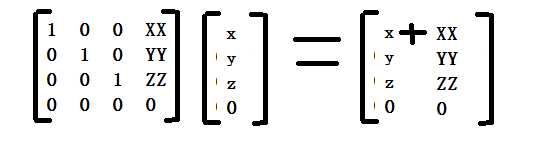
      >
      > 图片有个问题，一个矩阵的最后一个值变为1

   2. 现在创建一个数组

      ```
      初始化
      Matrix.setRotateM(mMMatrix,0,0,0,1,0);
      进行设置平移   参数说明数组，偏移，x,y,z
      Matrix.translateM(mMMatrix,0,0,0,1);
      ```

      数组创建结束，上面说了最终是和点相乘，那么我们两个坐标进行相乘既可。

      ```
      Matrix.multiplyMM(mMVPMatrix, 0, mVMatrix, 0, spec, 0);
      Matrix.multiplyMM(mMVPMatrix, 0, mProjMatrix, 0, mMVPMatrix, 0);        
      ```

      解释一下，总结一下，现在有一个摄像机，有一个投影，有一个旋转，上面代码的目的就是将这几个都相乘，得到最后的矩阵。

      得到最的矩阵，将它传递给坐标位置。

      --------

      旋转

      ```
        Matrix.rotateM(mMMatrix,0,xAngle,1,0,0);
      ```

      实现原理：

      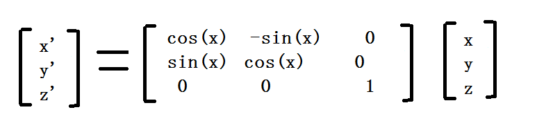

      --------

      缩放

      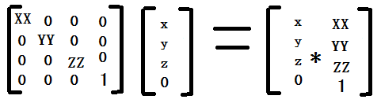

      ```
         public static void scale(float x, float y,float z) {
          	Matrix.scaleM(currMatrix,0, x, y, z);
          }
      ```

      

4. 正交投影

   现在无需改变着色器，矩阵，我有，顶点，我有，颜色吧，我也有

   - 正交变换，物体不会随着举例改变

     也仅仅是设置一个数组即可。

     ```
     Matrix.orthoM(mProjMatrix, 0, left, right, bottom, top, near, far);
     ```

5. 透视投影

   - 变换的结果，随着举例改变

     ```
     Matrix.frustumM(mProjMatrix, 0, left, right, bottom, top, near, far);
     ```

   在这个里面的far和near并没有具体的含义，主要是为了节约渲染而设定的 。 

   -------

   有时候为了可以将某一个时刻的物体保留下来，可以先将物体进行画出，然后保存状态（时间就是保存在画图时刻，矩阵的形态），将矩阵移动之后在次的画出图像。

   ```
       public static void pushMatrix()//保护变换矩阵
       {
       	stackTop++;
       	for(int i=0;i<16;i++)
       	{
       		mStack[stackTop][i]=currMatrix[i];
       	}
       }
       
       public static void popMatrix()//恢复变换矩阵
       {
       	for(int i=0;i<16;i++)
       	{
       		currMatrix[i]=mStack[stackTop][i];
       	}
       	stackTop--;
       }
   ```

   

6. #### 对于变换的解释下

   变换的实质：

   ​	可以理解为首先通过矩阵对坐标系进行变换，然后根据传入的原始坐标在最终结果未知进行绘制。绘制的最终结果是将最终的矩阵结果得到最终的位置结果。

   ​	物体空间：就是原始的坐标系空间，比如一个几何题的中心。

   ​	世界空间：加入说在[3,4,2]位置放置了一个什么玩意，这个就是世界空间。

   ​	摄像机：观察的点

   ​	裁剪空间：就是在显示物题的范围内

   ​	标准空间：透视触发之后的就是标准空间

   ​	实际空间，就是屏幕显示的空间。

   ​             总变换矩阵           摄像机矩阵     投影矩阵       透视矩阵      深度 和坐标转换

   物体空间-------->世界空间--->摄像机空间---> 裁剪空间---->标准空间--->实际空间

   一个几何体                                                               


1. 有时候画图的时候，为了节约顶点个数，可以使用索引。

2. 设置合理的视角

3. 卷面和背面裁剪

   在openGL默认逆时针是正，顺时针是否，到那时这个可以进行设置的，问题来了，什么背面裁剪

4. 


## 光照

1. 光照的计算是很麻烦的，如果模型太难，就会造成计算过大，我们可以使用光照模型对其进行简化，光照包括：环境光、散射光、镜面光

   1. 环境光就是全方位的光，并且均匀，环境光的特点就是依赖于位置，没有方向性。

   2. 着色器修改

      ```
      uniform mat4 uMVPMatrix; //总变换矩阵
      attribute vec3 aPosition;  //顶点位置
      varying vec3 vPosition;//用于传递给片元着色器的顶点位置
      varying vec4 vAmbient;//用于传递给片元着色器的环境光分量
      void main()     
      {         
         //根据总变换矩阵计算此次绘制此顶点位置         		
         gl_Position = uMVPMatrix * vec4(aPosition,1); 
         //将顶点的位置传给片元着色器
         vPosition = aPosition;   
         //将的环境光分量传给片元着色器
         vAmbient = vec4(0.15,0.15,0.15,1.0);
      }      
      ```

      上面原本是一个球体，我们为了光照，这里将数据写入代码中传递给片段着色器。

      ```
      precision mediump float;
      uniform float uR;
      varying vec2 mcLongLat;//接收从顶点着色器过来的参数
      varying vec3 vPosition; //接收从顶点着色器过来的顶点位置
      varying vec4 vAmbient;//接收从顶点着色器过来的环境光分量
      void main()                         
      {
         vec3 color;
         float n = 8.0;//一个坐标分量分的总份数
         float span = 2.0*uR/n;//每一份的长度
         //每一维在立方体内的行列数
         int i = int((vPosition.x + uR)/span);
         int j = int((vPosition.y + uR)/span);
         int k = int((vPosition.z + uR)/span);
         //计算当点应位于白色块还是黑色块中
         int whichColor = int(mod(float(i+j+k),2.0));
         if(whichColor == 1) {//奇数时为红色
         		color = vec3(0.678,0.231,0.129);//红色
         }
         else {//偶数时为白色
         		color = vec3(1.0,1.0,1.0);//白色
         }
         //最终颜色
         vec4 finalColor=vec4(color,0);
         //给此片元颜色值
         gl_FragColor=finalColor*vAmbient;
      }     
      ```

      核心代码就一行，将传递的光照和颜色相乘。

      由上面可以得出，我们在绘制的时候只需要将环境的光和颜色相乘即可，那么也就是说，我们在使用的过程中，只需要表示出环境光、散射光、镜面光即可。当然了上面是直接将数据写入在shader中，我们也可以将数据从外界传入，传入数据又和前面的方式一样传入即可。

      

      为了方便理解，大可不必那么麻烦，不就是成一个数据吗，那就使用如果方式，直接修改片段着色器，

      ```
      gl_FragColor=vec4(color,0)*vec4(0.77,0.15,0.15,1.0);
      ```

      ------------

      - 环境光

        从四面八方射向物体，它仅仅是光射的一个案例，效果差，没有一个很好的层次。

        直接将光传输给颜色就可以了。

      - 散射光

        物体从四面八方将数据传输反射的效果。代表的是显示升高中粗糙物体表面光照折射，并向四周均匀。散射虽说各个方法的光照均匀，但是散射光和入射强度以及入射的角度密切相关，当位置改变时，效果也会有很大的改变。

        散射光的结果是 = 材质的反射系数 x 散射光的强度 x max（cos(入射角)，0），在开发中分为两步

        散射光最终强度 = 散射光强度 X max(cos(入射角)，0);

        散射光照射结果 = 材质反射系数 X 散射光的最终强度。

        唯一的区别就是多了一个 max(cos(入射角)，0);，入射角越大散射越弱。

        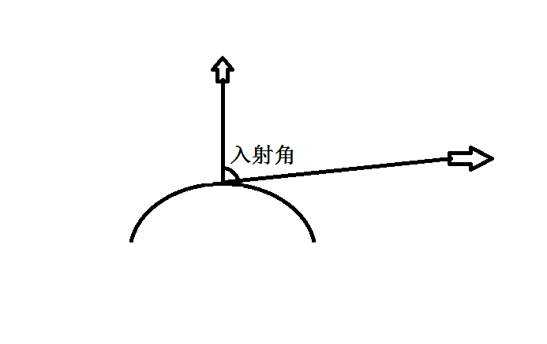

      - 实现，首先我们需要知道光源在哪里，我们将位置放在画图的地方，然后将他们放入到缓存区汇中

        ----

        可以将数据随时放入缓存区，并不是只有在创建的时候。

      - 改变光的位置

        ```
        public static void setLightLocation(float x,float y,float z)
        {
        llbbL.clear();
        
        lightLocation[0]=x;
        lightLocation[1]=y;
        lightLocation[2]=z;
        
        llbbL.order(ByteOrder.nativeOrder());//设置字节顺序
        lightPositionFB=llbbL.asFloatBuffer();
        lightPositionFB.put(lightLocation);
        lightPositionFB.position(0);
        }
        ```

        我们需要一个法向量，将数据存储，法向量通过坐标点进行计算得到。

        ```
        //创建绘制顶点法向量缓冲
        ByteBuffer nbb = ByteBuffer.allocateDirect(vertices.length*4);
        nbb.order(ByteOrder.nativeOrder());//设置字节顺序
        mNormalBuffer = nbb.asFloatBuffer();//转换为float型缓冲
        mNormalBuffer.put(vertices);//向缓冲区中放入顶点坐标数据
        mNormalBuffer.position(0);//设置缓冲区起始位置     
        ```

      - 设置参数

        ```
        //将光源位置传入着色器程序   
        GLES20.glUniform3fv(maLightLocationHandle, 1, MatrixState.lightPositionFB);
        // 将顶点位置数据传入渲染管线
        GLES20.glVertexAttribPointer(maPositionHandle, 3, GLES20.GL_FLOAT,
        false, 3 * 4, mVertexBuffer);
        //将顶点法向量数据传入渲染管线
        GLES20.glVertexAttribPointer(maNormalHandle, 3, GLES20.GL_FLOAT, false,
        3 * 4, mNormalBuffer);
        // 启用顶点位置数据
        GLES20.glEnableVertexAttribArray(maPositionHandle); 
        GLES20.glEnableVertexAttribArray(maNormalHandle);// 启用顶点法向量数据
        // 绘制球		
        GLES20.glDrawArrays(GLES20.GL_TRIANGLES, 0, vCount);
        ```

        

      - 附送，改变位置

        ```
         GLES20.glUniform3fv(maLightLocationHandle, 1, MatrixState.lightPositionFB);
        ```

        

      - 计算向量

        ```
        void pointLight (								//散射光光照计算的方法
          in vec3 normal,								//法向量
          inout vec4 diffuse,								//散射光计算结果
          in vec3 lightLocation,							//光源位置
          in vec4 lightDiffuse							//散射光强度
        ){  
          vec3 normalTarget=aPosition+normal;					//计算变换后的法向量
          vec3 newNormal=(uMMatrix*vec4(normalTarget,1)).xyz-(uMMatrix*vec4(aPosition,1)).xyz;
          newNormal=normalize(newNormal);					//对法向量规格化
        //计算从表面点到光源位置的向量vp
          vec3 vp= normalize(lightLocation-(uMMatrix*vec4(aPosition,1)).xyz);
          vp=normalize(vp);									//规格化vp
          float nDotViewPosition=max(0.0,dot(newNormal,vp)); 	//求法向量与vp向量的点积与0的最大值
          diffuse=lightDiffuse*nDotViewPosition;			//计算散射光的最终强度
        }
        ```

        上面可以看做是一个公式吧。

        -----------

        镜面光

        当光滑的物体被照射之后会有很强的反射光。散射的强度最终依赖于注射光和法向量的夹角，镜面


## 纹理

​       纹理简单理解就是画出一个物体，我们在物体的表面上用图片覆盖在它的上面。加入我画出一个三角形，但是三角形是没有任何其他东西的，仅仅是个三角形，我们可以在它的上面加上纹理，变为一个砖块的纹理。

​	纹理它的左上角为0，最大的数值为1，

​	纹理使用步骤，创建纹理，将图片加载。

使用步骤：

- 创建纹理

- 写shader，获取纹理（因为纹理是一段一段进行的，所以有一个段进行作为每次的渲染）

  1.顶点着色器

  ```
  uniform mat4 uMVPMatrix; //总变换矩阵
  attribute vec3 aPosition;  //顶点位置
  attribute vec2 aTexCoor;    //顶点纹理坐标
  varying vec2 vTextureCoord;  //用于传递给片元着色器的变量
  void main()     
  {                            		
     gl_Position = uMVPMatrix * vec4(aPosition,1); //根据总变换矩阵计算此次绘制此顶点位置
     vTextureCoord = aTexCoor;//将接收的纹理坐标传递给片元着色器
  }        
  ```

  2.片段着色器

  ```
  precision mediump float;
  varying vec2 vTextureCoord; //接收从顶点着色器过来的参数
  uniform sampler2D sTexture;//纹理内容数据
  void main()                         
  {           
     //给此片元从纹理中采样出颜色值            
     gl_FragColor = texture2D(sTexture, vTextureCoord); 
  }       
  ```

  3.创建一个顶点和纹理位置

  ```
  float vertices[]=new float[]
  {
  0*UNIT_SIZE,11*UNIT_SIZE,0,
  -11*UNIT_SIZE,-11*UNIT_SIZE,0,
  11*UNIT_SIZE,-11*UNIT_SIZE,0,
  };
  
  //创建顶点坐标数据缓冲
  //vertices.length*4是因为一个整数四个字节
  ByteBuffer vbb = ByteBuffer.allocateDirect(vertices.length*4);
  vbb.order(ByteOrder.nativeOrder());//设置字节顺序
  mVertexBuffer = vbb.asFloatBuffer();//转换为Float型缓冲
  mVertexBuffer.put(vertices);//向缓冲区中放入顶点坐标数据
  mVertexBuffer.position(0);//设置缓冲区起始位置
  //特别提示：由于不同平台字节顺序不同数据单元不是字节的一定要经过ByteBuffer
  //转换，关键是要通过ByteOrder设置nativeOrder()，否则有可能会出问题
  //顶点坐标数据的初始化================end============================
  
  //顶点纹理坐标数据的初始化================begin============================
  float texCoor[]=new float[]//顶点颜色值数组，每个顶点4个色彩值RGBA
  {
  0.5f,0, 
  0,1, 
  1,1        		
  };        
  //创建顶点纹理坐标数据缓冲
  ByteBuffer cbb = ByteBuffer.allocateDirect(texCoor.length*4);
  cbb.order(ByteOrder.nativeOrder());//设置字节顺序
  mTexCoorBuffer = cbb.asFloatBuffer();//转换为Float型缓冲
  mTexCoorBuffer.put(texCoor);//向缓冲区中放入顶点着色数据
  mTexCoorBuffer.position(0);//设置缓冲区起始位置
  ```

  4.获取位置

  ```
  maPositionHandle = GLES20.glGetAttribLocation(mProgram, "aPosition");
  //获取程序中顶点纹理坐标属性引用id  
  maTexCoorHandle= GLES20.glGetAttribLocation(mProgram, "aTexCoor");
  //获取程序中总变换矩阵引用id
  muMVPMatrixHandle = GLES20.glGetUniformLocation(mProgram, "uMVPMatrix");
  ```

  5.绑定数据

  ```
           GLES20.glVertexAttribPointer  
           (
           		maPositionHandle,   
           		3, 
           		GLES20.GL_FLOAT, 
           		false,
                  3*4,   
                  mVertexBuffer
           );       
           //为画笔指定顶点纹理坐标数据
           GLES20.glVertexAttribPointer  
           (
          		maTexCoorHandle, 
           		2, 
           		GLES20.GL_FLOAT, 
           		false,
                  2*4,   
                  mTexCoorBuffer
           );   
  ```

  6.绑定纹理

  ```
          //绑定纹理
           GLES20.glActiveTexture(GLES20.GL_TEXTURE0);
           GLES20.glBindTexture(GLES20.GL_TEXTURE_2D, texId);
           
           //绘制纹理矩形
           GLES20.glDrawArrays(GLES20.GL_TRIANGLES, 0, vCount); 
  ```

  

  ------------

  **纹理的其他知识**

  上面仅仅是对纹理的一个简单使用，下来是纹理的其他内容。

  - 拉伸方式

    - 重复拉伸

      设置重复拉伸，当顶点数据大于1的时候。就会进行纹理的重复显示，比如

      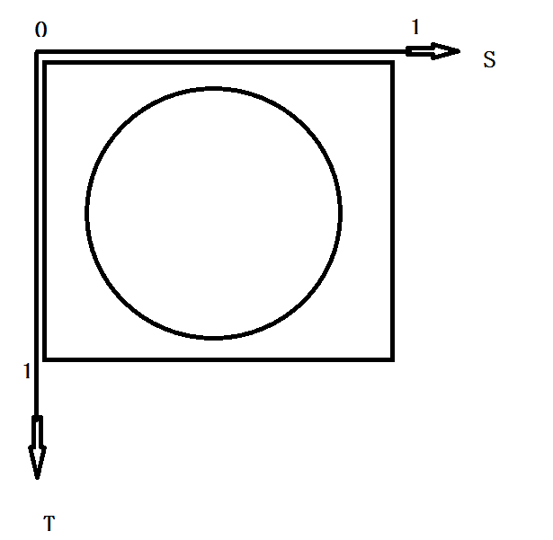

      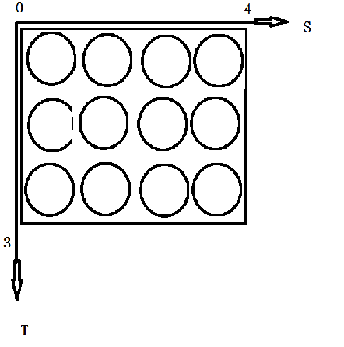

      纹理参数设置

      glTexParameterf(GL_TEXTURE_2D,GL_TEXTURE_WRAP_S,GLES20.GL_REPEAT);

      glTexParameterf(GL_TEXTURE_2D,GL_TEXTURE_WRAP_T,GLES20.GL_REPEAT);

      应用场景，比如地图中草坪的显示。

    - 截取拉伸

      当纹理值大于1的时候就会对边缘进行拉伸

      glTexParameterf(GL_TEXTURE_2D,GL_TEXTURE_WRAP_S,GLES20.GL_CLAMP_TO_EDGE);

      glTexParameterf(GL_TEXTURE_2D,GL_TEXTURE_WRAP_T,GLES20.GL_CLAMP_TO_EDGE);

      原图

      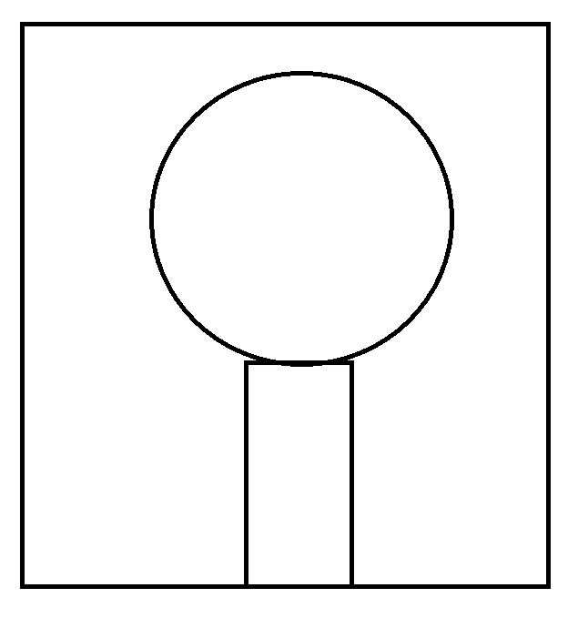

      

      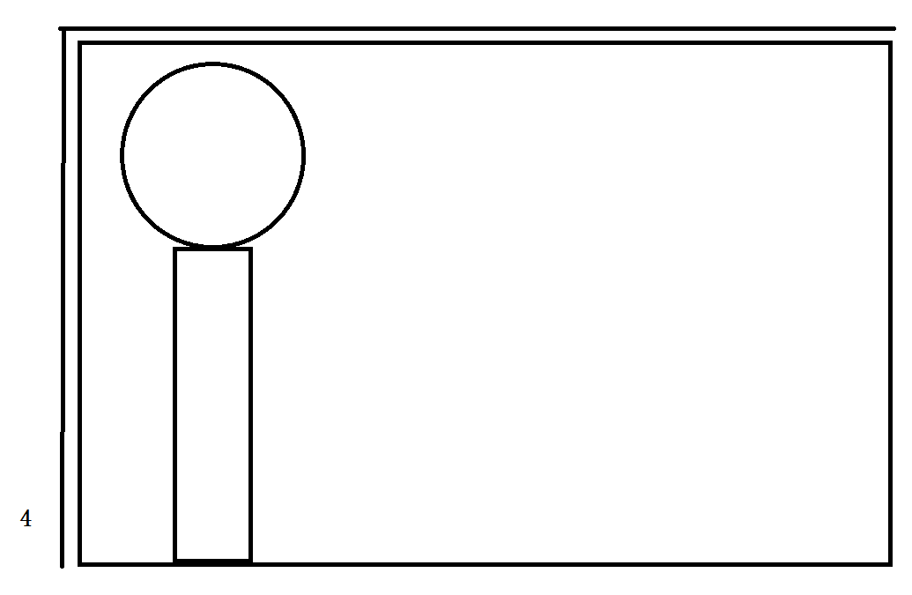

  我们在上面用到了

  	GLES20.glTexParameterf(GLES20.GL_TEXTURE_2D, GLES20.GL_TEXTURE_MIN_FILTER,GLES20.GL_NEAREST);	GLES20.glTexParameterf(GLES20.GL_TEXTURE_2D,GLES20.GL_TEXTURE_MAG_FILTER,GLES20.GL_LINEAR);
  如果说纹理采样就是将坐标文职的和纹理中的位置进行提取对应的一个过程，但是有时候纹理并不是一一对应的，小的纹理到大的图元，那么就需要放大，反之。

  

  - 采样：最近点采样
    - 特点：速度最快，计算量小
    - 缺点：有锯齿。
    - 应用场景，缩小的时候可以使用。不适合在放大的环境下。
  - 线性纹理采样
    - 它不仅仅是使用一个像素，而是使用附近的多个像素，采样时对附近多个像素进行了加权平均，因此不会有锯齿，但是有模糊。

```
GLES20.glTexParameterf(GLES20.GL_TEXTURE_2D, GLES20.GL_TEXTURE_MIN_FILTER,GLES20.GL_LINEAR);	GLES20.glTexParameterf(GLES20.GL_TEXTURE_2D,GLES20.GL_TEXTURE_MAG_FILTER,GLES20.GL_LINEAR);

```

纹理的采样一般都是MAX和MIN两种方式，纹理比图元大的时候就需要使用MIN对应的纹理，当纹理比图元小的时候就需要使用MAX的纹理。

- mipmap纹理技术

  有时候会有一种现象，远处的比近处的景物清晰，因为纹理的大小对应到图元上的效果，造成的。

  可以使用在远处的物体使用尺寸不同的纹理就可以解决。在openGL中，他会自己的进行处理，仅仅需要一个简单的处理即可。他会自己生成每次是自己1/2的图，直到最后为1的时候结束。

- 多重纹理和过程纹理{随后加}

- 压缩  {随后加}


## 丰富的立体形状

​	此部分学习图形，已经知道，在openGl中物体都是由三角形组成的，那么我们仅仅是需要使用三角形组成各物体。

### 三角形


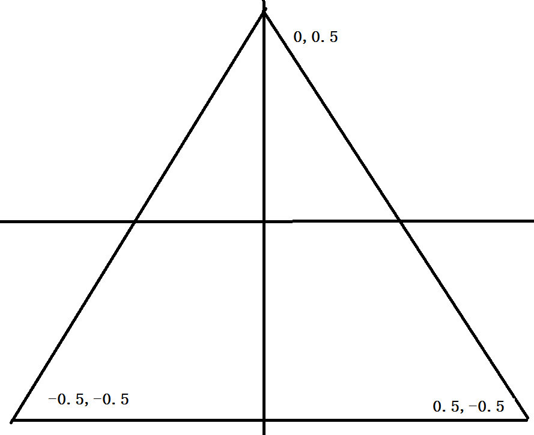

指定是三个顶点坐标。

- 六角形

  ​	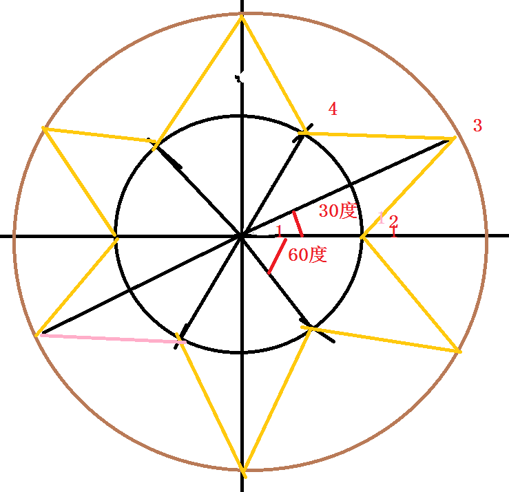

这图形，可以看做是两个圆，一个是大圆，一个是小圆，一个旋转30du，一个旋转60

所以顶点写法就是图中坐标的位置，将他们放入数组中，然后在写入顶点缓存。

0 0 Z    |    rcos(x)  rsin(x)  Z |  Rcos(x)  Rsin(x)  Z 

0 0 Z    |    Rcos(x) Rsin(x) Z |  rcos(x+angle) rsin(x+angle) Z  

然后循环一周即可。

- 正方体

  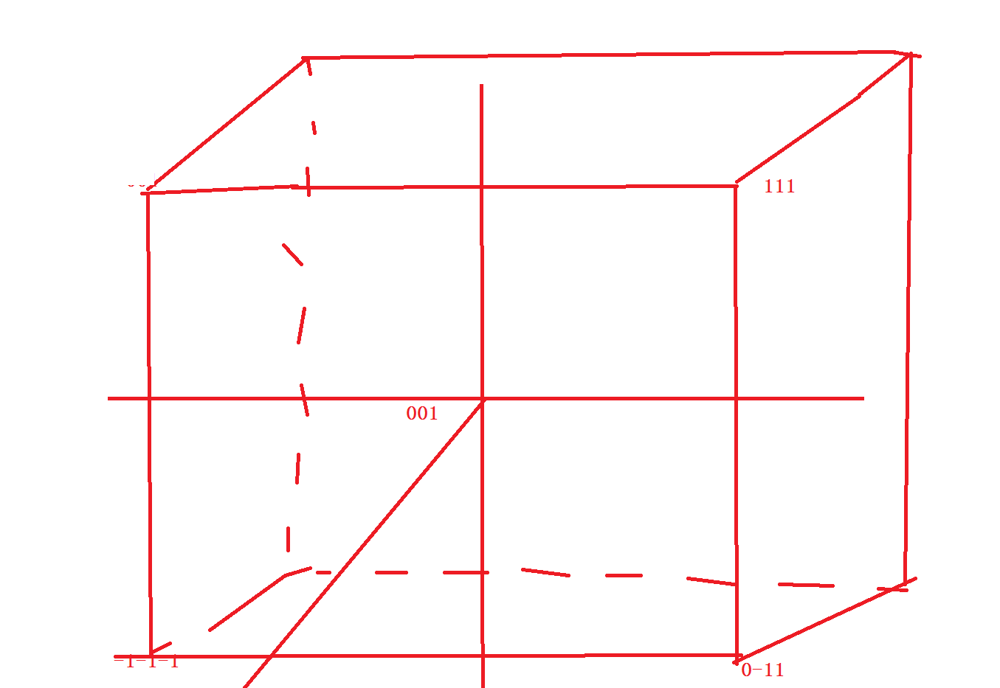

  一个面一个面处理，使用三角形扇或者三角形都可以{下来试，感觉不可以，因为三角扇是一个顶点，向四周去画出三角形}表示，上下作用，每个点按照坐标点写即可，写的时候注意别写错了就可以。颜色表示，也别客气，给每个点设置参数好了。

  - 三角形条形带绘制扇形

    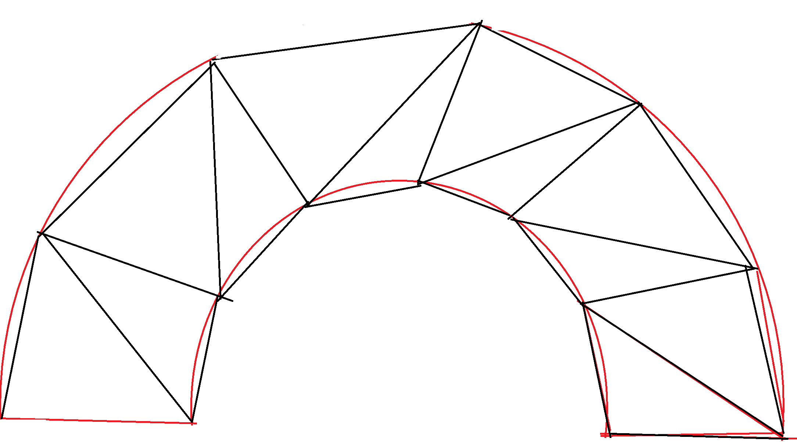

    其实也是圆上点，旋转角度，然后按照顺序得出即可。

    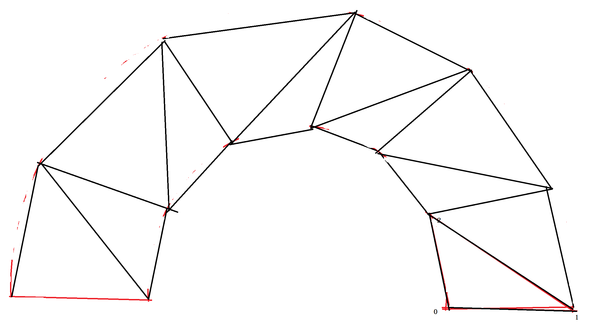

  R*cos(x)  Rsin(x) Z  |   r*cos(x)  rsin(x) Z   使用一个循环，两个点循环。

  - 球

    计算过程，先获取到一个球的半径，半径cos(x)求出每一个○的半径，○cos

    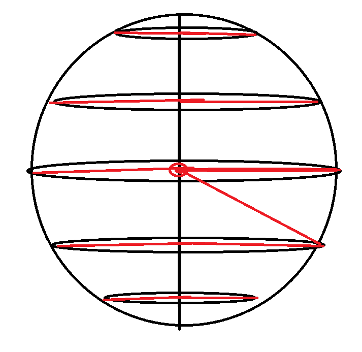

  

  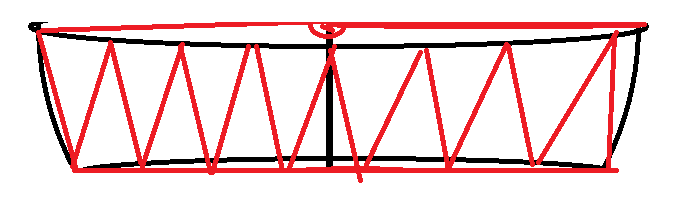

  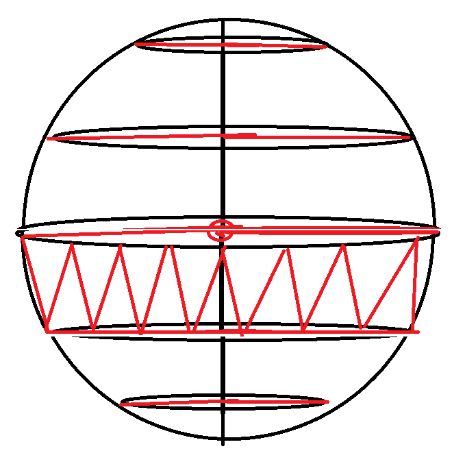

  

  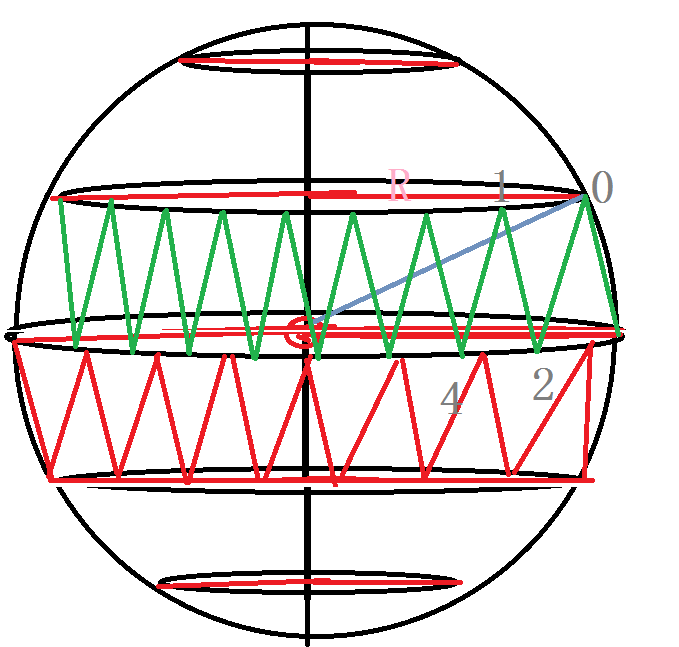

  

  - 圆柱体

    圆柱体有两个圆和一个长方形组成，

    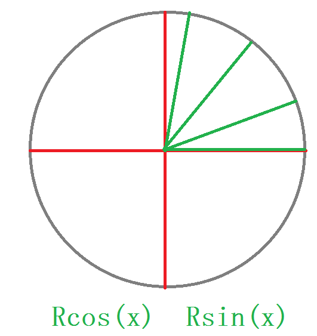

    如果使用纹理，纹理坐标通过圆上的坐标进行转换。

    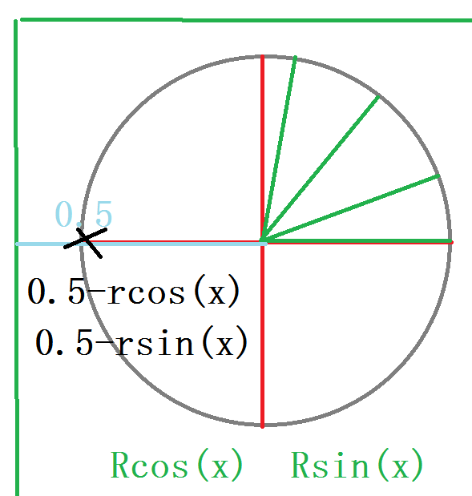

  

  圆柱侧面画法：	

  ​	圆柱侧面是一个四边形，他可以看做是一个一个的三角形组成。

  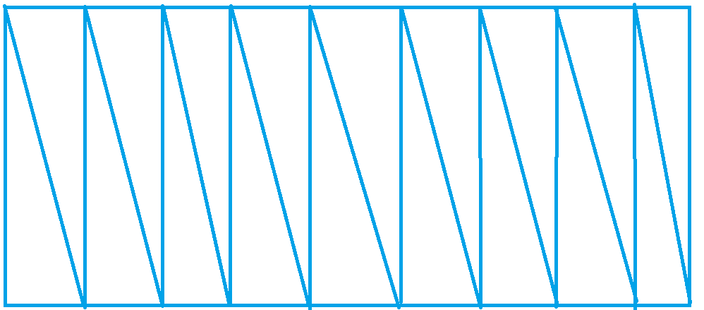

  

  点的坐标R*cos(x)  y  Rsin(x)将数据的结果表示xyz

  圆柱体滑动时候，先画出上面的○，将其下移，在画出底部，在画出侧面

  - 圆锥体

    顶点坐标计算

    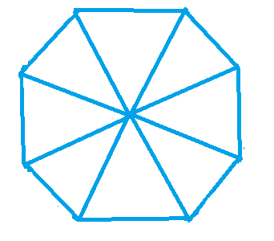

  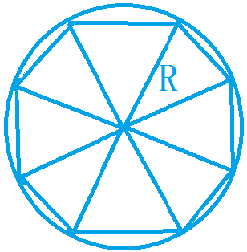

  顶点坐标为Rcos(x)   0  Rsin(x)   |||  0 y 0 ||| Rsin(x+angle) 0 Rcos(x+angle)

  

  ## 图像绘制方式

  

  open GL ES不仅仅可以使用三角形，也可以使用其他的点、线画图。

  - 点：GL_POINT
  - 线段：GL_LINES
  - 顶点顺序连接，但不封口：GL_LINES_STRIP
  - 顶点顺序连接，但封口:GL_LINES_LOOP
  - 三角形：GL_TRIANGLES
  - 将点顺次连接：GL_TRIANGLES_STRIP
  - 三角形扇：GL_TRIANGLES_FAN

  

  ## 加载3D模型

  ​	obj模型文件的概述

  ​	介绍如何用程序obj之前，了解一下文件的导入导出，obj本质就是一个文本文件，只是具有固定的格式，其格式为基本单元的格式定义，只不过在每个的开头一个特殊的字符。

  '#'表示注释

  ‘v’存放顶点的位置

  'vt'存放纹理坐标的位置

  'vn'存放法向量

  'g'一组的开始

  'f'表示一个面

  

  

  

  ## 混合和雾

  ​	物体都不是透明的，但是一般都是透明的，所以需要在通过各项测试之后，进入帧缓存区中的偏片源和帧缓存中原有的片源按照设定的比例加权计算出最终的颜色，可以理解为新片源将不再直接覆盖缓存区中的源片元。

  ​	混合前设定加权比例，OpenGLES设定混合因子，一般为两个：

  - 第一个源因子，用于确定将进入帧缓存最终片源比例

  - 确定员帧片源在最终片源的比例、 

    设定源因子和目标因子他们有四个参数，混合因子由开发人员确定，但是OpenGLES为了简化，不允许自己设定，仅仅可以自己选择

  混合因子的使用，只需要在化的方法中加入即可glBlendFunc(XX,XXX)

  - 雾的实现，就是将举例比较远的物体，显示出朦胧的感觉

    实现的数学模型，f=max(min((end-dist)/(end-start))),这个公式中是线性的，但是现实中并不是这样的，所以可以使用下面的方式：f = 1 - smoothstep(start,end,dist)

  --------

  ## 标志板

  ​	因为树等不规则的物体，形状十分复杂，直接使用三角形一般情况下无法支撑，所以使用成本低廉的技术，标志板。

  ​	使用纹理矩形来绘制图像。，每棵植物进需要一个纹理即可。，一般适合使用在一个对称 的植物上。

  - 每棵植物用一个纹理矩阵绘制，纹理内容为透明背景图，绘制纹理要使用恰当的混合因子，使其具有遮挡效果。
  - 纹理矩阵一直面向相机

  


## 图片的处理

​	了解了许多关于图性的绘制，下来开始对图像进行处理，比如滤镜、放大，缩小等操作。我们平时使用相机或者ps对图片进行处理。可以很方便的对其色彩进行控制和改变，达到我们需要的效果。在html中通过设置颜色的属性对颜色进行设置，我们平时见到的图片都是通过4中进行合并，根据不同的比例得到最总所需要的颜色，每一种压缩通过16进制进行表示,使用比例的不同显示出各种各样的颜色。在这里使用GLSL语言，我们通过vec4向量的方式将数据颜色进行表示四个通道，通过代码传递颜色值，在通过片段着色器进行颜色的渲染，首先R [红] G[黄] B[蓝] A[透明] ，如果三个坐标相同，那么就会显示出黑白的效果。所以灰度图像就比较容易处理，将三个通道的颜色设置一样就可以了，还有一种是根据一个颜色的比例和各个通道相乘就可以得到灰色的效果。

​	在ps中通过调整颜色的色相可以控制颜色的饱和度等，显示出暖色或者冷色，亮或者暗。

图片模糊：

​	图片模糊可以通过取出最近的几个点，将点取得平均值，然后得到每一个颜色的属性值，最常听说的有高斯模糊，其实模糊并一定是将图片显示的不清晰，比如取出一下小的斑点，也是可以使用的 。

**放大镜效果**

放大镜效果相对模糊处理来说，处理过程也会相对简单一些。我们只需要将制定区域的像素点，都以需要放大的区域中心点为中心，向外延伸其到这个中心的距离即可实现放大效果。具体实现，可参考着色器中vChangeType=4时的操作。

**实例处理**

- 将图片变为灰色图像

- 将图片变为暖色调

- 将图片转为冷色调

  --------

  转换一：灰度转变

  灰度图像就是将图片的三个量设置为一样

  ```c++
   float c=nColor.r*vChangeColor.r+nColor.g*vChangeColor.g+nColor.b*vChangeColor.b;
   gl_FragColor=vec4(c,c,c,nColor.a);
  ```

  转换二：冷暖色调转换

  ```
    vec4 deltaColor=nColor+vec4(vChangeColor,0.0);
    modifyColor(deltaColor);
    gl_FragColor=deltaColor;
  ```

  冷暖色调，那么我们需要将其颜色都进行加深，所以将各个颜色值加上一个参数即可，但是在加深的过程中如果颜色超过了规定值的大小，那么就需要将其设置在一个规定的范围内。

  ```c++
      color.r=max(min(color.r,1.0),0.0);
      color.g=max(min(color.g,1.0),0.0);
      color.b=max(min(color.b,1.0),0.0);
      color.a=max(min(color.a,1.0),0.0);
  ```

  其他处理

  ```
  放大处理：
  float dis=distance(vec2(gPosition.x,gPosition.y/uXY),vec2(vChangeColor.r,vChangeColor.g));
              if(dis<vChangeColor.b){
                  nColor=texture2D(vTexture,vec2(aCoordinate.x/2.0+0.25,aCoordinate.y/2.0+0.25));
              }
              gl_FragColor=nColor;
  ```

  模糊处理

  ```
   nColor+=texture2D(vTexture,vec2(aCoordinate.x-vChangeColor.r,aCoordinate.y-vChangeColor.r));
              nColor+=texture2D(vTexture,vec2(aCoordinate.x-vChangeColor.r,aCoordinate.y+vChangeColor.r));
              nColor+=texture2D(vTexture,vec2(aCoordinate.x+vChangeColor.r,aCoordinate.y-vChangeColor.r));
              nColor+=texture2D(vTexture,vec2(aCoordinate.x+vChangeColor.r,aCoordinate.y+vChangeColor.r));
              nColor+=texture2D(vTexture,vec2(aCoordinate.x-vChangeColor.g,aCoordinate.y-vChangeColor.g));
              nColor+=texture2D(vTexture,vec2(aCoordinate.x-vChangeColor.g,aCoordinate.y+vChangeColor.g));
              nColor+=texture2D(vTexture,vec2(aCoordinate.x+vChangeColor.g,aCoordinate.y-vChangeColor.g));
              nColor+=texture2D(vTexture,vec2(aCoordinate.x+vChangeColor.g,aCoordinate.y+vChangeColor.g));
              nColor+=texture2D(vTexture,vec2(aCoordinate.x-vChangeColor.b,aCoordinate.y-vChangeColor.b));
              nColor+=texture2D(vTexture,vec2(aCoordinate.x-vChangeColor.b,aCoordinate.y+vChangeColor.b));
              nColor+=texture2D(vTexture,vec2(aCoordinate.x+vChangeColor.b,aCoordinate.y-vChangeColor.b));
              nColor+=texture2D(vTexture,vec2(aCoordinate.x+vChangeColor.b,aCoordinate.y+vChangeColor.b));
              nColor/=13.0;
              gl_FragColor=nColor;
             取出好多个参数，然后将参数的值进行平均得到一个点的像素值，
  ```

  

## 图片裁剪

​	图片裁剪可以使用系统的图片裁剪，也可以自己实现一个图片的裁剪方案。想一下自己裁剪图片的过程，一张图片，想进行裁剪，首先自己确定裁剪的区域，选择好之后，此时并未裁剪，我们这个时候可能需要移动，或者缩放，使得图片达到最佳的效果。所以整体为，选择裁剪框，对图片进行控制，裁剪执行并保存数据、。

## 相机预览

 	openGLES的相机预览：open GL ES可以做游戏，同时它也可以做图片视频的处理， 进行相机 的预览，在前面进行图片的预览处理，可以对其进行多种变换和操作。那个可以认为是对一阵图片的处理，下来对相机预览，就是没有按下快照之前，他是按照时间顺序显示的，之前的是使用一个bitmap图片作为处理的目标，然后对目标进行处理，这个是相机，这里需要使用`GLES20.glTexImage2D(GLES20.GL_TEXTURE_2D,0,GLES20.GL_RGBA,width,height,0,GLES20.GL_RGBA,GLES20.GL_UNSIGNED_BYTE,buffer);`进行处理。

​	不过相机获得的图像是NV21和YV21的，并不是什么jpg等，如果实时转换，太浪费了，这个问题的处理方法是将其按照YUV的三个分量，将去拆分为三张纹理传入，然后通过GPU将其转换为RGB的，不过也是很麻烦的方式，可以使用下面的方法进行处理。

​	**Android的Camera及Camera2都允许使用SurfaceTexture作为预览载体，但是它们所使用的SurfaceTexture传入的OpenGL texture object name必须为GLES11Ext.GL_TEXTURE_EXTERNAL_OES。这种方式，实际上就是两个OpenGL Thread共享一个Texture，不再需要数据导入导出，从Camera采集的数据直接在GPU中完成转换和渲染。**

## —FBO离屏渲染

​	它是什么？？ 就是将获取到的图像不是直接的显示出来，这个时候使用FBO离屏渲染。

**FBO离屏渲染**

FBO就是Frame Buffer Object,这个不是将其直接的显示到屏幕上，而是放入到缓存中，比如我们在拍照，我们显示出来的部分，进行拍照，另一个进行录制保存。也就是不会必须显示处理的。


### RGBA、RGB、BGRA、BGR转YUV420P、YUV420SP

做视频需要格式的转换，转换的时候，使用转换公式即可

```
Y’= 0.299*R’ + 0.587*G’ + 0.114*B’ 
U’= -0.147*R’ - 0.289*G’ + 0.436*B’ = 0.492*(B’- Y’) 
V’= 0.615*R’ - 0.515*G’ - 0.100*B’ = 0.877*(R’- Y’) 
R’ = Y’ + 1.140*V’ 
G’ = Y’ - 0.394*U’ - 0.581*V’ 
B’ = Y’ + 2.032*U’
```

编码需要考虑效率问题，在转换运算中应该尽量避免浮点运算。以下代码实现相对简介，效率也还可以，如果需要更高的转换效率，可以用空间换时间，采用查表法来做。 

```c++
#include "jni.h"

#define max(x,y)  (x>y?x:y)
#define min(x,y)  (x<y?x:y)
#define y(r,g,b)  (((66 * r + 129 * g + 25 * b + 128) >> 8) + 16)
#define u(r,g,b)  (((-38 * r - 74 * g + 112 * b + 128) >> 8) + 128)
#define v(r,g,b)  (((112 * r - 94 * g - 18 * b + 128) >> 8) + 128)
#define color(x)  ((unsigned char)((x < 0) ? 0 : ((x > 255) ? 255 : x)))

#define RGBA_YUV420SP   0x00004012
#define BGRA_YUV420SP   0x00004210
#define RGBA_YUV420P    0x00014012
#define BGRA_YUV420P    0x00014210
#define RGB_YUV420SP    0x00003012
#define RGB_YUV420P     0x00013012
#define BGR_YUV420SP    0x00003210
#define BGR_YUV420P     0x00013210

/**
*   type 0-3位表示b的偏移量
*        4-7位表示g的偏移量
*        8-11位表示r的偏移量
*        12-15位表示rgba一个像素所占的byte
*        16-19位表示yuv的类型，0为420sp，1为420p
*/

void rgbaToYuv(int width,int height,unsigned char * rgb,unsigned char * yuv,int type){
    const int frameSize = width * height;
    const int yuvType=(type&0x10000)>>16;
    const int byteRgba=(type&0x0F000)>>12;
    const int rShift=(type&0x00F00)>>8;
    const int gShift=(type&0x000F0)>>4;
    const int bShift= (type&0x0000F);
    const int uIndex=0;
    const int vIndex=yuvType; //yuvType为1表示YUV420p,为0表示420sp

    int yIndex = 0;
    int uvIndex[2]={frameSize,frameSize+frameSize/4};

    unsigned char R, G, B, Y, U, V;
    unsigned int index = 0;
    for (int j = 0; j < height; j++) {
       for (int i = 0; i < width; i++) {
           index = j * width + i;

           R = rgb[index*byteRgba+rShift]&0xFF;
           G = rgb[index*byteRgba+gShift]&0xFF;
           B = rgb[index*byteRgba+bShift]&0xFF;

           Y = y(R,G,B);
           U = u(R,G,B);
           V = v(R,G,B);

           yuv[yIndex++] = color(Y);
           if (j % 2 == 0 && index % 2 == 0) {
               yuv[uvIndex[uIndex]++] =color(U);
               yuv[uvIndex[vIndex]++] =color(V);
           }
       }
    }
}


extern "C" {

    void Java_com_aiya_jni_DataConvert_rgbaToYuv
      (JNIEnv * env, jobject obj, jbyteArray rgba, jint width, jint height,
      jbyteArray yuv,jint type){
        jbyte * rgbaBuffer = env->GetByteArrayElements(rgba,0);
        unsigned char * cRgba=(unsigned char *)rgbaBuffer;
        jbyte* yuvBuffer = env->GetByteArrayElements(yuv,0);
        unsigned char * cYuv=(unsigned char *)yuvBuffer;
        rgbaToYuv(width,height,cRgba,cYuv,type);
        env->ReleaseByteArrayElements(rgba, rgbaBuffer, 0);
        env->ReleaseByteArrayElements(yuv, yuvBuffer, 0);
    }

}
--------------------- 
作者：湖广午王 
来源：CSDN 
原文：https://blog.csdn.net/junzia/article/details/54707322 
```


[相机有关的](照相机的获取方法.md)

[TOC]

