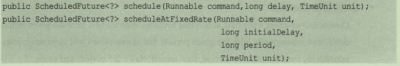
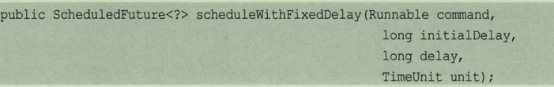
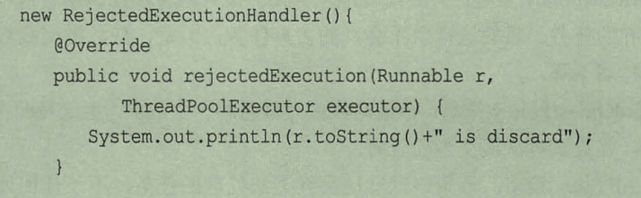
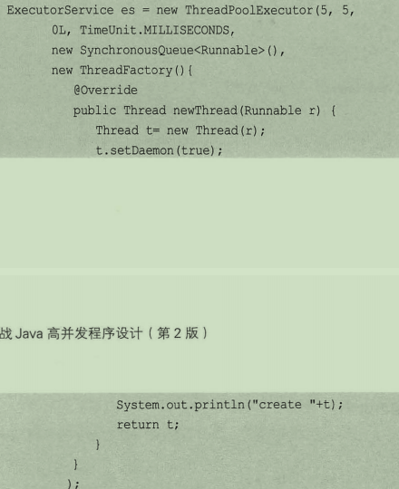
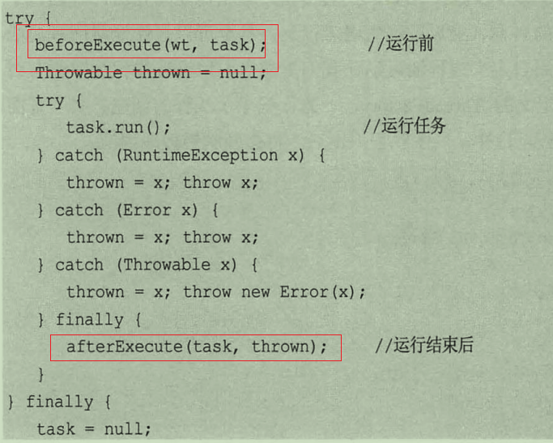
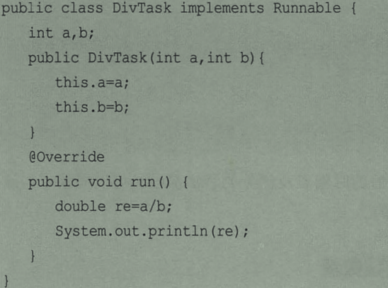
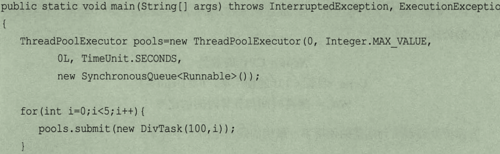
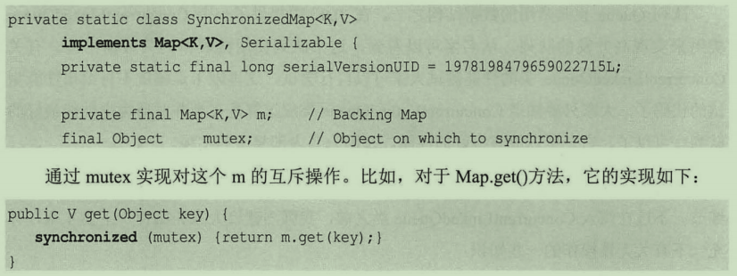
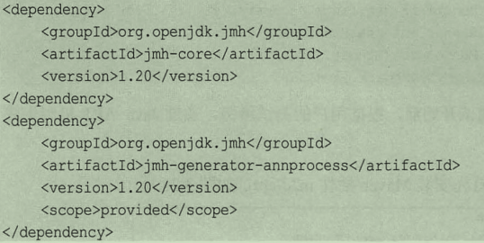

### Jdk并发包

java中保证线程安全的操作，首先是volita/syn、wait/notify、join、sleep.

#### Synchronized:可重入锁

5.0加入重入锁lock，6.0对syn进行优化，使得二者的差距不是很大。lock可以手动的加锁和取消锁，所以他是比较灵活的,重入锁有个好处就是重复的加锁。可以手动的进行加锁和解锁，但是一定要记得取消锁，否则其他的线程就无法进入到临界区域了。

```
创建锁
ReentrantLock r = new ReentrantLock();

//使用
r.lock();
代码
r.unlock();

//重入代码  重入锁还有一个就是锁几次，释放几次。
r.lock();
r.lock();
代码
r.unlock();
r.unlock();
```

可以多次加入同一个锁，如果不是这样就会造成死锁的情况

### 中断响应

syn只有两种结果：一种是一直等待，第二种是得到锁继续执行，但是对于重入锁就会有第三个情况，就是等了一会中断等待、收到通知，自己停止等待。这个可以解决死锁问题。

中断锁使用的锁请求是lockInterruptibly();

```
t.interrupt();可以放弃锁，也可以放弃当前锁请求。
```

锁的使用

```
//加锁的时候，加入一个可中断锁。
lock1.lockInterruptibly()
//执行代码
lock.unlock();


启动线程
Thread t = new Thread(lock);
t.start();

//中断
lock.interrupt();
```

假如有多个线程执行，就可以中断他们，最后看到的结果如果t在等，在收到中断之前还没有锁，那么就不等了退出。


### 锁申请等待是时限

死锁解决方法二就是使用时限锁，时间到位获得锁那么就放弃

```
tryLock(时间，时间单位)；返回一个boolean值。
```

还有一个方法就是无参数的，

```
tryLock();锁空闲，那么就直接的返回true，锁不空闲，那就返回false
```

如果是有参数的那么就等待那么久，然后返回，否则就有就执行，没有就返回

### 公平锁

公平锁会维护队列，所以他的执行效率一定会低一点。

多个线程同时对同一个锁进行请求，但是执行哪一个确实不知道的，什么时候可以获得也是不知道的，他会随机的挑出一个进行执行。公平锁会遵循先到先得的顺序，也会遵循一个顺序。synchronized是不公平的锁，lock我们可以对其进行设置。

```
public ReentrantLock(boolean fair);
```

参数为true的时候就是公平锁，公平锁需要维护一个队列，所以他的速度效率就会降低，公平锁的效果就是二者都可以执行。


总结一下ReentrantLock

- 构造函数可以设置公平和非公平
- lock给线程加锁
- lockInteruptibly()可以响应中断
- tryLock()如果锁空闲返回true，否则返回false
- tryLock(time,时间单位)，等待多久等待不到，那么就放弃了
- unlock()释放锁


### condition

它和wait和notify的作用一样，但是他们是和syn一起使用，condition是和重入锁一起使用的。在某一时刻等待，在某一时刻继续执行。

- 提供的方法
  - wait()
    - 使得当前线程等待，释放锁，需要其他线程执行signal方法重新获取锁，继续执行，或者当前被中断是，也会跳出等待。
  - waitUniteruptibly()
    - 和wait一样，但是他不会响应中断
  - long awaitNanos(long timeOut)
    - 
  - boolean await(long time,TimeUnit unit)
  - boolean awaitUntil(Date deasline)
  - void signal();
  - void signalAll();

在执行的过程中，执行了wait方法之后，就会释放锁，然后在执行了signal方法之后，会停止其他线程继续执行，但是重入锁都是由自己搞定的，所以需要执行一次释放锁。

注意的就是上面的两个方法都是在锁里面执行的。

**使用场景：在ArrayBlockedQueue里面就是使用重入锁，队列为空，就执行等待，当有数据就会通知，它所使用的锁式不会响应中断的**

### 允许多个线程同时访问

信号量Semaphore,他为多线程提供了强大的控制，之前的syn或者是重入，每次执行有一个在执行，但是信号量可以有多个线程同时访问。

- 构造方法

  ```
  public semaphore(int num)//准入线程个数，每次有多少线程可以同时访问
  public semaphone(int num,boolean fair)//是否公平
  ```
  


### 读写锁

简单就是一句话，读的时候是不需要加锁的，但是写的时候必须加锁，也可以理解为有一个是写的情况都需要加锁。所以在读的频率远大于写的时候就可以使用读写锁了。

```
	ReadWriteLock readWriteLock = new ReentrantReadWriteLock();
	Lock read = readWriteLock.readLock();
	Lock write = readWriteLock.writeLock();
	读写锁
```


### CountDownLactch

等待线程，可以传入个数，表示线程等待的个数，可以通过构造方法传入，每个线程完成就执行一个方法，让计数器减去一，

加入等待线程是10，那么就会等待10个线程，线程都到达了，在一起执行

### 珊栏

他会计数，到达一次计数一次，通过减一的方式进行的，比如说有是个线程，是个线程都到达了，我们将计数器归零，再次计数，也就是说他是可以循环利用的一个，并不是只能用一次。他是一个加法，但是CountDownLatch是一个减法。

### LockSupport

阻塞工具类：可以让线程在任何位置阻塞，他和rusume相比不会导致线程无法执行，和Object.wait()相比，他是不需要获得锁，也不会抛出异常


## 多线程

线程可以帮助我们完成任何，但是不加以限制有可能导致资源耗尽，比如oom异常，也有可能造成GC加长。线程在一定范围内可以提高效率，如果低于就会导致内存大量使用，拖垮应用。

**概念**就是不用每次都去创建一个线程，而是将线程放在一个池子里面，每次从池子里面取出来使用，使用结束在放回去。

线程池ThreadPoolExecutor,Executors是一个线程工厂，可以用于取出一个特定功能的线程池，ThreadPoolExecutor继承了Executor，所以他会执行任何Runnable对象。

**方法：**

- newFixedThreadPool(int nThread)//创建指定数量的线程池，有空闲就处理，没有空闲就等待，直到有空闲了在处理。
- newSingleThreadExecutor():该方法返回一个线程，如果其他资源来访问，就会等待，放入一个任务队列中，先入先出（相对比较公平），直到线程空闲，。
- newCacheThreadPool():不是固定的，他可以改变的，线程中都在忙的时候，如果有提交新任务，就会创建一个线程继续执行，最终放回线程池继续使用。

```
Executor es = Executors.newFixThreadPool(5);
for(int i=0;i<6;i++){
    es.submit(thread);
}
```

执行的时候是什么submit还是execute()

```
executor.submit(demo09);
executor.execute(command);
```


**最近的使用：**

使用Executors.newSingleThreadExecutor()创建一个连接，创建一个线程，执行网络操作。

**问题**：

如果第一次点击之后，答案未返回，退出，重新点击一个单词，导致最后的答案是错的，并且是有缓存的，那么存在的问题就会一直存在，除非退出引用程序。

**解决**：

如果我们每次都执行一次，这样肯定会出现问题，点击的太多就会卡死，那么该如何去做呢。在单个线程执行过程中


### 计划任务

newScheduledThreadPool(),它返回一个ScheduledExecutorService对象，可以根据时间需要对线程进行调度

```
public ScheduledFuture schedule(Runnable commond,long delay,TimeUnit unit);

```





它并不会立即执行，而是指定一个时间，然后去执行，对任务进行调度。

**区别**

FixRate  fixDelay周期性

FixRate他是本次开始为起点，多久之后开始下一个执行，如果任务的调度时间与小于运行时间，那么就当任务结束就调用。

FixDelay他是本次结束开始，多久之后开始执行。

**他并不是一直执行下去的，如果中途抛出异常。后面的就不会在继续执行了**

## 线程实现原理

上面的线程基本都是通过ThreadPoolExecutor(),

- 方法的参数
  - 指定线程数量
  - 指定线程的最大数量
  - keepLiveTime在超过线程数量的时候，在多久之后会死掉。
  - unit:时间单位
  - waitQueue任务队列，提交但是未执行的
  - threadFactory线程工厂，用于创建线程，一般默认即可
  - 拒绝策略，任何任务来不及处理，就会拒绝

- 任务用来存储Runnable，他可以使用BlackingQueue接口
  - 直接提交队列：它是由synchronousQueue对象提供，它是一个特殊的BlockingQueue，它是没有容量的，进入一个就需要删除一个，删除一个，就需要等待加入一个，他不会真正的存储任务，而是直接交给线程去操作，如果线程操作的时候，没有空闲，那么就会创建，如果超过上限，那么就会采取拒绝策略。所以一般会设置最大值
  - 有界的任务队列：有界的任务队列会有一个大小，作为最大任务队列。有界队列到队列装满才会拒绝ArrayBlockingQueue();
  - 无界队列：队列一直可以存放，直到资源耗尽
  - 有限任务队列：优先队列可以设置优先级

- 各种队列的状态

  - 固定线程：那么核心和总数相同
  - 无线不存在线程数量变化，所以可以设置相同
  - 单个线程：线程数量设置为1
  - newCacheThreadPool：将数值设置为0.最大为正无穷，没有任务时，没有线程，有任务就给空闲的，没有空闲的，就会创建线程，执行结束，60s后又会回收、

- 线程池的执行过程

  - 获取当前线程数
  - 小于就加入addWorker(),
  - 否则进入队列
  - 进入失败就会交给线程池
  - 失败，就拒绝

- 拒绝策略

  - 当超过了指定的大小就会有拒绝策略，jdk内置拒绝策略

    - AbortPolicy策略：直接抛出异常，阻止正常工作
    - CallerRunsPolicy策略：只有线程池未关闭，该策略直接在调用者线程中，执行被丢弃的任务，性能会降低。
    - DiscardOldestPolicy:丢弃最老的一个请求，也就是下一个执行的任务，并在此尝试。
    - DiscardPolicy:直接丢弃，如果任务可以丢失，这是最好的

    上面是内置的拒绝策略，如果无法满足，可以自己定义拒绝策略。

    ```
    //接口
    public rejectedExecutionHandler{
        new rejectedExecution(Runnable r,ThreadPoolExecutor executor);
    } 
    
    ```

    

## 自定义线程创建ThreadFactory

线程池中的线程从哪里来？？？？？？？？？

线程池的作用是避免重复创建和线程复用，节约资源。然而它只是一个接口，

```
Thread newThread(Runnable r);
```

只有一个用来创建线程的方法

自定义线程池，我们可以根据需要创建线程池，了解线程池的创建历程




#### 线程池进行扩展

我们可以很方便的创建出线程池，但是我们如何的扩展它呢，或者时得到一些自己想要的参数或者东西。

在线程池中提供了一些方法

```
beforeExecute()      afterExecute()  terminated() 三个接口用来对线程池进行控制
线程在work的runTask()方法内部提供实现。
```




### 线程关闭

不知道是不是有很多人和我一样，使用线程或者看线程一直看一直爽，忘记关闭这件事了。

那么线程池的关闭使用什么呢？

使用的不是stop。是shutdown().它仅仅是发送一个信号。


### 如何选择

当你大喊，真香，真甜的时候，那么怎么办呢，线程池写多少合适呢，对于我这种强迫症来说，我只能说我傻逼了。

先说一点废话，过大过小都会对性能产生影响，那么我们如何选择。但是他受什么影响呢。内存、CPU的个数。

```
//计算公式
NThread = NcpuXUCPUX(1+等待时间与计算时间的比率)
问题来了，怎样知可以使用的CPU数量
Runtime.getRuntime().availableProcessors();
```

### 堆栈去了哪里，在线程中选择堆栈

问题1：看个案例





可惜结果是不对的，少了一个值，因为他们在使用的过程中将异常给隐藏了。这个也是线程池的一个巨大问题。

我们可以通过两种方式进行解决

```
pools.execute();
或者
Future fu = pools.submit();
fu.get();

两种方法得到堆栈信息。
```

上面的方法，我们可知异常信息是哪里来的，但是这个线程池，所以最后知道他是从哪来的哎。

这个时候就需要我们自己丰衣足食了，自己复写线程池方法、

### Jdk自带并发包

jdk给我们自带了许多的工具类，可以减少工作量，比如hashMap ,队列，链表等，作者书上肯不是很严谨吧，HashMap是线程安全的。


### HashMap

需要一个线程安全的hashMap怎样做呢？？

- 使用Collections.SynchronizedMap()方法包装HashMap，将map变为一个线程安全的。

  **实现方式：**

  - 将map放入一个map中，通过一个Object来保证安全

  - 每次读取需要从锁中获取对象

    

    因为数据无论什么操作都需要从锁中获取map，所以并发小的还可以，如果是高并发就比较尴尬。

  

  #### 高效的读写队列：ConcurrentLinkedQueue

  他是使用链表实现，他是在并发环境中，性能最好的一种队列了，它具有好的性能主要是因为他的内部是很复杂的。

  

  

  ### JMH进行性能测试

  除了正确的代码之外，还需要写出高效的代码，首先，一部分并发通过串行改造，提高性能，其次，多线程可能因为线程并发导致性能损耗。

  

  #### JMH是什么？？

  是一个OpenJdk项目发布的，专门用户测试性能的框架，精度可以达到毫秒。可以做什么，一个函数需要多长时间，或者算法有多种不同实现哪一种比较好

  

  #### Hello HMH

  （1）引入jar

  

  

用法在查，现在就不看了。


