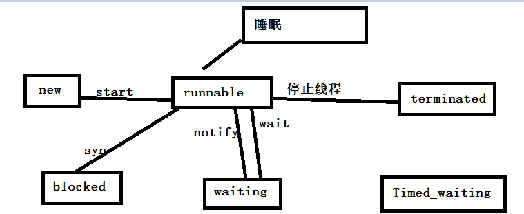
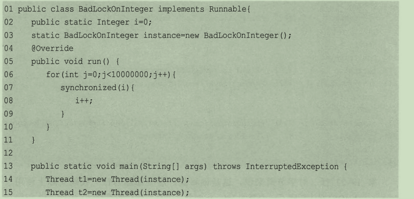
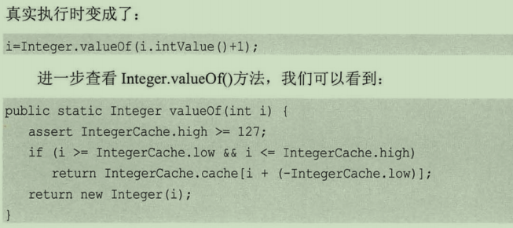

## java并行程序基础

- 进程：操作系统调度的最小单元

- 线程：程序执行的最小单元

- 线程的生命周期

  

- 声明周期解释

  - new创建线程，还没运行
  - Runnable：执行了start方法后的线程，一起准备就绪
  - terminated：停止
  - blocked：阻塞，直到获得锁
  - wait:执行了等待方法的，他会等待notify方法执行。
  - join方法等待会等待目标线程终止


#### 线程的基本操作

- 创建线程

  ```
  //new
  Thread t = new Thread();
  //开始执行
  t.start();
  start方法执行之后会启动一个线程去执行run方法
  ```

  问题1：直接调用run方法和start()执行有什么区别。

  父类中run啥也没做，需要来实现、

- 运行线程

  - 创建方式一：

  ````
  public static void main(String[] args) {
  		Thread t1 = new Thread() {
  			@Override
  			public void run() {
  				// TODO Auto-generated method stub
  				System.out.println("见贤思齐先生！");
  			}
  		};
  		t1.start();
  		//t1.start();  重复启动线程会报错。
  	}
  ````

  - 创建方式二

  ```
  Thread t2 = new Thread(new Runnable() {			
  			@Override
  			public void run() {
  				// TODO Auto-generated method stub
  				System.out.println("见贤思齐先生！");
  			}
  		});
  		t2.start();
  ```

  也可以继承Thread，重写run方法，也可以实现Runnable，重写run方法。

  ```
  class Thread implements Runnable
  ```

  

- 终止线程

  停止可以使用stop，但是已经废弃了，不再使用，它将执行的线程直接给停止了，导致数据不一致。stop停止，他会立即的将线程停止，并且释放锁，其他线程就可以进入。导致数据不一致。

  - 代码实现

  ```
  class User{
      name,sex;
      get / set
  }
  
  thread1
  User u = new User();
  class thread1 implement Runnable{
      public void run(){
          
          u.setName("");
          u.setSex("");
      }
  }
  
  class thread2 implement Runnable{
      public void run(){
          Syso(u.toString);
      }
  }
  
  main(String[]args){
      thread1 t1 = new thread1();
      t1.start();
      thread2 t2 = new thread2();
      t2.start();
  }
  ```

  

  如何优雅的停止？？？

  我们告诉他们，什么时候停止线程即可

  - 在run 方法，while循环出设置一个标志位，如果标志位不符合条件，让他跳出去。
  - 后台常驻线程一般在一个循环中，设置标志位然后跳出。

- 中断线程

  中断不是立即停止，也不是立即退出，而是给线程一个通知，告诉线程，你在合适的时候退出吧。所以什么时候退出自己说了算。

  中断处理的时候会有几个方法，第一个中断线程，第二个判断是否中断，第三个是判断是否中断，并清除中断状态。

  实例：

  ```
  	public static void main(String[] args) throws Exception{
  		Thread t = new Thread() {
  			@Override
  			public void run() {
  				// TODO Auto-generated method stub
  				Thread.yield();
  			}
  		}.start();
  		t.sleep(100);
  		t.interrupt();
  	}
  ```

  上面是使用了中断，但是这个中断的存在，他并不会造成线程的停止，线程依旧可以继续执行，因为中断了，但是并不清除什么时候退出循环，那么就需要使用如下代码，在中断 的时候退出while这个循环。

  ```
  	public static void main(String[] args) throws Exception{
  		Thread t = new Thread() {
  			@Override
  			public void run() {
  				// TODO Auto-generated method stub
  				while(true) {
  					=================
  					if(Thread.currentThread().isInterrupted()) {
  						System.out.println("wotuichu");
  						break;
  					}
  					System.out.println("zhongduan");
  					Thread.yield();
  					====================
  				}
  				
  			}
  		};
  		t.start();
  		t.sleep(100);
  		t.interrupt();
  	}
  }
  
  ```

  也许你会说，写个标志位岂不是更好，没有必要使用API提供的方法，其实是可以，但是中断肯定有它的优势。

  **总结：**

  中断标志位，在执行的过程，我们可以使用中断设置状态，然后来退出线程，但是我们在sleep和wait的时候需要做额外处理，中断发生，会清除中断信息，所以需要在此中断。

- 出现了wait或者sleep，只能通过中断来识别了。

  ```
  	public static void main(String[] args) throws Exception{
  		Thread t = new Thread() {
  			@Override
  			public void run() {
  				while(true) {
  					if(Thread.currentThread().isInterrupted()) {
  						System.out.println("wotuichu");
  						break;
  					}
  					try {
  					    System.out.println("sleep");
  						Thread.sleep(100);
  					} catch (InterruptedException e) {
  						// TODO Auto-generated catch block
  						e.printStackTrace();
  						
  					}
  				}
  				
  			}
  		};
  		t.start();
  		t.sleep(100);
  		t.interrupt();
  	}
  ```

  执行结果为什么，执行一次sleep就睡了，然后有个中断标志，就退出了，但是结果不是那样的，因为异常在里面铺货了，需要在重新在中断一次才可以

  ```
  sleep
  sleep
  sleep
  ……
  ```

  

  我们知道sleep是不会释放锁的，在上面的代码中，sleep会抛出一个中断异常，但是他并不释放锁，因为这个异常已经被铺货了，我们需要退出去，就必须在来一次中断，然后退出去。

  ```
  	try {
  		Thread.sleep(100);
  	} catch (InterruptedException e) {
  		// TODO Auto-generated catch block
  		e.printStackTrace();
  		Thread.currentThread().interrupt();
  	}				
  					}
  ```

  

- wait和notify方法

  这两个方法在Object中，所以它在每个里面都可以使用，

  举个例子：A线程在执行的过程中执行了一次wait方法，然后A就停止了运行，在等待中，知道其他线程调用了notify方法后。才可以继续执行

  问题1：执行wait并不至这一个，到底哪一个先执行呢，答案是只有一个执行，一般会在等待队列中随机选取一个【随机的】。

  问题2：如果想全部都唤醒，那就执行notifyAll();

  **注意：**wait和notify虽说是Object的方法，但是他可没有到处执行的权利，必须在syn代码块中（Syn是一个监视器），它必须获取一个监视器后，才可以执行。

  存在监视器就可以执行，执行之后就会释放监视器【这是它和sleep的区别】，说点别的，人不为己，天诛地灭，他需要别的线程来唤醒它，他肯定需要让位呀，所以他会释放，这个应该是必须释放吧。

  得到执行权的并不是直接就执行了，他什么时候执行，还是需要看自己的本事，获得锁才可以呀。

  - 代码实现

    ```
    final Object o = new Object ()
    class thread2 implement Runnable{
        public void run(){
        	syn(o){
            	Syso("==============");    
        		try{
                    Syso("==================");
                    o.wait();
        		}catch(InterruptException e){
                    e.print();
        		}
        		Syso("=============");
        	}
        }
    }
    
    class thread2 implement Runnable{
        public void run(){
        	syn(o){
            	Syso("==============");    
        		try{
                    Syso("==================");
                    o.notify();
        		}catch(InterruptException e){
                    e.print();
        		}
        		Syso("=============");
        	}
        }
    }
    ```

  **总结：**

  wait和notify方法是在object中的，必须在syn代码块中才可以执行，执行wait之后释放锁，执行notify必须获得锁，notify会随机的释放一个（不公平），notifyAll是将所有的释放。

- suspend和resume挂起和继续执行

  已经废弃，算了不看他们了。

- join等待接收和谦让yeild

  join它可以做什么，一个线程的可能需要依赖其他线程的参数，或者中间结果，那么就需要等待其他线程执行执行，在一起执行。

  API中有两个方法，一个是一直等，一个是等等就溜了。

  一直等：就会一直阻塞当前的线程，直到目标指向完毕

  等等就溜了：他有一个最大等待时间，

  **案例**不是的时候

  ```
  public class Demo04 {
  	private static long num = 0;
  	public static void main(String[] args) {
  		Thread t = new Thread() {
  			@Override
  			public void run() {
  				// TODO Auto-generated method stub
  				for(int i=0;i<1000;i++) {
  					num++;
  				}
  			}
  		};
  		t.start();
  		
  		System.out.println(num);
  	}
  }
  ```

  结果为0，我们通过一个线程来给我计算，结果为0，对我来说有暖用。

  一个在主线程，一个在t线程中，t线程计算，主线程显示，那么我们就需要让主线程等待子线程，所以修改如下：他是让主线程等待，子线程也到这里了一起执行下去。

  ```
  		};
  		t.start();
  		t.join();//他在主线程【阻塞当前线程，等待子线程】
  		System.out.println(num);
  	}
  ```

  它的实现是通过wait来实现的，被等待的线程在退出前会notifyAll,通知所有的等待线程进行执行。

  - yield这个有意思，想起来小时候，哥哥和我玩，把饼干放在桌子上，然后我要去取，他就赶紧拿到手上。哈哈哈哈。

    yield将cpu释放，然后自己再去抢夺。

### Volite与java内存模型

java内存模型核心都是原子性、可见性、有序性展开，对于有序和可见，java提供了一个关键字volite。可以告诉虚拟机有修改时，保证其他线程可见。为了原子性和可见性最直观的就是使用这个关键字。

**它是无法保证复合操作的原子性的，它并没有锁的作用。**

最典型的就是i++,多个线程执行，最终结果不是想要的结果。

举例：

```
	private static boolean ready ;
	private static int i=0;
	private static class volitedemo extends Thread{
		@Override
		public void run() {
			// TODO Auto-generated method stub
			if(ready) {
				System.out.println("nb---------------"+i);
			}
		}
	}
	public static void main(String[] args)throws InterruptedException {
		volitedemo s = new volitedemo();
		s.start();
		Thread.sleep(100);
		i=2;
		ready = true;
		Thread.sleep(100);
	}
```

在客户端模式下，上面的是么有问题的，在服务端优化的情况下就会出现问题，所以需要加关键字，不允许重排。

但是他的有序和性还是非常有用的


volite是可以保证原子性的，但是他是无法保证复合运算的合法性的，它可以保证有序性和可见性。


### 线程组

线程非常多的情况下，就可以使用一个组来存储它。线程创建结束之后，可以将其放入组中，组包含的方法有可以查看活跃的总数，不过是个变值，list会打印所有的信息，线程组就是将线程和组联系起来。

```
package kw.suanfa.demo;

public class Demo06 implements Runnable{

	@Override
	public void run() {
		// TODO Auto-generated method stub
		System.out.println("=======");
	}
	
	public static void main(String[] args) {
		ThreadGroup t = new ThreadGroup("test");
		Thread t1 = new Thread(t,new Demo06(),"T1");
		Thread t2 = new Thread(t,new Demo06(),"T2");
		t1.start();
		t2.start();
		System.out.println(t.activeCount());
		t.list();
	}
}

```

线程组有一个方法就是可以使用stop方法，停止所有的线程，但是这个方法和Thread.stop一样，存在很多问题。

### 守护线程

在后台默默做一些事情，比如垃圾回收等，用户线程会执行一些业务，当用户线程全部结束之后，守护现场也就不会存在了，他没有存在的必要了，一个java程序只有一个守护线程。

**设置守护线程的位置，在start方法执行之前，如果之后调用会有异常抛出，但是程序会继续执行，此时他们是普通线程**

如果将其设置为守护进程，那么main函数执行结束，程序就会退出。他是为其他线程服务的，其它线程没了，它的存在也就没有意义了。


### 线程优先级

线程优先级高的会首先进行，执行完毕，java中设置默认的3个级别。


### syn

voilte仅仅可以保证修改后其他线程可以感知到变化，并不能保证他输出会正确。

线程一将值读取并修改之后，另一个线程也读取了，进行修改，结果会不正确，为了结果正确，那么就需要使用线程安全的方式syn，每次只允许一个操作，另一个不可以操作，也不可以读取，也就是说每次只能有一个操作。

**Syn的使用总结**

- 加给定对象的锁
- 加类锁
- 加实例方法锁

实例方法锁需要注意，加入创建两个线程，那么就会有两个实例方法锁，所以结果可能会和自己想要的几个不一致。


如果不想过多修改代码，只需要在其上面加上static关键字就可以了。将实例方法锁变为一个类锁。


### 程序的幽灵

- 无提示的错误：程序溢出

- 并发下的ArrayList:加入10000个数据，两个线程操作

  - 20000个数据
  - 抛出异常（扩容的时候）
  - 小于200000个

  处理方法：使用Vector

- hashMap在多个线程下操作

  - 正常完成
  - 小于正常个数
  - 链表会发生破坏，造成环，就有可能造成死循环（1.8之后有处理，会避免这个情况）

- 错误的使用锁

  - 使用Integer加锁，Integer是一个不变量。如果需要修改就会new，所以锁式一直发生变化的。

  



