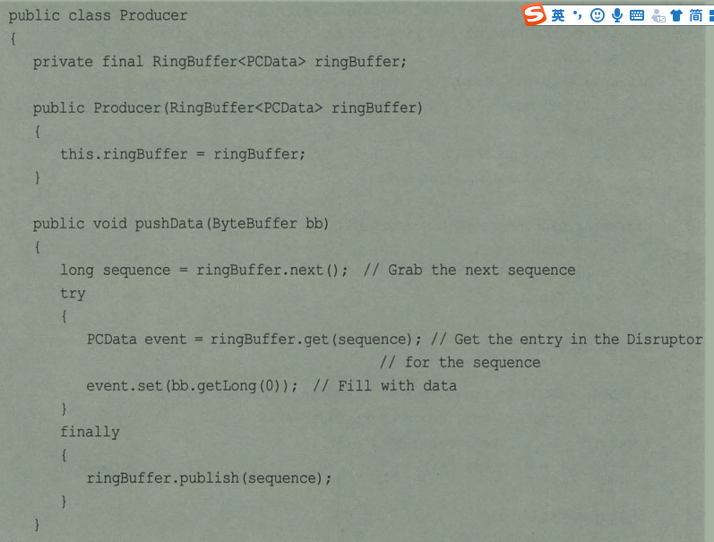

## 并行模式和算法

前面只需要按照套路就可以了，下来了解一些常用的方式，

#### 单例模式

#### 不变模式

当线程对同一对象进行操作，为了保证一致性和正确性，需要对对象进行同步，但是是在消耗性能的基础上，我们可以依靠不变对象，确保在多线程中保持不变性和正确性。

核心：对象一旦创建，它的内部状态永远不会发生改变，多线程操作是不需要进行同步的。

**不变和只读**

不变模式更具有一致性和不变性，对于只读属性，对象本身不能被线程修改，但是自身状态可以进行修改。比如只读，存活时间只读，任何线程都币可以修改，但是属性会发生变化，不变模式，无论什么原因，对象创建后，绝对稳定。

**两个条件**

- 创建后，内部状态和数据不再发生变化
- 需要高效时，被对线程频繁公用。

**不变模式实现**

- 去除setter方法以及所有可以修改的方法
- 所有属性私有，使用final标记
- 确保子类可以重载
- 有一个可以创建完整对象的构造方法


这里将子类禁止掉，其实也可以不禁止，父类不可变，子类继承之后属性也是不可以变的。

### 生产者和消费者

他是一个多线程设计模式，为多线程提供了良好的解决方案，一般两类线程，消费者和生产者。生成者负责提交用户请求，消费者负责具体处理生产者提交的任务，二者提供共享进行通信。

核心组件：共享内存缓存区

它允许生产者和消费者在速度上有一定的时间差，无论哪一个的速度快，或者慢都是通过缓存区进行的。

**实现成员：**

- 生产者，将数据存入队列
- 消费者：从队列中取出
- 数据模型：
- 队列：存放数据
- main：使用

#### 高性能实现，无锁

这个主要是队列的选择，比如blockQueue,它将不使用高效的，不过可以选择使用CAS实现，

- 框架（CAS）Disruptor

  - 无锁的内存队列，无锁实现一个环形队列

  - 内部实现是普通数组

  - 一般的需要同步头和尾，不过环形就仅仅考虑当前就可以了。

  - 但是大小确定，不可以动态修改

  - 为了快速的找到位置，Disruptor需要数组的大小设置为2的整数此方，（sequence）&（queueSize-1）定位index，

    

  - 读写都使用CAS进行操作。

- 具体操作

  - 准备数据

    ```
    class PCData{
        private long value;
        set/get
    }
    ```

    

  - 消费者

    ```
    class consumer implements WarkHandler<PCData>{
        public void onEvent(PCData event){
            syso(event.get+"---------");
        }
    }
    ```

    onEvent是方法回调

    

  - 创建工厂

    ```
    class PCDataF implements EventFactory<PCFata>{
        public PCData newIntance(){
            return new PCData();
        }
    }
    ```

    

  - 生产者

    

  - 


#### 并行流水线

并行可以提供CPU多核性能，但是并行并一定一定有用，比如前面的结果对后面有影响，(a+v)^3,这种在只有一个的情况下使用，但是如果有多个数据计算，那么依旧可以节约时间，仍然可以发挥多线程的优势。

### 并行速索

一般地直接执行遍历就可以了，如果使用并行，就需要加入一些其他操作了，线程之间通信机制。多个线程可以有效运行。两个线程找数据，然后立即返回。


### NIO

是一套新的IO机制，不同于标准的java机制，严格说，NIO与并发没有关系，使用NIO可以提供效率，它包含了内容通道、缓存区、文件IO，网络IO,

#### 基于Socket服务器多线程模式

场景描述：一个服务器将用户输入原封不动的返回。

多线程的结构示意图

服务器会为每一个客户端启用一个线程，这个线程置位这个客户端使用，为了接受连接，服务器还会额外的派发线程、


