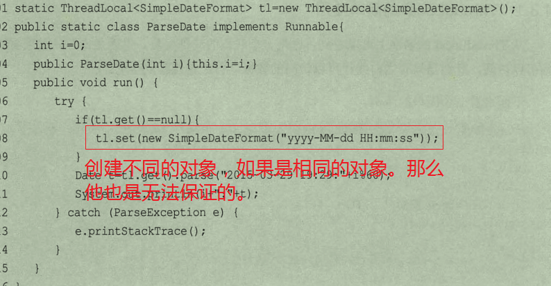
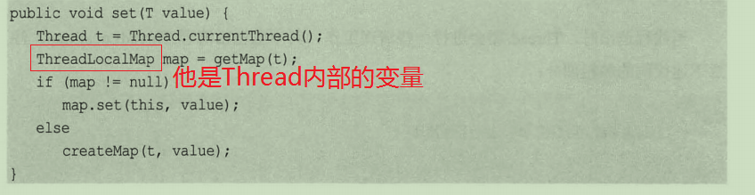
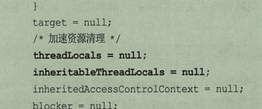

## 锁优化和注意事项

锁是最常见的同步方法之一。锁竞争激烈的情况下会产生性能下降。

单任务，注意是自身任务花销，但是多线程而言，就需要保证数据一致性等问题，还有线程之间的切换，上下文之间的变化。但是并行计算一般低于串行，提供性能不是干的活少，而是更加充分使用CPU资源。

##### 锁的几点建议

- 减少持有所的时间
  - 执行的代码，直对需要同步的地方加锁，比如一个方法，里面有100条代码，加锁的之后一句，那么我们可以将方法锁变为代码块，这样就可以了。【一般地，前面的方法是比较耗时的】

- 减少锁的粒度
  - 减少锁的粒度，比如currentHashMap，我们不使用传统的锁方式，使用段，将一个大锁分成小的段处理。但是如果是一个全局操作也需要加锁，不过在currentHashMap使用的CAS.这样的使用一般在锁全局操作比较少的时候。

- 读写分离
  - 读读不互斥，读写互斥， 写写互斥，使用读写锁就可以了。

- 锁分离
  - 这个一般可以使用在队列上，比如说去数据在队列头，加数据在队列尾部，那么就可以在头一个锁，尾部一个锁。他们拥有不同的锁。

- 锁粗化

  - 锁细化，将比较小的锁合并成大锁减少上下文切换等的时间。

    ```
    for(int i=0;i<10;i++){
        Syn(this){
            //执行代码（）
        }
    }
    ------------
    syn(this){
        for(int i=0;i<10;i++){
            //执行代码；
        }
    }
    ```

    

### 虚拟机对锁的努力

- 偏向锁

  - 是什么？？

    是加锁优化的手段

  - 为什么？

    线程加了一个锁，那么就进入偏向锁，当在此获得锁就不需要在进行同步操作，节省了大量有关锁申请操作。

  - 怎么做？

    一般地锁竞争不激烈的情况下，效果比较好，但是对于竞争激烈的就不好了，偏向锁会失效。

- 轻量级锁

  偏向锁失效，还可以使用轻量级锁，它将对象头作为指针指向持有锁的线程堆栈内部，判断是不是有锁，如果成功就进入临界区，如果失败，那么就进入重量锁。

- 自旋锁

  为了防止膨胀后，避免挂起，如果无法获得锁，那么就做几个空循环，如果几次得到就会进入执行，否则就执行挂起。

- 锁消除

  JIT在编译时会通过上下文去除不可能存在共享资源竞争的锁，节省毫无意义的请求锁时间。（是不是傻了，不存在竞争还加锁，这个不是我们傻，是……）使用一些安全的API，就会有锁

  **回顾：局部变量是在线程栈上分配的，属于私有的数据，不可能被线程访问**

  锁消除涉及逃逸分析，就是观察某一个变量是否掏出一个作用域，如果说可能被其他的访问到，逃出当前的区域。

  **逃逸一般在服务器模式下运行**

#### ThreadLocal

高并发，使用锁是第一种方式，那么第二种方式就是使用ThreadLocal.他是一个局部线程，所以也是安全的

他为每一个线程都分配一个对象，但是实在应用层面的，创建对象的，不是由ThreadLocal创建的，如果创建同一个对象，它也是不可以保证安全的。

除了控制资源的方式保证安全，也可以通过增加资源的方式保证安全（Thread），但是也是不可以保证安全 的，



- 实现原理

  每次set的时候会得到当前线程，然后将其放入到map中，【我想起了注册单例模式，不过有点像】

  ```
  1.获取当前线程t
  2.查看map是否有次线程map
  3.有，map.put(this,value);
  4.无，创建map，将参数设置
  ```

  

存储的key即使当前线程，ThreadLocals本身就保存了当前自己所有线程的所有的局部变量，也就是一个ThreadLocal变量的集合。


获取的时候也是一样，通过当前线程取出实际的数据。

上面可以看出，它将所有的放在一个集合中，那么线程如果不退出，那么他就一直存在，如果Thread退出。那么就会进行清理工作，

加速清理的代码:




因此在使用线程池并不意味着会退出（因为线程池会维系一部分的线程连接数量），但是也回收不了，造成内存泄漏。这句话不是说线程池会造成内存泄露，而是说将数据设置到ThreadLocal中，会造成内存泄露。因为数据一致会保存。

**加速回收的方式，我们直接的给句柄一个null，导致对象是没有任何指向的，使得垃圾回收机制将其回收掉**

它也是提供了回收方法的，remove方法


### 无锁

乐观锁和悲观锁


