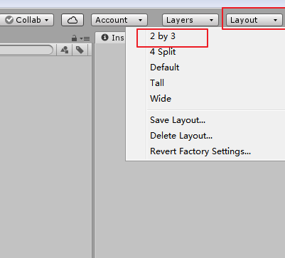
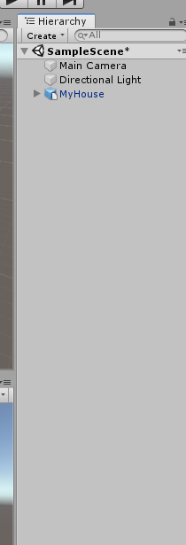
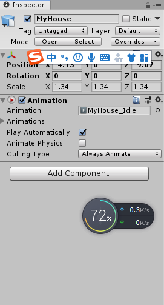
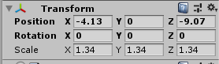
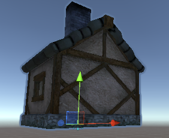
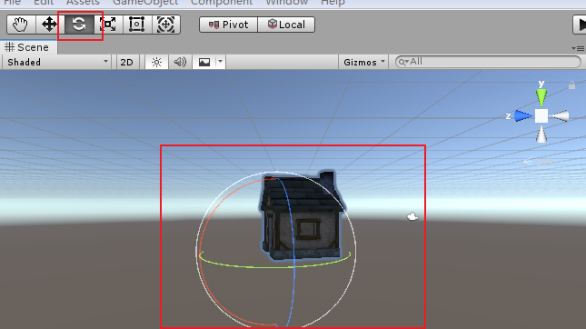
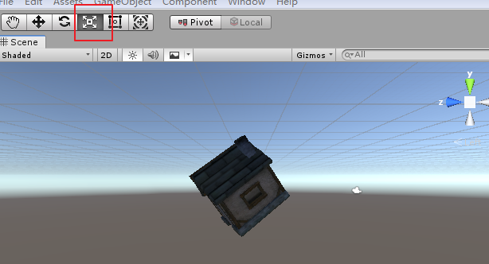
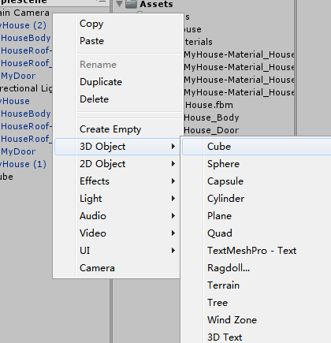

## unity工具介绍

1.打开图标，创建项目

2.修改布局

Assent就是一个资源文件。赋值项目只复制这一个就可以了。如果将这个文件夹删除了。那也就不见了。

游戏对象

快捷键使用

鼠标右键：旋转

滚轮：前进后退

按下滚轮：拖动

选中物体+F键：居中

ALT+鼠标左键：围绕旋转

ALT+鼠标右键：放大缩小

鼠标右键+W：放大

鼠标右键+S：缩小

鼠标右键+A:旋转

鼠标右键+D：旋转

监视面板

具有什么组件，那么他就有什么属性。

变换属性

看到那个轴，蓝色为z，红色为x轴。设置正朝着正方形走，负的朝着负方向走。

旋转除了设置数值旋转之外，也可以使用如下方式。

缩放

画出一个正方体

ctrl+d就可以复制

将他们两个贴在一起，我们要使用吸附。

我们任意旋转一个物体，按住V就可以将其进行拖动进行吸附。