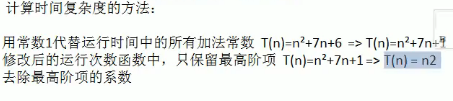

### 排序

#### 排序的分类

- 内部排序
  - 将需要处理的所有数据加载到内部存储器中进行排序
  - 包括
    - 插入排序
      - 直接插入排序
      - 希尔排序
    - 选择排序
      - 简单选择排序
      - 堆排序
    - 交换排序
      - 冒泡排序
      - 快速排序
    - 归并排序
    - 基数排序
- 外部排序
  - 数据量太大，无法加载到内存中，需要借助外部存储进行排序

##### 算法时间复杂度

度量一个程序执行时间的两种方法

- 事后统计方法
  - 先将程序运行，然后得到运行多长时间
  - 问题：运行和硬件是有关的，运行是需要耗费时间的
- 事前估计
  - 通过时间复杂度来进行判断

#### 时间频度

**介绍：**

时间频度:一个算法花费的时间与算法中语句的执行次数成正比，花费的时间就越多。一个算法中的语句执行的次数称为语句频度或者时间频度。

**时间复杂度：**

- 常数项可以忽略，在次数增大的时候，常数项无线接近。
- 可以忽略低次项的
- 系数可以忽略



- 平均时间复杂度:所以可能的实例在等概率的情况下，算法的运行是建
- 最坏在最坏的情况下，一般讨论都是在最坏的情况下


#### 空间复杂度

就是算法使用的空间大小

#### 冒泡排序

- 冒泡排序的思想

  

- 代码实现

```
public static void bubbleSort(int arr[]) {
		int temp ;
		//比较的次数是arr.length-2次
		for(int i=0;i<arr.length-1;i++) {
			for(int j = 0;j<arr.length-1-i;j++) {
				if(arr[j]>arr[j+1]) {
					temp = arr[j];
					arr[j] = arr[j+1];
					arr[j+1] = temp;
				}
			}
		}
	}
```

优化

```
for(int i=0;i<arr.length-1;i++) {
	flag = true;
	for(int j = 0;j<arr.length-1-i;j++) {
		if(arr[j+1]>arr[j]) {
			flag = false;
			temp = arr[j];
			arr[j] = arr[j+1];
			arr[j+1] = temp;
		}
	}
	if(flag) {
		break;
	}
}
```


#### 选择排序

- 思想

  选择排序的思想：每次挑选出一个最小（最大），然后将数据插入，一个一个插入。

- 代码

```
	public static void bubbleSort2(int arr[]) {
		int min = 0;
		int temp  =0;
		for(int i=0;i<arr.length-1;i++) {
			min = i;
			for(int j = i;j<arr.length;j++) {
				if(arr[min]>arr[j]) {
					min = j;
				}
			}
			temp = arr[i];
			arr[i]=arr[min];
			arr[min]=temp;
		}
	}
	
```

优化

```
for(int i=0;i<arr.length-1;i++) {
	min = i;
	for(int j = i;j<arr.length;j++) {
		if(arr[min]>arr[j]) {
			min = j;
		}
	}
	if(min != i) {
		temp = arr[i];
		arr[i]=arr[min];
		arr[min]=temp;	
	}
}
```

#### 插入排序

- 思想

  插入排序思想：将数据分为两部分，一部分是有序的，一部分是无序的，将无序的数据插入到有序的部分中。

- 代码

```
for(int j = 1;j<arr.length;j++) {
	temp = arr[j];
	index = j;
	for(int z = j-1;z >= 0;z=z-1) {
		if(temp<arr[z]) {
			arr[z+1]=arr[z];
			index = z;
		}
	}
	arr[index] = temp;
}
```

#### 希尔排序

希尔排序的我的理解可能不是很准确：他是插入排序的优化，之前是从第一个开始，一直到达最后面。希尔是将1变为了step，但是这个step就是从arr.length/2一直到为1.

```

for(int i= arr.length/2;i>0;i=i/2) {
	for(int j = i;j<arr.length;j++) {
	//for(int j = 1;j<arr.length;j++) { 插入
		temp = arr[j];
		index = j;
		for(int z = j-i;z >= 0;z=z-i) {
		//for(int z = j-1;z >= 0;z=z-1) { 插入
			if(temp<arr[z]) {
				arr[z+i]=arr[z];
				index = z;
			}
		}
		arr[index] = temp;
	}
}
```

快速排序

````
public static void quickSort(int arr[],int left,int right) {
		int l = left;
		int r = right;
		int mid = (left+right)/2;
		int temp=0;
		int povi = arr[mid];
		while(l<r) {
			while(arr[l]<povi) {
				l+=1;
			}
			while(arr[r]>povi) {
				r--;
			}
			if(l>=r) {
				break;
			}
			temp = arr[l];
			arr[l]=arr[r];
			arr[r]=temp;
			if(arr[l]==povi) {
				r++;
			}
			if(arr[r]==povi) {
				l--;
			}
		}
		if(l==r) {
			l++;
			r--;
		}
		if(left<r) {
			quickSort(arr, left, r);
		}
		if(right>l) {
			quickSort(arr, l, right);
		}
	}
````


#### 桶排序

#### 堆排序


