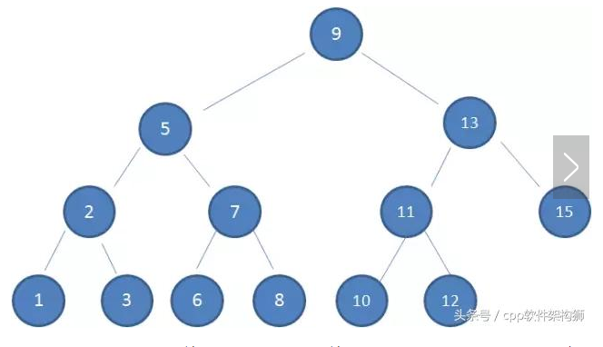
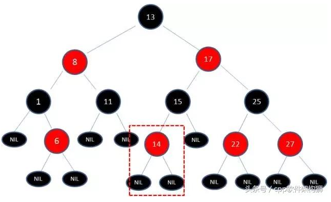
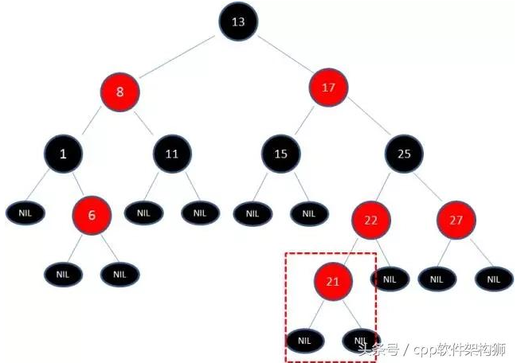
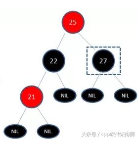
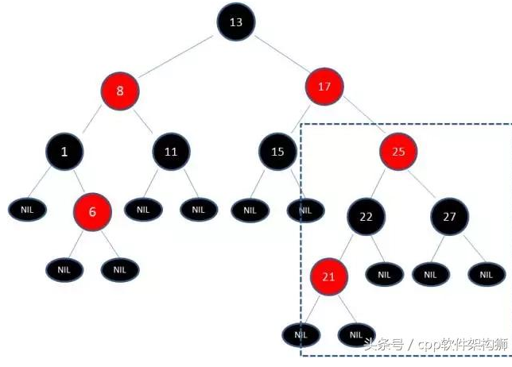
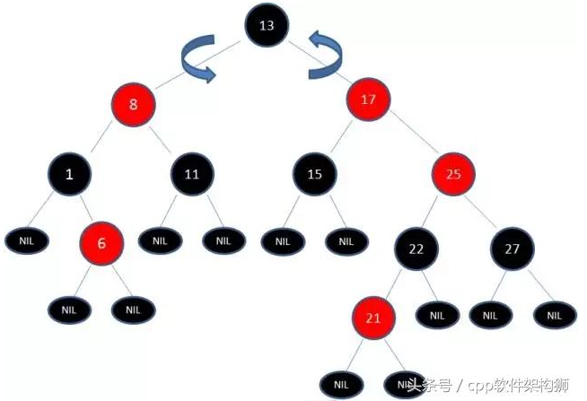

## 红黑树

为什会有红黑树？

（1）为什么需要二叉树？,因为可以快速的找到官架子的数据项、可以快速的插入和删除数据项

（2）为什么会有红黑树？因为随机的插入效果比较好，但是逆序的或者是有序的插入效果就不会太好了。

#### 研究内容

速索和普通二叉树一样，但是在另一个方面，插入和删除都是基于普通算法，所以重点在插入上。

#### 插入方法

**自顶向下插入**：从定向下插入点，需要改变数的结构。

**自底向上**：从底向上插入，找到新的插入位置，（效率低）

#### 平衡数和非平衡数

非平衡树是他们的左右子树是不一样的，平衡数是相同的。相差比较小。

平衡树的查找是一维的时候，他需要的时间复杂度是o(log N)，

如果是升序或者降序的时候，查找的时间复杂度是0(N)

加入说一个数组的数据个数是1000，那么就需要500次比较，如果是平衡的，那么就是log 1000

#### 红黑树记录什么？

- 记录数据
- 记录了红黑点
- 父节点
- 左右子树

#### 回顾

- 根节点为黑
- 叶子节点是黑
- 黑的子为红
- 到达叶子节点的颜色是黑数目是相同的


--------

### 二叉查找树

- 左子树大于右子树
- 右子树大于等于其他根节点
- 左右子树为二叉排序数

#### 案例查找



查找10.，先右在左在左，一直到达10 结束


#### 插入

如果是插入

```

				10
			   /  \
			  /    \
			 9		11
我们插入数据 8,7,6,5,4,3

				10
			   /  \
			  /    \
			 9		11
			/
		   8
		  /
		 7
		/
	   6
问题就是形成了偏树，一个树的节点特别多，一个特别少。红黑树的作用就是解决这个问题的。
```

#### 红黑树的特性

- 节点为红树或者是黑树
- 根为黑树
- 每个叶子节点都是黑色的空节点
- 每个黑节点都有两个红节点（红节点同理）
- 每个路径到达子叶几点都会有相同的黑节点数量

**保证**：每个路径的最长不大于最多的2倍。

### 删和增加

每次删除和增加都会破坏数的平衡，都会重新的排列一次。加入节点， 节点 的颜色是红色的，因为树中的黑节点是相同的。先作为普通的插入，然后进行变色，进行旋转

- 没有孩子节点的插入




- 破坏子树

  叶子需要的是黑色，所以21位红色，但是22也为红色，所以破坏了

  

  **处理方式**

  - 变色

    - 21和22不符合，那么就变色，

      

      变色之后的数据，这时候的树为

      

      上面虽然变色了，但是17和25还是不符合要求。下来在进行左右旋转。

  - 左右旋转

    - 左旋：根被右子节点取代，自己变为左节点。

      ```
      static void rbtree_left_rotate(RBRoot *root, Node *x){
          // 设置x的右孩子为y
          Node *y = x->right;//将右节点保存
          // 将 “y的左孩子” 设为 “x的右孩子”；
          // 如果y的左孩子非空，将 “x” 设为 “y的左孩子的父亲”
          x->right = y->left;//将y的左节点给x的右
          //y不是null的时候，y的左节点的父亲节点是x，完成交换吧
          if (y->left != NULL)
              y->left->parent = x;
      	//y上位
          // 将 “x的父亲” 设为 “y的父亲”
          y->parent = x->parent;
      	//如果是null，那么就是root节点
          if (x->parent == NULL)
          {
              //tree = y;            // 如果 “x的父亲” 是空节点，则将y设为根节点
              root->node = y;            // 如果 “x的父亲” 是空节点，则将y设为根节点
          }
          else
          {
              if (x->parent->left == x)
                  x->parent->left = y;    // 如果 x是它父节点的左孩子，则将y设为“x的父节点的左孩子”
              else
                  x->parent->right = y;    // 如果 x是它父节点的左孩子，则将y设为“x的父节点的左孩子”
          }
          
          // 将 “x” 设为 “y的左孩子”
          y->left = x;
          // 将 “x的父节点” 设为 “y”
          x->parent = y;
      }
      ```

      

    - 右旋转：根被左子树取代，自己变为右节点

    

    旋转之后

    

    在接着重新的分配颜色。

### 代码实现

关键字：颜色、key、父亲节点、左右子节点。

##### 定义

```
#define RED        0    // 红色节点
#define BLACK    1    // 黑色节点

typedef int Type;

// 红黑树的节点
typedef struct RBTreeNode{
    unsigned char color;        // 颜色(RED 或 BLACK)
    Type   key;                    // 关键字(键值)
    struct RBTreeNode *left;    // 左孩子
    struct RBTreeNode *right;    // 右孩子
    struct RBTreeNode *parent;    // 父结点
}Node, *RBTree;
// 红黑树的根
typedef struct rb_root{
    Node *node;
}RBRoot;
```


