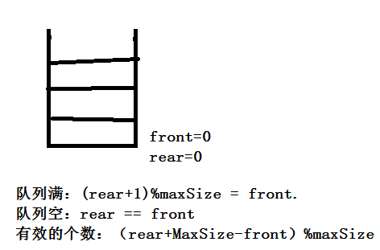

## 队列

#### 单队列

**介绍**

队列的实现使用了数组，但是这样的方式容易造成空间的浪费，所以我们可以使用另一种方式实现，就是使用数组来。

队列单队列它的存储是指针都指向数据的前一个位置，存放的数据仅是数组中的一部分。

**代码实现**

```
public class ArrayQueue {
	//使用数组实现
	private int data[];
	private int maxSize;
	private int rear;//尾部   尾部加数据
	private int font;//头   头部出数据
	public ArrayQueue(int maxSize) {
		// TODO Auto-generated constructor stub
		this.maxSize = maxSize;
		this.data = new int[maxSize];
		//开始的时候都要放在开头的前一个
		font = -1;
		rear = -1;
	}
	//存放数据满的时候是最大的减去1，数组下标是从0开始的
	public boolean isFull(){
		return rear == maxSize -1;
	}
	//头和尾部是相同的 ，
	public boolean isEmpty(){
		return rear == font;
	}
	
	public void addQueue(int value){
		if(isFull()) {
			throw new RuntimeException("队列已满!");
		}
		//开始初始化的时候是-1
		rear++;
		data[rear] = value;
	}
	
	public int getQueue(){
		if(isEmpty()) {
			throw new RuntimeException("队列为空！");
		}
	
		font++;
		return data[font];
	}
	
	public void showQueue(){
		for(int i=font+1;i<=rear;i++) {
			System.out.println(data[i]);
		}
	}
	
	public int headQueue() {
		return data[font+1];
	}
	
	public static void main(String[] args) {
		ArrayQueue a = new ArrayQueue(5);
		a.addQueue(1);
		a.addQueue(2);
		a.addQueue(3);
		a.addQueue(4);
		a.addQueue(4);
		a.showQueue();
		System.out.println("-----------");
		System.out.println(a.getQueue());
	    System.out.println("-----------");
		a.showQueue();
		System.out.println("-----------");
		System.out.println(a.headQueue());
	}
}
```


### 循环队列

解决方法就是使用循环队列来实现。




在循环队列中还有一个是每次增加数据和取出数据的时候下标的位置变化

```
增加数据   (rear+1)%maxSize;
取出数据   (front+1)%maxSize;

```

**代码实现**

```

public class CircleArrayQueueDemo {
	//使用数组实现
	private int data[];
	private int maxSize;
	private int rear;//尾部   尾部加数据,尾部是最后一个元素的下一个元素
	private int font;//头   头部出数据
	public CircleArrayQueueDemo(int maxSize) {
		// TODO Auto-generated constructor stub
		this.maxSize = maxSize;
		this.data = new int[maxSize];
	}
	
	public boolean isFull() {
		return (rear+1)% maxSize==font;
	}
	
	public boolean isEmpty() {
		return rear==font;
	}
	
	public void addQueue(int value){
		if(isFull()) {
			//throw new RuntimeException("队列已满!");
			System.out.println("队列已满");
			return ;
		}
		data[rear] = value;
		rear=(rear+1)%maxSize;
	}
		
	public int getQueue(){
		if(isEmpty()) {
			throw new RuntimeException("队列为空！");
		}
		int value = data[font];
		font=(font+1)%maxSize;
		return value;
	}
	
	public void showQueue(){
		if(isEmpty()) {
			throw new RuntimeException("队列为空！");
		}
		for(int i=font;i<font+size();i++) {
			System.out.println(data[i%maxSize]);
		}
	}
	
	public int size() {
		return (rear+maxSize-font)%maxSize;
	}
	public static void main(String[] args) {
		CircleArrayQueueDemo a = new CircleArrayQueueDemo(5);
		a.addQueue(1);
		a.addQueue(2);
		a.addQueue(3);
		a.addQueue(4);
		a.addQueue(4);
		a.showQueue();
		System.out.println("-----------");
		System.out.println(a.getQueue());
	    System.out.println("-----------");
		a.showQueue();
		System.out.println("-----------");
	}
	
}
```

